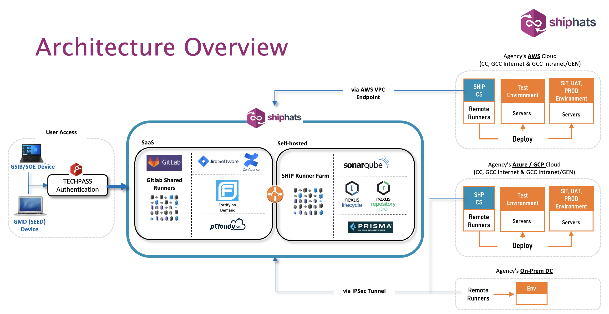
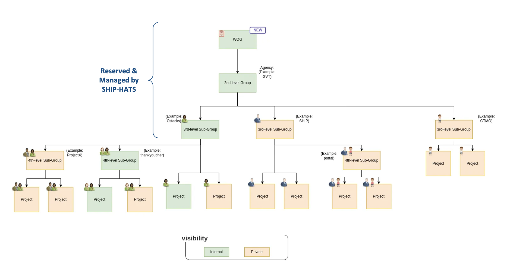

# Architecture

The integrated CI/CD used is GitLab on SaaS is hosted in Singapore and dedicated to GovTech usage. Based on the risk assessment and compliance review, this architecture is approved to host systems with classification of **Restricted and below**.

The SHIP-HATS 2.0 Architecture can be described in the following sections: 
- [Access](#access)
- [Deployment endpoints](#deployment-endpoints)
- [Runners](#runners)
- [GitLab Groups](#gitlab-groups)
- [Templates](#templates)

!> **Important:** Please note that only a limited set of services are available if you access SHIP-HATS via GSIB's Secure Internet Surfing (SIS). Services not supported via GSIB include executing any git commands. Please reach out to our team before making major ICT decisions based on the above diagram. 

<!--Please note that GSIB rules and policies apply as always that may lead to limited services available on GSIB. Before finalizing any changes to your environment based on the above diagram, please reach out to our team.-->

?> **Note:** The above architecture diagram represents our vision. For information on our roadmap, refer to [Upcoming features](#upcoming-features). 

## Access

SHIP-HATS 2.0 is accessible using [TechPass](https://docs.developer.tech.gov.sg/docs/techpass-tenant-guide/) & [SEED](https://docs.developer.tech.gov.sg/docs/security-suite-for-engineering-endpoint-devices/) as this is the unified approach to accessing any SGTS product. 
Users can either access from GSIB or SEED-enabled developer devices to authenticate themselves via TechPass login. 

 
- [TechPass is a single sign-on IAM solution](https://docs.developer.tech.gov.sg/docs/techpass-tenant-guide/) to allow users to gain authentication and authorization to different services in SHIP-HATS as well as other SGTS subscriptions. 
- [SEED is an MDM application](https://docs.developer.tech.gov.sg/docs/security-suite-for-engineering-endpoint-devices/) to be installed on user devices, which is a mandatory requirement to access to SGTS services.

> **Note:** The decommissioning date for [OpenVPN is 31st, Dec 2022](https://docs.developer.tech.gov.sg/docs/ship-hats-migration/ship-hats-migration-what-to-expect?id=key-tool-decommission-dates).

## Deployment endpoints

Users can leverage SHIP-HATS deployment Runners offered as a common service to the tenant hosting environments. SHIP-HATS supports deployment to GCC 2.0, GCC 1.0, and Commercial Cloud, for both Internet & intranet/Gen compartments.

Users with on-prem resources can configure Remote Runners in their data centre and connect to SHIP-HATS via IPSec Tunnel to consume our services and to perform automated deployment.

## Runners

[runners](./runners-snippet.md ':include')

### Docker Alternative FAQs

[Docker Alternative FAQs](./docker-alternative-faqs.md ':include')

### Windows Runner

[Windows runner](./windows-runner.md ':include')

## GitLab Groups

Gitlab allows groups and multi-level subgroups. The subgroups enable access control for multi-tenancy. 

The first three levels of subgroups are managed by SHIP-HATS. The first-level subgroups are the root level groups for WOG, the second-level subgroups are grouped by agency names, and the third-level subgroups are offered to our subscribers (e.g. project initiative name, department, or division name). Based on your requirement, SHIP-HATS team will create and manage these for you.   
**After the third-level groups are created, you will have the permission to create and manage any subsequent subgroups within it.**  

Gitlab subgroups have the inheritance characteristic from the parents. For more information, refer to the GitLab [groups](https://docs.gitlab.com/ee/user/group/index.html) and [subgroups](https://docs.gitlab.com/ee/user/group/subgroups/) documentation. 

## Templates

With SHIP-HATS 2.0, we offer:  

- End-to-end CI/CD templates for [common use cases](pipeline-templates) in-line with [Gitlab pipeline COE](https://docs.gitlab.com/ee/ci/pipelines/). 
- Pipeline Compliance Framework to support GovTech standards & guidelines (e.g., DevSecOps IM8), on an audit-friendly platform. 

These templates are re-usable and are designed according to the standard guidelines to help agencies to follow better DevOps practices, such as GitOps workflow, bootstrapping deployment runners, and release rollback. 

Following image shows an example of production pipeline in GitLab: 

<!-- We will also open up the template development for inner-sourcing. Anyone in SHIP-HATS community, expecting up to 3000 users will be able to contribute freely and to consume what others have contributed. We are hoping with more active engagement in the community is able to help the development team to accelerate their devops maturity journey. -->

<!-- One of our vision is to help agencies to comply to GovTech DevSecOps polices as stated in the IM8 document more easily, and preparing them to have an easy access to the evidence for future audit exercises. -->

> **Note:** For more information, refer to [Pipeline templates](pipeline-templates) documentation.

## Upcoming features

[Product Roadmap](./roadmap-features.md ':include')

## Terminology
This documentation uses the following terminology:

| **Term** | **Description** |
| --- | --- |
|CC|Commercial Cloud|
|GCP|Google Cloud Platform|
| GSIB | Government Standard Image Build|
| GCC | Government Commercial Cloud |
|Runner  | Agents that run the CI/CD jobs that come from GitLab|
|SaaS | Whitelisted services & resources in the Commercial cloud
|SEED|Security Suite for Engineering Endpoint Devices
|Self-Hosted |  Services & resources hosted in ship-hats GCC environment
| SOE | Standard ICT Operating Environment|
| VPC | Virtual Private Cloud|
| TGW | Transit GateWay|

### Related topics

- [AWS VPC Endpoint](aws-vpc-endpoint)
- [IPsec Tunnel](ipsec-tunnel)
- [Set up GitLab Runners](gitlab-runners)
- [Pipeline templates](pipeline-templates)