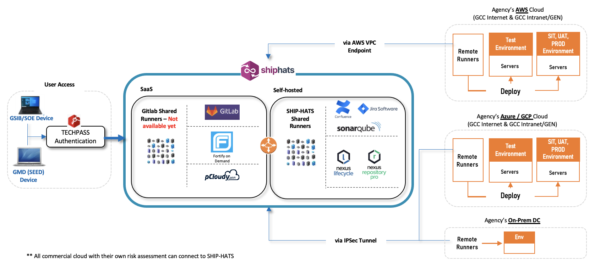

# Architecture

**Commercially Off the Shelf (COTS)** tools are available on SHIP-HATS with the right security and compliance settings. The following diagram shows how they work together to provide a seamless platform. 

## Terminology
This documentation uses the following terminology:

| **Term** | **Description** |
| --- | --- |
|CC|Commercial Cloud|
|GCP|Google Cloud Platform|
| GSIB | Government Standard Image Build|
| GCC | Government Commercial Cloud |
| SOE | Standard ICT Operating Environment|
| VPC | Virtual Private Cloud|
| TGW | Transit GateWay|