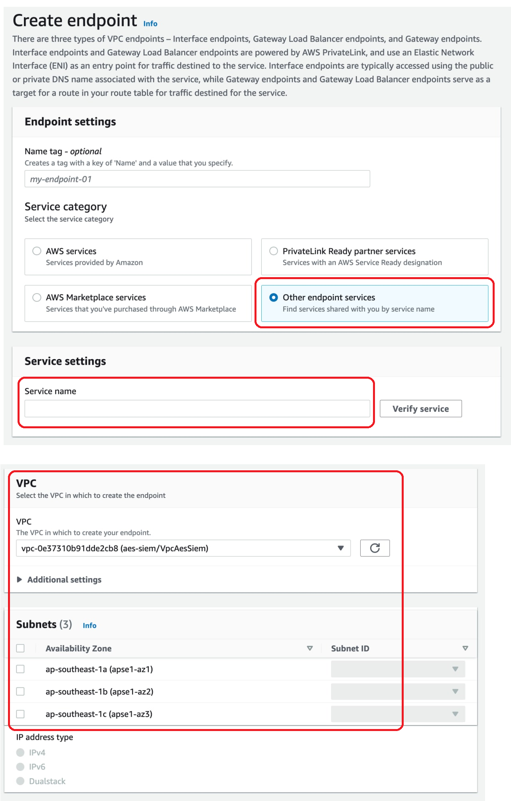

# AWS VPC Endpoint

You can connect to SHIP-HATS using one of the following methods based on your setup:

- [AWS VPC Endpoint](#prerequisites)
- [IPsec Tunnel](ipsec-tunnel)

## Prerequisites

1. [Log a ticket](https://jira.ship.gov.sg/servicedesk/customer/portal/11/create/404) with the SHIP-HATS Service Desk
1. Wait for the SHIP-HATS team to confirm that they have added you to the whitelist before continuing with the next step [Create a VPC Endpoint](#create-a-vpc-endpoint).

## Create a VPC Endpoint

1. Go to your AWS console, select **VPC**, and then select **Endpoints**.

    

1. Click **Create Endpoint**. 
1. Click **Find Service By Name**, and then provide the endpoint service name to which you want to connect. You can choose the endpoint service based on information included in [VPC Endpoint Services](#vpc-endpoint-services).

    

1. Select the VPC from which you want to connect, and then select the subnets in which the endpoints will be created.

    > **Note:** Instances that are required to use this endpoint must have connectivity to the subnets specified.

1. Use or create a new security group that allows incoming traffic from the port of the endpoint service to which you want to connect (specified in [VPC Endpoint Services](#vpc-endpoint-services)), then click **Create endpoint**.

    

1. Inform the SHIP-HATS team that you have created the Endpoint connection, and then wait for us to approve the connection.

1. After the Endpoint connection is approved, select the newly approved endpoint connection, and then copy the first DNS name of the endpoint connection, starting from `vpce` and ending in `https://aws.amazon.com/`. Exclude the text in brackets. This will be the DNS name to which you will point the full URL as specified in [VPC Endpoint Services](#vpc-endpoint-services).
    
    In the example image below, the string to be copied will be `vpce-05856b9113ebb1f76-bq95ohr0.vpce-svc-08a46dd461766eed3.ap-southeast-1.vpce.amazonaws.com`. 

    

1. Click **Create Hosted Zone**, and then provide the following information:

    > **Note:** You must complete this step one time for each VPC. If you have completed this step for another endpoint connection, proceed to next step.

    - In the **Domain Name** field, enter [ship.gov.sg](ship.gov.sg) for SHIP DNS or [hats.stack.gov.sg](hats.stack.gov.sg) for HATS DNS.

    - In the **Type** field, select **Private Hosted Zone for Amazon VPC**.

    - In the **VPC ID** field, select the VPC in which you created the endpoint connections.

    

1. On your VPC, enable DNS hostnames and DNS Support.

1. Click the [ship.gov.sg](ship.gov.sg) or [hats.stack.gov.sg](hats.stack.gov.sg) private hosted zone that you newly created, or created previously for your VPC. Make sure that it is the correct hosted zone for your VPC in which you just created the endpoints, as you may have created multiple hosted zones with the same domain for different VPCs.

    

1. Click **Create Record Set**, and then provide the following information:

    - In the **Name** field, enter the service name specified in [VPC Endpoint Services](#vpc-endpoint-services).
    - In the **Type** field, select **CNAME**.
    - In the **Value** field, paste the domain name that you copied in last step in the endpoint creation.

1. Click **Create**.

    

1. After the DNS is propagated, test for connectivity to the endpoint service from one of your instances in the specified VPC.

## VPC Endpoint Services

The following table provides a list of SHIP-HATS VPC Endpoint Services:

|Service Name|Full URL|Endpoint Service Name|Port|Protocol|
|---|---|---|---|---|
|GitLab SAAS	|sgts.gitlab-dedicated.com|com.amazonaws.vpce.ap-southeast-1.vpce-svc-0c4c6c964095f9102	|443 22	|HTTPS SSH|
GitLab SAAS Registry	|registry.sgts.gitlab-dedicated.com|com.amazonaws.vpce.ap-southeast-1.vpce-svc-06682b483e966c6d9	|443	|HTTPS|
Nexus|	nexus.ship.gov.sg|	com.amazonaws.vpce.ap-southeast-1.vpce-svc-03195a4fc17e6ad26	|443|	HTTPS|
Nexus-IQ|nexus-iq.ship.gov.sg|	com.amazonaws.vpce.ap-southeast-1.vpce-svc-00943fbdd70eeddf9	|443|	HTTPS|
Nexus-docker|	nexus-docker.ship.gov.sg|com.amazonaws.vpce.ap-southeast-1.vpce-svc-0713a3442f9c84cdf	|443|	HTTPS|
Nexus-docker-publish|	nexus-docker-publish.ship.gov.sg|	com.amazonaws.vpce.ap-southeast-1.vpce-svc-03e831ff086735380|	443|	HTTPS|
Sonar (Community Edition)|sonar.hats.stack.gov.sg|com.amazonaws.vpce.ap-southeast-1.vpce-svc-08acd442167ce0316	|443|	HTTPS|
Sonar (Developer Edition)|sonar1.hats.stack.gov.sg|com.amazonaws.vpce.ap-southeast-1.vpce-svc-0d9a38efadd18add2	|443|	HTTPS|
Twistlock|twistlock.apps.hats.stack.gov.sg|com.amazonaws.vpce.ap-southeast-1.vpce-svc-021d94466d60feca2	|443|	HTTPS|
Device Farm CLI|device-farm-cli-be.hats.stack.gov.sg|com.amazonaws.vpce.ap-southeast-1.vpce-svc-02e850b5422c1ea27	|443|	HTTPS|

## FAQs

>**Tip:** Click the question/triangle to view the answer.

  
<b>If I am reusing DevOps and VPC endpoints that I created for SHIP-HATS 1.0, can I continue to use the endpoints?</b>
 

- For tools that are being carried forward from SHIP-HATS 1.0 (e.g. Jira, Nexus, etc.), you can continue to use the same endpoints. 
- For new tools in SHIP-HATS 2.0 (SaaA GitLab), you must create and use new endpoints.

 