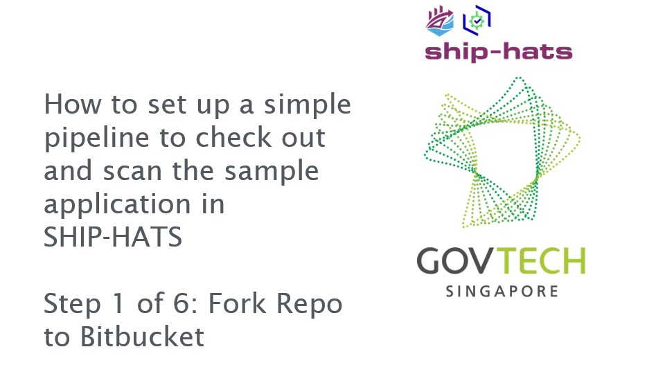
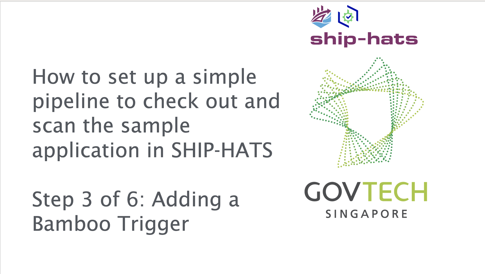
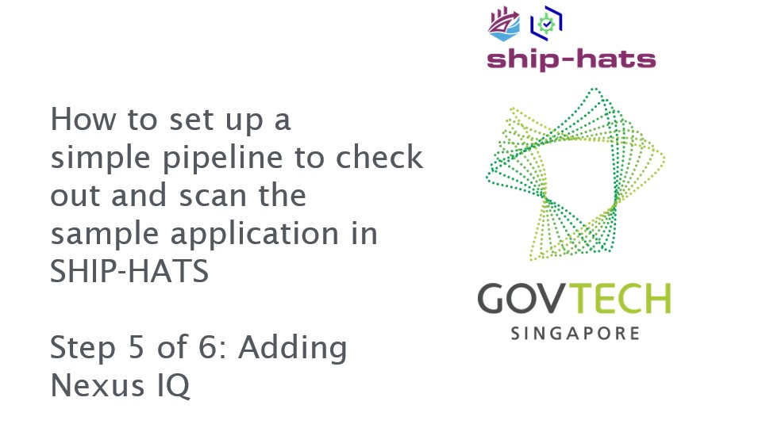
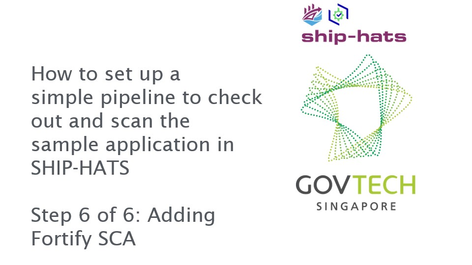

# CI Pipeline

This tutorial guides you to set up a simple pipeline using Javascript to check out and scan the sample application in SHIP-HATS.

**Topics**
- [Prerequisites](#prerequisites)
- [Set up CI Pipeline](#set-up-ci-pipeline)

## Prerequisites
- You must have Bitbucket, Bamboo, Nexus IQ, and Nexus Repository added to your project.  If not, please contact your Project Admin to get the required access.
- You must have *write access* to the projects created on the above-mentioned tools. If not, please contact your Project Admin to get the required access.
- You must have a basic understanding of the SHIP-HATS CI Tools (Bitbucket, Bamboo, Nexus IQ, and Nexus Repository).

For more information on prerequisites, refer to:  
- [General Information on user roles and permissions](https://docs.developer.gov.sg/docs/ship-hats-documentation/#/user-roles-permissions)
- [Bitbucket user roles and permissions](https://docs.developer.gov.sg/docs/ship-hats-documentation/#/bitbucket-user-role)
- [Bamboo user roles and permissions](https://docs.developer.gov.sg/docs/ship-hats-documentation/#/bamboo-user-roles)

## Set up CI Pipeline

### To set up a simple pipeline to check out and scan the sample application in SHIP-HATS:

1. **Fork Repo to Bitbucket**  

    Bitbucket is a source code management tool. Source code for your application is hosted within a Bitbucket repository. A Bitbucket project contains one or more repositories.  

    Normally, an application development team will create an empty repository and check in their code. For this tutorial, we will make use of existing code. We will create a new repository by forking from another repository. 

    

    Click the image or [link](https://youtu.be/y0znQiheC4Q) to access the video.

1. **Integrate Bitbucket to Bamboo** 

    As your code repo is in Bitbucket, we need to integrate it into Bamboo to allow and automate testing of the code/application. Bamboo is essentially a build tool that allows constant merging, testing of code  which allows  development teams to receive rapid feedback on their work.

    

    Click on the image or [link](https://youtu.be/8ky79S2YfRg) to access the video.

1. **Add a Bamboo Trigger**  

    Adding a Bamboo Trigger is required so that Bamboo is notified whenever there is a code change in any of the selected source code repositories. 

    

    Click on the image or [link](https://youtu.be/LyBSH4T4Lc4) to access the video.

1. **Add Bamboo Tasks**  

    Adding Bamboo tasks allows the automated execution of code, steps and processes.

    

    Click on the image or [link](https://youtu.be/supsnqoPKqs) to access the video.

1. **Add Nexus IQ**  

    Adding Nexus IQ as a Bamboo task allows the execution of vulnerability scanning for dependencies and libraries.

    

    Click on the image or [link](https://youtu.be/BW7_LRePBa8) to access the video.

1. **Add Fortify SCA**  

    Adding Fortify SCA as a Bamboo task allows the execution of vulnerability scanning for your source code.

    

    Click on the image or [link](https://youtu.be/0GAtczJpKwA) to access the video.

    >**Note:** As this is a sample pipeline, do reset user access and unlink the repository after completion of the tutorial.