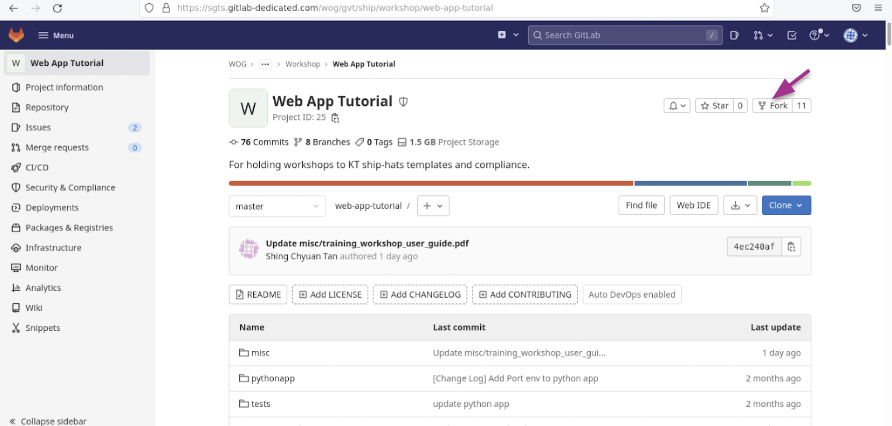

pl# Checkpoints


This tutorial is divided into various checkpoints that help you build and deploy a simple Python web application using SHIP-HATS e2e template. Make sure that you meet the specified [prerequisites](web-app-tutorial) before you [fork this tutorial](#fork-this-tutorial).

## Fork this tutorial

Complete the following steps to fork this tutorial:

1. Access the [https://sgts.gitlab-dedicated.com/WOG/GVT/ship/workshop/web-app-tutorial](https://sgts.gitlab-dedicated.com/WOG/GVT/ship/workshop/web-app-tutorial). 
1. In the top-right of the page, select **Fork**.

    

1. Enter values in the available fields. 
1. Make sure that **Project URL** is set to **WOG/GVT/ship/workshop-attendees/sgts-trainee-`#`**, where `#` is trainee number provided to you.

    >**Note:** The requirement to sign commits using GPG signature is disabled only for the purpose of this workshop. In your live development, make sure to follow the global setting and set up your machines to sign commits as a best practice. For more information, refer to https://docs.gitlab.com/ee/user/project/repository/gpg_signed_commits/ 

1. Clone from your newly forked project, and then run the following line of code:

    ```
    git checkout master

    ```

1. Observe that there is no file named **.gitlab-ci.yml**. This filename is reserved for the default pipeline definition in GitLab. Running a pipeline to build and deploy the web app would require this file to be defined as described in the [Checkpoint 1: Configure E2E template](#checkpoint-1---configure-e2e-template). 


## Checkpoint 1: Configure E2E template

1. To configure E2E template, you require a `.gitlab-ci.yml` file that you can:
    - Build from scratch  
    or 
    - you can try to find a match in use-case defined within the [SHIP-HATS E2E Templates](https://sgts.gitlab-dedicated.com/WOG/GVT/ship/e2e-templates).  

    For our example, we will use the relevant webapp E2E template provided in the [SHIP-HATS E2E](https://sgts.gitlab-dedicated.com/WOG/GVT/ship/e2e-templates/ship-hats-webapp-e2e-templates) templates. The instructions for usage are provided in its `README`.

1. To put the Python webapp source codebase alongside the E2E template, you can use one of the following options:

    - Create a repository clone from the E2E template, and then copy the Python webapp files in the newly cloned repository.
    - Clone E2E template repo locally, and then push its files to the Python webapp repository.
    - Fork from E2E template repo.
    - Create a `.gitlab-ci.yml` file and include the E2E template's `.gitlab-ci.yml` by adding the following lines of code:

    ```
    include:
        - project: "compliance/e2e-templates/webapp-e2e"
        ref: "main"
        file:
            - .gitlab-ci.yml
        - local: BUILD.gitlab-ci.yml
        - local: TEST.gitlab-ci.yml
        - local: DEPLOY.gitlab-ci.yml
    ```

    > **Note:** Each of the above options has its own pros and cons: 
    > - The copy/fork method would require more manual maintenance  
    > - The inclusion method would mean that if the E2E template pipeline changes, your pipeline could be affected without prior knowledge or notice.  
    > - There is ongoing development of release management plans of the templates and compliance.

1. Run the following lines of code:

    ``` 
    git checkout master  
    git merge origin/checkpoint-1/configure-e2e-template
    ```

3. Observe the following: 
    - The E2E template files has been placed alongside with the Python webapp by all methods, except for the inclusion method.
    - `.gitlab-ci.yml` has standard stages defined to build and deploy a web application. These stages are important for compliance to be applied later on. **Do not rename or change them. You can, however, customise the definition of the jobs within as and when needed.** 
    - Any customisation, such as app-specific or language-dependent steps, is to be placed inside the file `BUILD/TEST/DEPLOY.gitlab-ci.yml` as the E2E templates are designed to be language-agnostic. You will need to fill the **variables** section.  

    > **Note:** All of the required details are covered either in E2E templates documentation or later on in this tutorial.
    
    - Observe the usage of modular templates in `.gitlab-ci.yml`. The wait for service to be up first before integration testing is leveraging **[wait-for-app-and-assert-text](https://sgts.gitlab-dedicated.com/WOG/GVT/ship/ship-hats-templates/-/tree/main/templates#file-gitlab-ci-check-app-readinessyml)** from the SHIP-HATS templates. Using this takes away the complexity of bash development. You may find [other templates](pipeline-templates) useful as they are built to be modular and reusable while ensuring security.

## Checkpoint 2: Configure build

1. Define the app-specific details, such as how to build the webapp. This can be done in the `BUILD.gitlab-ci.yml` file. 

1. Run the following lines of code: 
    ``` 
    git checkout master
    git merge origin/checkpoint-2/configure-build
    ```

2. Observe `BUILD.gitlab-ci.yml`. `build-job` has been defined to build this Python webapp. If you are building a Ruby or Java application, add the customised scripts here. You may find some examples in the [E2E templates](https://sgts.gitlab-dedicated.com/WOG/GVT/ship/e2e-templates/examples). 

3. Observe `.gitlab-ci.yml`. Note that:
    - `WORKING_DIR=pythonapp` and `OUTPUT_ARTEFACT=$WORKING_DIR/pythonapp.zip` have been defined. 
    - `WORKING_DIR` is referenced by `BUILD.gitlab-ci.yml` as it will run the build command in the directory to produce an `OUTPUT_ARTEFACT`. 
    - `poi` should be the path to the file of the binary or zipped folder that is to be eventually deployed. 
    - `.gitlab-ci.yml` is used by compliance later for scanning, signing, and for verification of checksum.


## Checkpoint 3: Configure test

1. Define the app-specific way of testing the webapp, which can be done in `TEST.gitlab-ci.yml` file. Include the Unit/integration testing, language-based linting, framework-based dependency checks and E2E testing here.

1. Run the following lines of code: 
    
    ``` 
    git checkout master
    git merge origin/checkpoint-3/configure-test
    ```
2. Observe `TEST.gitlab-ci.yml`. It includes some very framework/app specific ways of checking for dependencies, linting, and unit/integration testing using `pip check`, `pylint`, `pytest`.

3. Modify the following variables in `.gitlab-ci.yml` and customize it to match your requirements:

    |Variable|Description|
    |--------|-----------|
    |NAME|Name to be displayed in the webapp and for tests. Separate/delimit spaces using an additional backslash. E.g. if your name is John Smith, NAME='John\ Smith'|
    |COLOR|Color of header in the webapp (CSS color scheme)|

4. Push changes to master branch:  

    ```
    git checkout master
    git add .gitlab-ci.yml
    git commit -m "Personalised variables added in .gitlab-ci.yml"
    git push origin master # trigger pipeline to run
    ```

5. In the left navigation, go to **CI/CD** > **Pipeline** to observe the pipeline status.  
    - Click the pipeline under the **status** column accordingly.  You can view various jobs and stages defined in `.gitlab-ci.yml`.  
    - To view output of each job, click the individual job.

6. Verify that your pipeline passed the `static-test` stage but failed at the `deploy-to-testing-env` stage.

## Checkpoint 4: Configure deployment

1. Define the infrastructure-specific way of deploying the webapp, which is heavily dependent on how the application is to be hosted. Include its definition in the `DEPLOY.gitlab-ci.yml` file. 

1. Run the following lines of code: 
    
    ``` 
    git checkout master
    git merge origin/checkpoint-4/configure-deploy
    ```

2. Observe `.gitlab-ci.yml`. 

    - `WEBAPP_NAME="Python Webapp"` has been defined. This is the value used by `wait-for-web-app-ready-job` to check whether the webapp is up. 
    - `WEBAPP_URL="ec2-18-139-176-29.ap-southeast-1.compute.amazonaws.com:$PORT"` has also been defined. This is the URL used by `wait-for-web-app-ready-job` to check whether the webapp is up so that `e2e-test-job` can run integration tests.

3. Define `PORT=<user_port>` in `.gitlab-ci.yml`.   

4. Define `UNZIPPED_DIR=<user_app_dir>` in `DEPLOY.gitlab-ci.yml`. Make sure that **<user_app_dir>** does not have any whitespaces. 

5. Push changes to master branch:

    ```
    git checkout master
    git add DEPLOY.gitlab-ci.yml .gitlab-ci.yml
    git commit -m "User definition in deploy stage."
    git push origin master # trigger pipeline to run
    ```

6. Observe `DEPLOY.gitlab-ci.yml`. 
    - The steps are used for deployment to staging environment for running E2E tests against and also later on reused for final deployment to production environment. This consistency is important to omit any possibilities of the webapp being deployed wrongly. 

7. Observe the usage of modular templates. 
    - In `DEPLOY.gitlab-ci.yml`, fetching of the SSH key from AWS Secrets Manager is leveraging **[invoke-awssecretretrieval](https://gts.gitlab-dedicated.systems/templates/ship-hats-templates/-/tree/main/templates#file-gitlab-ci-awsyml)** from SHIP-HATS Templates. This takes away the complexity of role assumption and uses a method that requires no storage of secrets like `AWS_SECRET_ACCESS_KEY` and `AWS_ACCESS_KEY_ID`. The templates are building blocks developed by the platform team to help you fix up pipelines quicker and safer and the project is open for innersourcing welcoming contributors from you. For more information, refer to the [CONTRIBUTING.md](https://gts.gitlab-dedicated.systems/templates/ship-hats-templates/-/blob/main/CONTRIBUTING.md) file.

8. Verify that the pipeline fails due to missing variables in the `runtime-test` stage.

9. Observe **Deployments** > **Environments**. A **testing** environment is up and running. 
    - `deploy-testing-job` with **environment:name** set to **testing** in `DEPLOY.gitlab-ci.yml` automatically enables this. 
    - You can select the **testing** environment, and then **View Deployment** to see the actual webapp through your browser and verify it is up.

## Checkpoint 5: Configure runtime test

1. Run the following lines of code: 
    
    ``` 
    git checkout master
    git merge origin/checkpoint-5/configure-runtime-test
    ```
1. Observe the following variables in `.gitlab-ci.yml` which have been filled:

    |Variable|Value|Description|
    |--------|-----|-----------|
    |VERSION|1.0|Version of web app published to artefact repository|
    |RF_TESTSCRIPT_FOLDER|tests/e2e|Path to robotframework test script for runtime testing|
    |OPTS in `e2e-test-job`|-v BROWSER:headlesschrome -v URL:$WEBAPP_URL| Webapp URL added for runtime test|

1. Verify that the pipeline is now passing `runtime-test` stage.

Note that such tests may vary based on different frameworks/languages used in development. It is okay to override the job's implementation. The use of RobotFramework may not be for everyone. This has been included in the E2E template as a starter guide and to ensure the importance of having E2E tests for compliance.

## Checkpoint 6: Configure publish To Nexus

1. Run the following lines of code:

    ``` 
    git checkout master
    git merge origin/checkpoint-6/configure-publish
    ```
1. Observe the following variables in `.gitlab-ci.yml`, which have been filled:

    |Variable|Value|Description|
    |--------|-----|-----------|
    |MAVEN_SETTINGS_SERVER_ID|ship-raw-test|Variable for `publish-maven-artefact` template|
    |MVN_SETTINGS_FILE|settings.xml|Variable for `publish-maven-artefact` template|
    |NEXUSREPO_REPO_ID|ship-raw-test|Variable for `publish-maven-artefact` template|
    |NEXUSREPO_REPO_GROUP_ID|workshop-python|Variable for `publish-maven-artefact` template|
    |ARTEFACT_PACKAGE|zip|Variable for `publish-maven-artefact` template|

1. Define `ARTEFACT_ID=<artefact_name>` in `.gitlab-ci.yml`. Make sure that **<artefact_name>** does not have any whitespaces. This is the name of the artefact that will be pushed to the Nexus Repo. 

1. Observe `.gitlab-ci.yml`. 
    - `pull-deploy-artefact` has been defined to retrieve NEXUS_REPO_USERNAME and NEXUS_REPO_PASSWORD from AWS Secrets Manager, to download artefact from Nexus Repo for deployment.  
    - In your own development, you can store the credentials in your own secrets. Alternatively, the credentials can be stored in your project's CI/CD variables. 

1. Verify that the pipeline passes the publish stage and the pipeline runs successfully.
1. Push changes to master branch:
    
    ```
    git checkout master
    git add .gitlab-ci.yml
    git commit -m "ARTEFACT_ID customised."
    git push origin master # trigger pipeline to run
    ```

1. Verify that the pipeline passes runtime testing job and publish job.
1. Since the `deploy-prod-manual-job` to deploy to production environment is configured to be triggered manually, in the navigation bar, select the job through **CI/CD** > **Pipelines** > select the most recent pipeline > click the Play button to trigger the `deploy-prod-manual-job`.
1. Observe the pipeline jobs and dependencies.  
    
    Using E2E template helps in:
    - Ensuring the required pieces of a CI/CD pipeline is present with the definition of sequence of events. 
    - Your pipeline uses an artefactory in between build, test, and deploy stages.
    - Segregation of responsibilities between build, test, and deploy stages.

1. Observe **Deployments** > **Environments** in the navigation bar again. 
    - A **production** environment is up and running and added on top of the previous **testing** environment.  `deploy-final-job` with  **environment:name** set to **production** in `DEPLOY.gitlab-ci.yml` automatically enables this. 
    - You can select the **production** environment then **View Deployment** to see the actual webapp through your browser to verify it is up. 
    - You may have different environment values (staging) set for different branches. Possible names for environments: https://docs.gitlab.com/ee/ci/yaml/index.html#environmentdeployment_tier. 
    - You may protect your environment as per: https://docs.gitlab.com/ee/ci/environments/protected_environments.html.

## Checkpoint 7: Apply compliance framework

Now that the pipeline is complete, the Python webapp pipeline is able to build and deploy the Python webapp as demonstrated. However, the pipeline is still lacking in terms of the Security component in DevSecOps. 

To fulfil compliance, we can apply the relative compliance framework and see the value that it adds.

1. In the navigation bar, select **Settings** > **General** > **Compliance framework** > **ship-hats-webapp-compliance** to apply compliance.

1. Select **Setting** > **CICD** > **Variables** to set the **compliance-required** variables.  

   |Variable|Value|Description|
   |--------|-----|-----------|
   |COSIGN_PASSWORD|**#**|Variable for `publish-maven-artefact` template. Replace **#** with your password string|
   |NEXUS_IQ_USERNAME|*CI/CD variable*|Variable for compliance framework Nexus IQ scan|
   |NEXUS_IQ_PASSWORD|*CI/CD variable*|Variable for compliance framework Nexus IQ scan|
   |NEXUS_IQ_APP_ID|workshop-nexus-scan-**#**|Variable for compliance framework Nexus IQ scan. Replace **#** with your assigned USER ID|

1. To trigger the pipeline, in the navigation bar, select **CI/CD** > **Pipelines** > **Run pipeline** > **Run for branch name or tag** > **Run pipeline** > **master**.
1. Run the pipeline and observe the additional compliance jobs. 

    Using the webapp compliance framework helps in:
    - Ensuring the checksum/signature verification in between pushing the artefact to the repository and pulling it for deployment.
    - Static scans including secret detection scans are in place.
    - DAST is in place.
    - Reports are generated as part of provenance and visibility.
1. Upon completion of the run, observe **Security & Compliance** > **Security dashboard** in the navigation bar.
1. Observe **Security & Compliance** > **Vulnerability report** in the navigation bar.
1. Show the compliance framework and highlight that it cannot be overwritten.

## Checkpoint 8: Apply compliance framework to use different toolchain (FOD SAST, FOD DAST)

1. Observe the following variables in `.gitlab-ci.yml` which have been filled:  

    |Variable|Value|Description|
    |--------|-----|-----------|
    |FOD_UPLOADER_OPTS|-apf -ts 10 -l 18|Uploader option will default to this, you can find out more usage examples at [https://github.com/fod-dev/fod-uploader-java](https://github.com/fod-dev/fod-uploader-java)|

1. To add toolchain credentials variables, in the navigation bar, select **Settings** > **CI/CD** > **Variables** > **Add variable** for all 3 FOD variables.  

   |Variable|Value|Description|
   |--------|-----|-----------|
   |FOD_USERNAME||Variable for compliance framework FOD scan|
   |FOD_PAT||Variable for compliance framework FOD scan|
   |FOD_RELEASE||Variable for compliance framework FOD scan|

1. To trigger pipeline, in the navigation bar, select **CI/CD** > **Pipelines** > **Run pipeline** > **Run for branch name or tag** > **Run pipeline** > **master**.

1. If you provided the credentials, it will use the toolchain, which in this case is FOD. If you provided the credentials, the compliance will use GitLab native tools.


## Achievements through tutorial

- Ease of CI/CD development: Write once, run anywhere - templates, E2E templates
- Leverage on GitLab's OTS security tools
- Flexibility to switch to use other available SHIP-HATS tools
- Leverage on GitLab's reporting
- Can be on future leaderboard scoring for QD. (Unconfirmed)
- Be more **compliant**, as per various published standards. Some commonly mentioned stuff in standards -  
  - Pipeline as code with commit history
  - Sign and verify artefacts
  - SAST and SCA
  - Prioritizing trusted package managers and repositories by the fetching of libraries and images via Nexus Repo 
  - Standardization of pipelines across projects 
  - Uploading of artefacts (even as images) to artifactory in this case, Nexus Repo


## Call for contribution / innersourcing
- [Modular templates](https://sgts.gitlab-dedicated.com/WOG/GVT/ship/ship-hats-templates)
- [End-to-end templates](https://sgts.gitlab-dedicated.com/WOG/GVT/ship/e2e-templates) 
- [Examples](https://sgts.gitlab-dedicated.com/WOG/GVT/ship/e2e-templates/examples)
