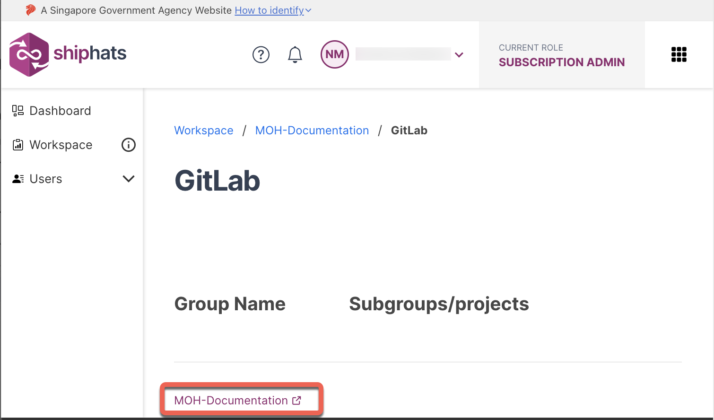

# Step 3: Configure GitLab

?> Complete these steps in the **[GitLab](https://sgts.gitlab-dedicated.com/) tool**. 

## Step 3a: Verify User Mapping

### To verify user mapping

1. In the [SHIP-HATS portal](https://portal.ship.gov.sg/), click GitLab group.

        

1. In the GitLab tool, click **Subgroup information** > **Members**.

    

    The **Group members** screen appears. 

    

1. Verify that all your users added in the selected Group appear. 

    If you want to **add additional users**:

    1. Click **Invite Members**.

    

    1. Provide values in the **Username or email address** and **Select a role** fields, and then click **Invite**. 

## Step 3b: Set up SSH keys

In GitLab, each developer must [Use SSH keys to communicate with GitLab](https://docs.gitlab.com/ee/user/ssh.html).

## Step 3c: Set up GPG keys	

In GitLab, each developer must [Sign commits with GPG](https://docs.gitlab.com/ee/user/project/repository/gpg_signed_commits/).

### What's Next

- [Step 4: Configure Pipelines](configure-pipelines) 
