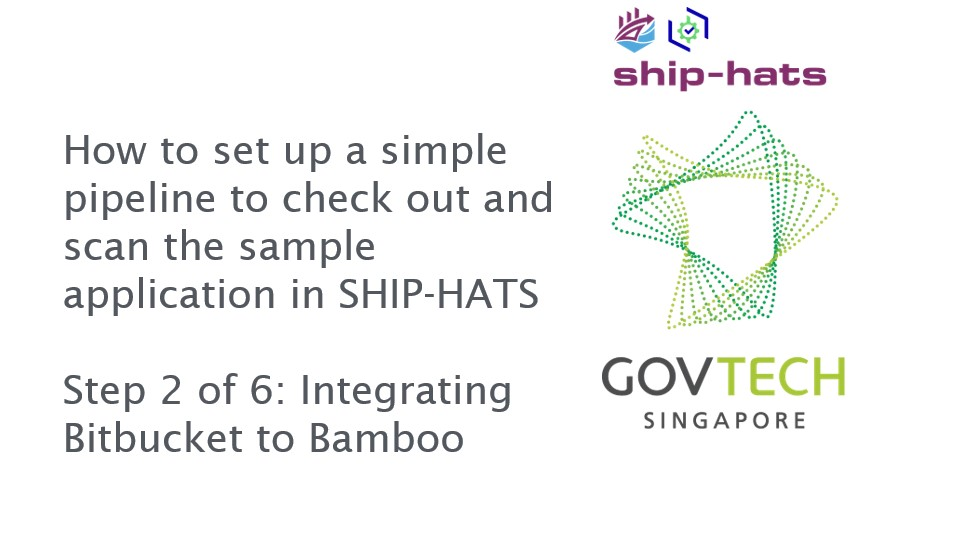
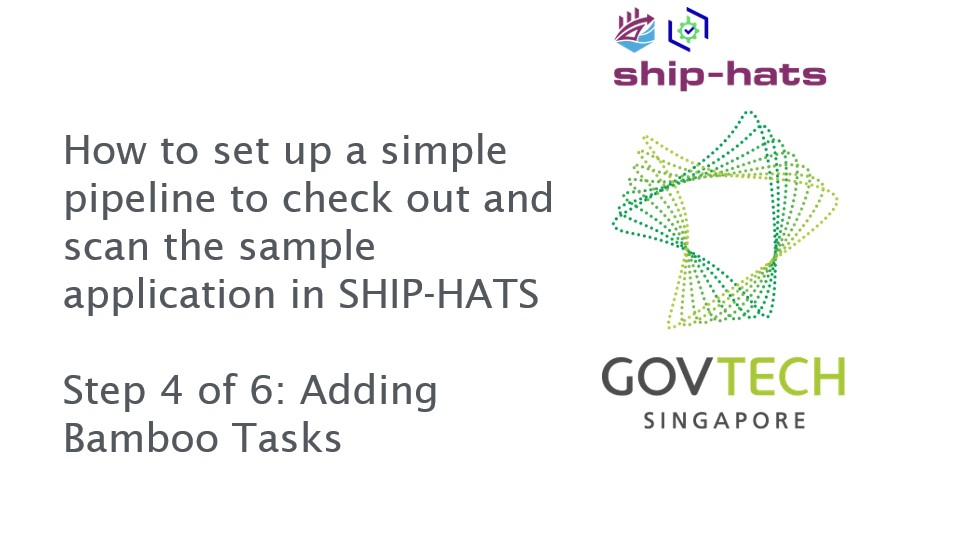

# Getting Started

**Topics**
- [Pre-requisites](#pre-requisites)
- [Quick Start Guide](#quick-start-guide)
- [Set up CI/CD Pipeline](#set-up-cicd-pipeline)

## Pre-requisites

- Visit [Subscription info](https://www.developer.tech.gov.sg/singapore-government-tech-stack/toolchain/subscription) and [Subscription FAQ](https://docs.developer.tech.gov.sg/docs/ship-hats-documentation/#/subscription) for information on subscription tiers.  
- A session is active for 20 minutes. Therefore, we recommend having the following details before clicking the onboarding link that you receive in your email: 
    - Details of the [Primary and Secondary Subscription Admins](https://docs.developer.tech.gov.sg/docs/ship-hats-documentation/#/user-roles-permissions?id=sa-permissions):
        - Name
        - Email
        - Mobile Number 
        For more information, refer to [User Roles and Permissions](user-roles-permissions).  
    - Details of the Billing contact: 
        - Name
        - Email 
        - Contact Number
        - Address 
        - Sub Business Unit code details. 
        >**Note:** Sub Business Unit (SUB BU) is not your Department code. Please work with your finance team for the SUB BU code.
    - Approval of the subscription by a MIC (Manager In-Charge). The approver of the subscription has to be Deputy Director and above for signatory.  
    - Approver details:
        - Name
        - Email 
        - Designation

>**Note:** The onboarding link only lasts for 14 days. If you require an extension, send an email to [enquiries_ENP@tech.gov.sg](mailto:enquiries_ENP@tech.gov.sg). 

## Quick Start Guide 
1. Use gov.sg email to send a request to [enquiries_ENP@tech.gov.sg](mailto:enquiries_ENP@tech.gov.sg) with the email address of your Primary Subscription Admin (SA).  
1. The SA receives the onboarding link via email.
1. Open the invitation link on an Internet device, enter the fields, and then submit the onboarding form. 
1. SHIP-HATS Team verifies the information. 
1. System will send an email with the Memorandum of Understanding (MoU) to the approver nominated in the onboarding form. 
1. Agency's approver is required to reply 'Approved’ after receiving the email. 
1. After approver replies, SHIP-HATS Team provisions the Primary SA and Secondary SA's account. 
1. SAs will receive an email to inform that your account is provisioned. 
1. SAs log into [SHIP-HATS Portal](http://ship.gov.sg) after their accounts have been provisioned and send the [invitation link](https://docs.developer.tech.gov.sg/docs/ship-hats-documentation/#/manage-users?id=invite-users) to their users for them to self-create accounts and approve the user accounts.

## Set up CI/CD Pipeline

This tutorial guides you to set up a simple pipeline using Javascript to check out and scan the sample application in SHIP-HATS.

### Prerequisites
- You must have Bitbucket, Bamboo, Nexus IQ, and Nexus Repository added to your project.  If not, please contact your Project Admin to get the required access.
- You must have *write access* to the projects created on the above-mentioned tools. If not, please contact your Project Admin to get the required access.
- You must have a basic understanding of the SHIP-HATS CI Tools (Bitbucket, Bamboo, Nexus IQ, and Nexus Repository).

For more information on prerequisites, refer to:  
- [General Information on user roles and permissions](https://docs.developer.gov.sg/docs/ship-hats-documentation/#/user-roles-permissions)
- [Bitbucket user roles and permissions](https://docs.developer.gov.sg/docs/ship-hats-documentation/#/bitbucket-user-role)
- [Bamboo user roles and permissions](https://docs.developer.gov.sg/docs/ship-hats-documentation/#/bamboo-user-roles)

### To set up a simple pipeline to check out and scan the sample application in SHIP-HATS:

1. Fork Repo to Bitbucket.  

    Bitbucket is a source code management tool. Source code for your application is hosted within a Bitbucket repository. A Bitbucket project contains one or more repositories.  

    Normally, an application development team will create an empty repository and check in their code. For this tutorial, we will make use of existing code. We will create a new repository by forking from another repository. 

    

    Click the image or [link](https://youtu.be/y0znQiheC4Q) to access the video.

1. Integrate Bitbucket to Bamboo. 

    As your code repo is in Bitbucket, we need to integrate it into Bamboo to allow and automate testing of the code/application. Bamboo is essentially a build tool that allows constant merging, testing of code  which allows  development teams to receive rapid feedback on their work.

    

    Click on the image or [link](https://youtu.be/8ky79S2YfRg) to access the video.

1. Add a Bamboo Trigger  

    Adding a Bamboo Trigger is required so that Bamboo is notified whenever there is a code change in any of the selected source code repositories. 

    

    Click on the image or [link](https://youtu.be/LyBSH4T4Lc4) to access the video.

1. Add Bamboo Tasks  

    Adding Bamboo tasks allows the automated execution of code, steps and processes.

    

    Click on the image or [link](https://youtu.be/supsnqoPKqs) to access the video.

1. Add Nexus IQ  

    Adding Nexus IQ as a Bamboo task allows the execution of vulnerability scanning for dependencies and libraries.

    

    Click on the image or [link](https://youtu.be/BW7_LRePBa8) to access the video.

1. Add Fortify SCA  

    Adding Fortify SCA as a Bamboo task allows the execution of vulnerability scanning for your source code.

    

    Click on the image or [link](https://youtu.be/0GAtczJpKwA) to access the video.

    >**Note:** As this is a sample pipeline, do reset user access and unlink the repository after completion of the tutorial.