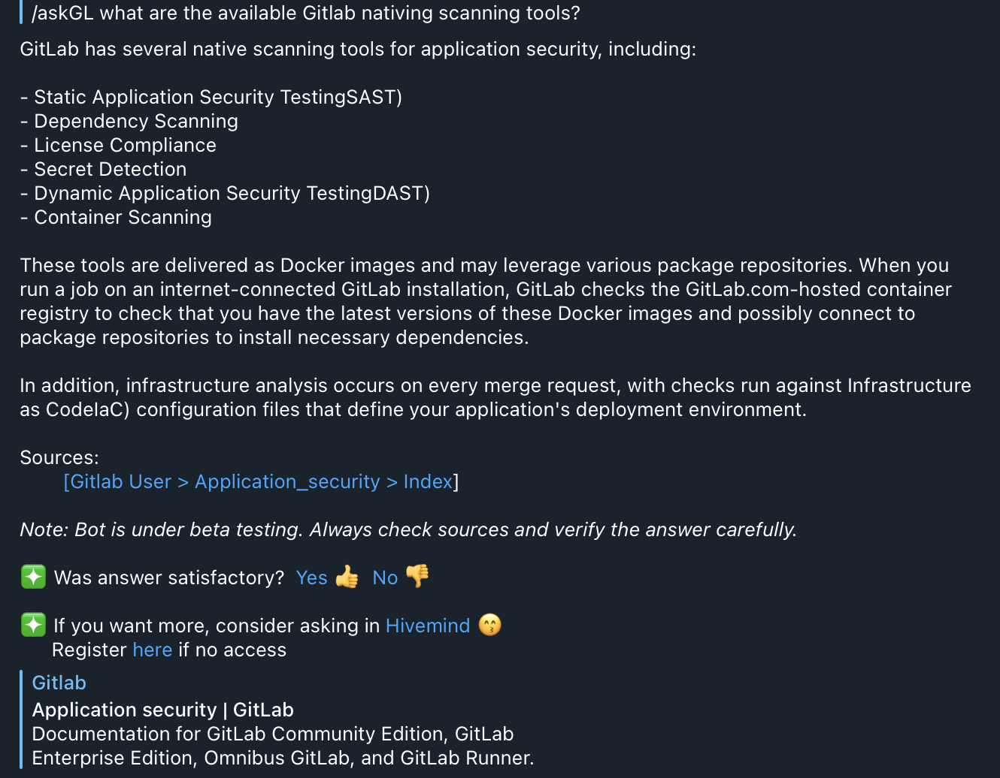

# Hivemind Chatbot

?> This is a pilot project.

## About Hivemind Chatbot

Hivemind chatbot (pilot) was launched in April 2023 to help answer queries on SHIP-HATS. 

Hivemind chatbot is based on ChatGPT and brings the power of ChatGPT to internal knowledge management. Learn more on [Integrating ChatGPT with internal knowledge base and question-answer platform](https://medium.com/singapore-gds/integrating-chatgpt-with-internal-knowledge-base-and-question-answer-platform-36a3283d6334) via our Medium article.

## Using Hivemind chatbot

**To use the Hivemind chatbot:**

1. Please ask your SA to add you to the telegram group: **SHIP-HATS 2.0 Group**. 
1. Send a private message to **@HivemindChatBot**.
1. Select **/Start**.

    

1. Use one of the commands below to ask your query:

    |Command|Description|Example|
    |---|---|---|
    `/ask` |Ask queries related to SGTS, SHIP-HATS, SEED, TechPass, etc.|/ask does SHIP-HATS GitLab support service account not tied to a human user?|
    `/askGL`  | Ask queries related to using Gitlab v15|/askGL give me an example of multi-project pipeline triggers|
    `/askGPT`  |Ask generic queries. Please note that it's a limited integration with ChatGPT|/askGPT I need a simple live coding challenge that is not commonly used for a senior developer role
    `/post`  | Get the bot to post a question on Hivemind| /post 
    `/help` | Show help|N/A

1. Click :thumbsup:	or  :thumbsdown: to indicate if your answer was helpful. 

?> **Note:** All interactions are recorded for analytics purpose.

<!--## Commands
Use the following commands to ask your queries:-->

## Rating the answers

Currently, chatbot is undergoing training on our knowledge base through fine-tuning to better answer your queries. To do this, we require more ratings of :thumbsup:	or  :thumbsdown: to improve the bots' performance. When you use the bot, please remember to rate the answer given!

## Example

<!---->

## Additional Resources

- [Integrating ChatGPT with internal knowledge base and question-answer platform](https://medium.com/singapore-gds/integrating-chatgpt-with-internal-knowledge-base-and-question-answer-platform-36a3283d6334)

<!--
you can use the following resources:

Introducing @HivemindChatBot , We’re working with the Hivemind team to test out a GPT-powered Telegram bot that will answer specific SGTS queries. This bot should be your first touchpoint for queries. Get started by sending a private message to @HivemindChatBot

That sounds like an exciting project! You can get started by sending a private message to @HivemindChatBot to test out the GPT-powered Telegram bot for SGTS queries. However, for more complicated queries, you can still use the group chat. Good luck with your project!

-->