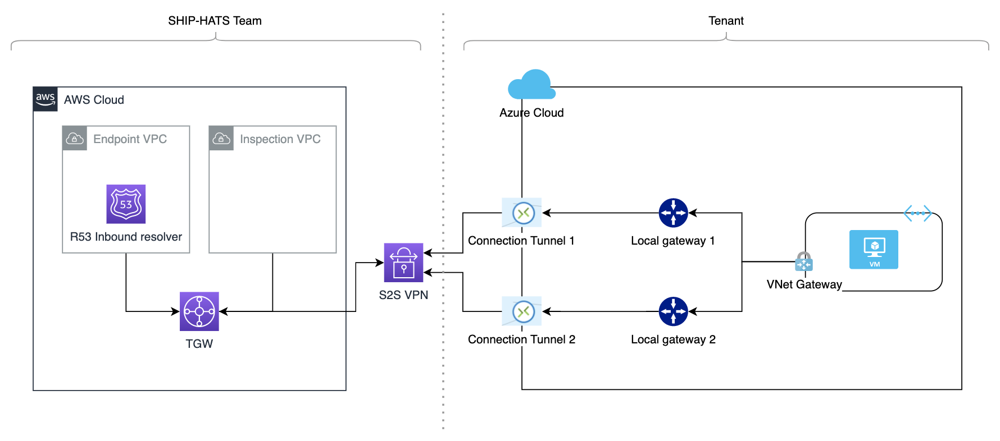

# IPsec Tunnel

You can connect to SHIP-HATS using one of the following methods based on your setup:

- [AWS VPC Endpoint](aws-vpc-endpoint)
- [IPsec Tunnel](#audience)

## Audience

The following topic is intended for tenants on Azure to establish connectivity to AWS GCC 2.0 via a site-to-site VPN Tunnel.

## Setup S2S VPN

1. Provision a blank VNet and a gateway subnet within the blank VNet.
    - VNet must not have any VNet gateway attached that is not visible to us.
    - A gateway subnet of /28 is required. Ensure that there are sufficient addresses for other usage.
1. Provision and configure a Virtual Network gateway: 
    1. Create a VNet gateway in the blank VNet.
        
    </kbd>

    1. Create a public IP and attach it to a new VNet Gateway.
    
    </kbd>
1. Provide following details to the SHIP-HATS team:
    - Your target Azure Virtual Network CIDR range
    - VNet Gateway's public IP address created in previous step

SHIP-HATS team will configure a VPN at AWS GCC 2.0 and share the VPN configuration file.

## Create Local Network Gateways

1. Make a note of the Virtual Private Gateway IPs from the *VPN configuration* file shared by the SHIP-HATS team: 
    - Navigate to **IPsec Tunnel #1** > **Outside IP Addresses** > **Virtual Private Gateway** 
        
    - Navigate to **IPsec Tunnel #2** > **Outside IP Addresses** > **Virtual Private Gateway**
        
1. Provision two Local gateways, one for each of the above Virtual Private Gateway IPs:
    - In the **IP Address** field, enter the Virtual Private Gateway IP from above.
    - In the **Address Space** field, enter the SHIP-HATS GCC 2.0 AWS PROD VPC CIDR: *100.10.4.0/22*. 
1. Click **Review + create**.  

    Your local network gateways are created.

    

## Create Connections

Create two connections - one for each IPsec tunnel. 

1. Navigate to **AWSVnetGateway** > **Connections**, and then click **Add**.
1. In the **Name** field, select the *Local network gateway* from the dropdown list corresponding to IPsec Tunnel 1.
1. In the **Connection type**, select **Site-to-site (IPsec)**.
1. In the **Local network gateway** field, select the gateway for the IPsec Tunnel 1. 
1. In the **Shared key (PSK)** field, copy the value of **Pre-Shared Key** corresponding to IPsec Tunnel 1 from the *VPN configuration* file provided by the SHIP-HATS team.
1. For **IKE Protocol**, select **ikev2**. 
1. Select **OK**.  

    This creates your connection. The new connection appears in the **Connections** grid. 

    Repeat the above steps to create a second connection. Make sure that you select values in the **Name**, **Local network gateway**, and **Shared key (PSK)** fields corresponding to IPsec Tunnel 2.
    

## Set up custom dns server

### To configure custom dns servers on VM that hosts the GitLab runner, complete the following steps:

1. Request the SHIP-HATS team for DNS Resolver IPs. 
1. Log in to Azure portal, and then select **Virtual machines**. 
1. Navigate to the virtual machine that hosts the GitLab runner, and then click **Networking**.
1. Select the Network interface. 
1. Click **Settings** > **DNS servers**.
1. Click **Custom**, and then add the IP address provided by the SHIP-HATS team.
1. Click **Save**.  

    Added DNS server IPs will appear under **Applied DNS servers**.

    

## What's Next

- [Set up GitLab Runners](gitlab-runners)
