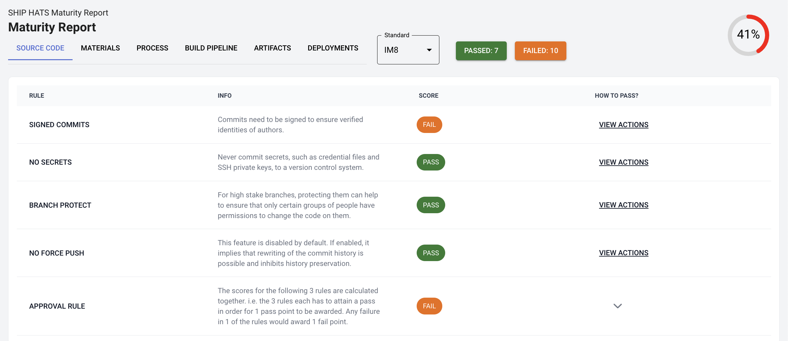
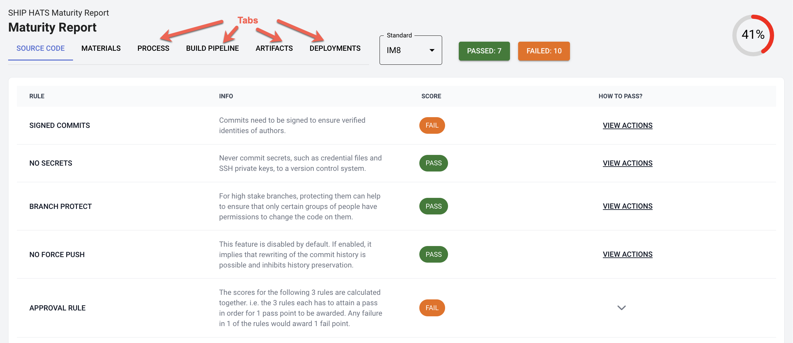
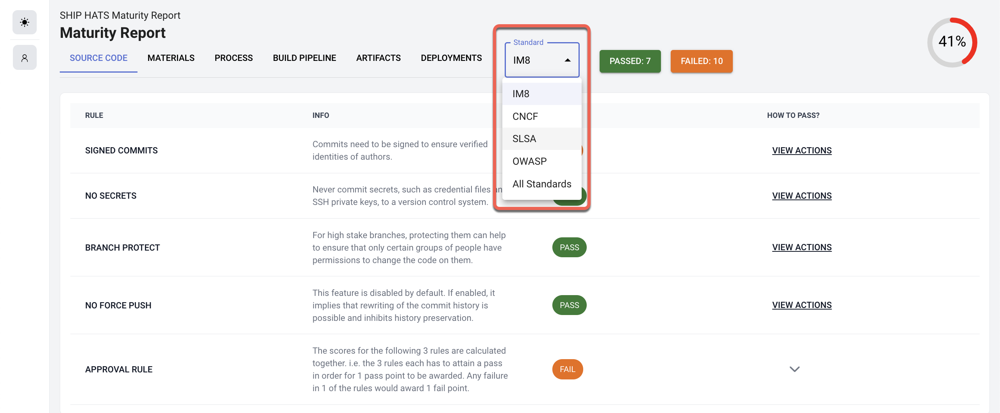
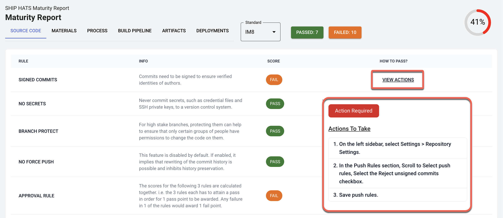

# Metrics

## DevSecOps Maturity Report (Beta)

You can now use the `.generate-maturity-report` template to generate a [report](https://sgts.gitlab-dedicated.com/wog/gvt/ship/ship-hats-templates/-/tree/main/templates#file-gitlab-ci-generate-maturity-reportyml) to measure DevSecOps maturity from users' CI/CD pipelines for a project's default branch. The report is generated as an HTML job artefact for viewing. 

?> We are looking for agencies to be part of this pilot to review features of the report. To take part in pilot, please [reach out to us](https://go.gov.sg/she) to be part of the pilot.

### Benefits 

- Ability to review compliance with IM8 DevSecOps policies
- Greater insight into the adoption of best practices with standards, such as IM8, CNCF, SLSA, OWASP
- Potentially using the report to support RFIs from auditors

### Example

Following image shows an example of DevSecOps Maturity Report:

### Interpreting the report

You can use the following features to interpret the report:

- **View Rules and details based on tabs:** Switch to the tab for which you want to view the Rules and Scores. View [Maturity Report Measuring Metrics](https://sgts.gitlab-dedicated.com/wog/gvt/ship/devsecops-maturity-report/maturity-report/-/blob/main/README.md) for details on each tab and rules included based on the selected standard.

    

- **View Reports based on Standard:** Choose one of the available standards (IM8, CNCF, SLSA, OWASP) to view the report for the selected standard or **All Standards**.

    

- **Take Action for failed score:** Click **View Actions** to view the suggested **Action Required** to pass. You can complete the suggested actions > run the pipeline > generate the report to verify if the Score changed to **PASS**.

    

<!---->

<!--Variable to be set in .POST: $PROJECT_TOKEN-->
