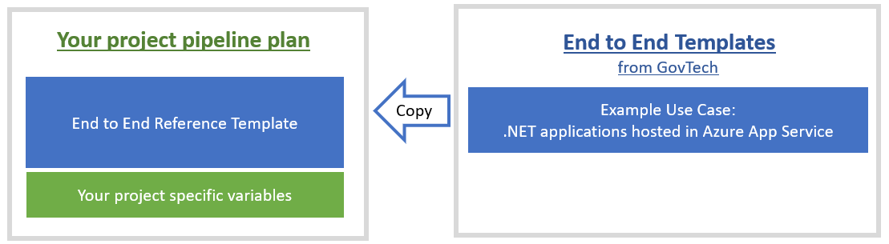
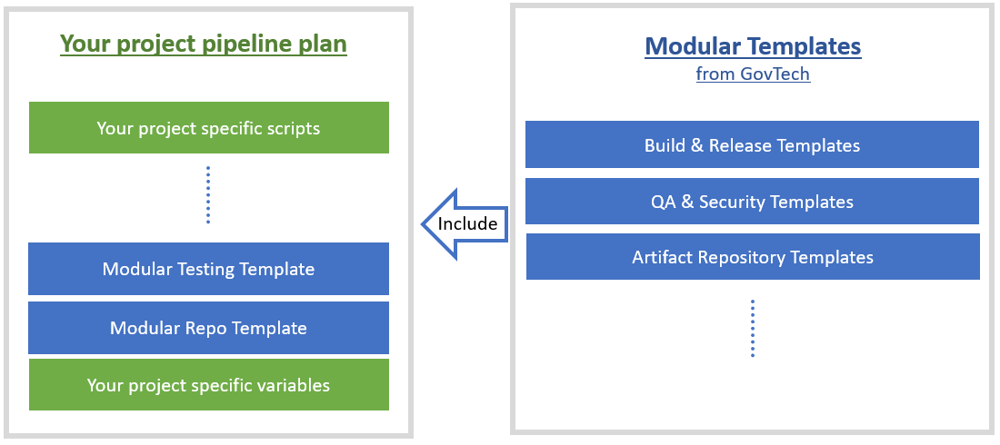

# Pipeline templates

SHIP-HATS Pipeline templates are reusable configuration files that developers can use to configure instead of building from the scratch. The templates help agencies to incorporate best practices for security compliance and performance metrics.  

<!--
**Topics**
- [Types of Templates](#types)
- [List of Templates](#list-of-templates)
-->

## Types

Following types of templates will be provided:

- **End-to-End Reference templates:** An end-to-end CI/CD workflow for a specific use case such as .Net application hosted in Azure App Service, Java application hosted in AWS EC2, etc.  
    
- **Modular templates:** A stand-alone basic template for invoking build, test, deploy tools, etc.   
    

## List of Templates  

This section provides a high level of overview of templates to expect for migrating to SHIP-HATS 2.0 to help the agencies plan the migration.

We will update the link to templates after SHIP-HATS 2.0 is ready. You can bookmark this page as we will update details on existing and upcoming templates regularly.  

|Templates|Description|Template Type|  
|---|---|---|  
.NET Application |An end-to-end CI pipeline for a sample .NET application hosted in Azure App Service|End-to-End   
.NET Docker Application|An end-to-end CI pipeline for sample containerized .NET Core application hosted in AWS Fargate | 	End-to-End  
Node.js Typescript Application 	|An end-to-end CI pipeline for sample Node.js typescript application hosted in Azure App Service | 	End-to-End  
Java Application|An end-to-end CI pipeline for a sample Java application hosted in AWS EC2 | 	End-to-End  
Java Docker Application |An end-to-end CI pipeline for a sample containerized Java application hosted in AWS EKS | 	End-to-End  
Docker Pull from Nexus Repo |A modular template to pull a docker image through SHIP Nexus Repository docker-proxy. 	|Modular for Build & Release  
NPM Configuration for Nexus Repository 	|A modular template to set Nexus Repository as NPM config registry.|Modular for Build & Release   
Maven artefacts publish to Nexus  	|A modular template to publish maven artefacts to SHIP's Nexus Repository.|Modular for Build & Release   
Nexus IQ  	|A modular template to perform Nexus IQ scan on files or directories. 	|Modular for QA & Security   
Robot Framework 	|A modular template to run integration test with the Robot Framework and generate individual reports |Modular for QA & Security
Fortify On Demand SAST 	|A modular template to analyze application source code for exploitable vulnerabilities. |Modular for QA & Security
Fortify On Demand DAST 	|A modular template to identify vulnerabilities in deployed web applications and services. |Modular for QA & Security
SonarQube 	|A modular template to analyze source code and provide analysis for the code quality of a project. |Modular for QA & Security
Prisma container image scan  	|A modular template to scan container images for potential vulnerabilities. |Modular for QA & Security
Purple HATS 	|A modular template to assess whether a product is user-friendly to people with disabilities (PWDs). |Modular for QA & Security  
Readiness check for web application| 	A modular template to check if a web application is ready by querying the URL and searching for a given text in a loop until a given wait duration. 	|Other Modular templates 
Azure Command Line Interface 	|A modular template to invoke Azure CLI commands. |Other Modular templates 
Depcheck for NPM Projects 	|A modular template to perform depcheck for NPM projects to identify unused dependencies. |Other Modular templates 
AWS identity federation 	|A modular template to assume an AWS IAM role in AWS account of the user. |Other Modular templates 

?> The End-to-End Reference templates are derived from the Bamboo plan templates provided by GovTech SVC Clusters & Technology Management Office (CTMO) in SHIP-HATS 1.0.  

<!--
## Modular Templates

### Build and Release

### QA and Security

### Others

## End-to-end Reference Templates

### Effort Planning

## Upcoming Migration Updates

-->