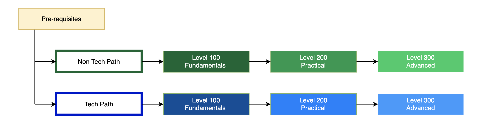

To ensure we support at scale, anyone can access Self-paced trainings. 

## Pre-requisites

### Overview

- [Vision for DevSecOps with SHIP-HATS](https://youtu.be/CeZs3nAK5gY)
- [What is CI/CD?]() 
- [DevSecOps Playbook](https://docs.developer.tech.gov.sg/docs/devsecops-playbook/)

### Know your tools

|Tools|Documentation learning resources|Video tutorials|
|---|---|---|
**GitLab**| [GitLab documentation](https://docs.gitlab.com/) | [Learn with GitLab Tutorials](https://docs.gitlab.com/ee/tutorials/?_gl=1*p30fv0*_ga*MTM3MDkzNjg2MC4xNjU5MzM4MDUx*_ga_ENFH3X7M5Y*MTY2MTI0NjMxNi4xMC4xLjE2NjEyNDg3NTkuMC4wLjA.)
**Jira**| [Overview](https://www.atlassian.com/software/jira/guides/getting-started/overview) | [Tutorials](https://www.atlassian.com/software/jira/guides/getting-started/basics#step-2-pick-a-template)
**Confluence** |[Overview](https://www.atlassian.com/software/confluence/guides/get-started/confluence-overview#hosting-options) | [Tutorials](https://www.atlassian.com/software/confluence/guides/get-started/set-up)
**Fortify on Demand**| |
**Nexus IQ** |[Overview](https://www.sonatype.com/nexus-iq-server)|
**Sonarqube**| [Overview](https://docs.sonarqube.org/latest/)|

## DevSecOps Basic Quiz

Getting ready for SHIP-HATS 2.0? Take a short [DevSecOps Basic quiz](https://forms.office.com/pages/responsepage.aspx?id=2C5u0OVT90SBNoc86LqpOxwQKkSeUz5Anl_vW239zUZUNldQVlVIUEgwUTNMS0ZaMjc5WU0zMklQRyQlQCN0PWcu) to test your fundamentals. 

## Learning resources

### Non Technical

|Level|Sub-level|Category|Courses|
|---|---|---|---|
Level 100|101| SHIP-HATS 2.0 | [Overview video](https://youtu.be/dRfI_zXgiHs) & [Getting Started documentation](ship-hats-overview)
||||[Technical Architecture Video](https://youtu.be/aMARb5xd1qI) & [Technical Architecture Doc](architecture)
||||Subscription  - Coming soon
||||[Using SHIP-HATS Portal](https://docs.developer.tech.gov.sg/docs/ship-hats-portal/)
||102| Tools|[GitLab]() 
Level 200|201 |Automation| Basic CI/CD - Covers the basics of how to set up a pipeline to build, test, and deploy your code
||202 |Measurements |DevOps Metrics with GitLab 
||||Dashboards

### Technical

|Level|Sub-level|Category|Courses|
|---|---|---|---|
Level 100|101 |Overview| [Overview video](https://youtu.be/dRfI_zXgiHs) & [Getting Started documentation](ship-hats-overview)
||| Architecture| [Technical Architecture Video](https://youtu.be/aMARb5xd1qI) & [Technical Architecture Doc](architecture)
||| Access| [TechPass](https://docs.developer.tech.gov.sg/docs?product=TechPass) & [SEED](https://docs.developer.tech.gov.sg/docs/security-suite-for-engineering-endpoint-devices/)
||T101 |Automation|Understanding Runners
||||Basic CI/CD - the basics of how to set up a pipeline to build, test, and deploy your code
||||[Pipeline templates overview](pipeline-templates)
||T102 |Management & Measurements | GitLab as a PM tool 
||||Issues, labels, and boards
||||DevOps Metrics with GitLab 
||||Dashboards
Level 200|T201 |Automation|Advanced CI/CD  - advanced topics such as includes/extends templates, rules, child pipelines , compliance pipelines
||T203 |Security|GitLab Security, Compliance
||T204 |Cloud Ops|GitOps with GitLab 
||T205 |Innersourcing|WOG public repos setup
||||MR/PR best practices

 

<!--

## For Project Manager & Business Analysts

|Category|Topics|
|---|---|
|Prerequisites|- [Read the recommended best practices in the DevSecOps playbook](https://docs.developer.tech.gov.sg/docs/devsecops-playbook/) - [Learn the CI/CD basics](https://docs.developer.tech.gov.sg/docs/devsecops-playbook/devsecops-playbook?id=elements-of-devsecops-continuous-integration-amp-continuous-delivery)|
|Products 101|- CI/CD with GitLab (Coming in September)
|Onboarding to SHIP-HATS|- Pricing & Subscription Overview (Coming in October) - [Subscription Process](https://docs.developer.tech.gov.sg/docs/ship-hats-getting-started/subscription) 

## For Developers

|Category|Topics|
|---|---|
|Prerequisites|- [Read the recommended best practices in the DevSecOps playbook](https://docs.developer.tech.gov.sg/docs/devsecops-playbook/) - [Learn the CI/CD basics](https://docs.developer.tech.gov.sg/docs/devsecops-playbook/devsecops-playbook?id=elements-of-devsecops-continuous-integration-amp-continuous-delivery)|
|Products 101|- CI/CD with GitLab (Coming in September)
|SHIP-HATS 101|- [Architecture Overview](https://docs.developer.tech.gov.sg/docs/ship-hats-getting-started/architecture) - Tools Overview (coming soon)
-->

<!--
---
Option 2

---

### Pre-requisites

- [Read the recommended best practices in the DevSecOps playbook](https://docs.developer.tech.gov.sg/docs/devsecops-playbook/)
- [Learn the CI/CD basics]()
-->
<!--
|Pre-requisites||
|---|---|
[DevSecOps](https://docs.developer.tech.gov.sg/docs/devsecops-playbook/) – read the recommended best practices in the playbook|Tech Doc
CI/CD basics|Self-learn
-->

<!--
### Products 101
- CI/CD with GitLab [Coming in September]
    - Video Playlist
- Should we list tutorials of non GitLab tools??|
-->

<!--
|Products 101||
|---|---|
CI/CD with GitLab [Coming in September]|Video Playlist
Should we list tutorials of non GitLab tools??|
-->
 
<!--
### Onboarding SHIP-HATS

- [Pricing & Subscription Overview [Coming in October]]()
- [Subscription Process](subscription) 

-->

<!--
|Onboarding SHIP-HATS||
|---|---|
Pricing & Subscription Overview [Coming in October]|Video
Subscription Process |Tech Doc
-->
<!--
### SHIP-HATS 101

- [Project management using SHIP-HATS Portal]()
-->
<!--
|SHIP-HATS 101||
|---|---|
Project management using SHIP-HATS Portal|Tech Doc
-->

<!--
## For Developers

### Prerequisites

- [Read the recommended best practices in the DevSecOps playbook](https://docs.developer.tech.gov.sg/docs/devsecops-playbook/)
- [Learn the CI/CD basics]()

### Products 101

- CI/CD with GitLab [Coming in September]
    - Video Playlist
- Should we list tutorials of non GitLab tools??
 

### SHIP-HATS 101

- [Architecture Overview](architecture)
- [Templates Overview](templates)
- [Tools Overview]()
-->

<!--
|Topic|Resources|
|---|---|
Architecture Overview | Tech Doc
Templates Overview |Tech Doc
Tools Overview|Tech Doc
-->