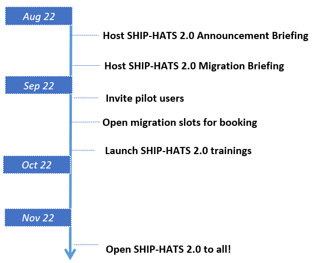

# Change Management

We will guide you through the internal processes such as estimating migration effort, seeking pricing approvals, and planning migration with your vendors (if applicable).

**Topics**
- [What you can do now](#what-you-can-do-now)
- [Upcoming Migration Updates](#upcoming-migration-updates)

## What you can do now

1.	**Identify 1st system to migrate Plan:** Evaluate your systems on SHIP-HATS and identify a system based on [System for Early Migration](ship-hats-migration-annex#systems-for-early-migration) recommendations.
2.	**Plan timeline:** Based on the high-level [migration approach](ship-hats-migration), identify the best suited time for migration.
3.	**Heads up stakeholders:** Prepare your stakeholders on the upcoming migration and possible budget approvals to support the effort. 
4.	**Let us know:** If you have dependencies that are time sensitive, [log a ticket](http://go.gov.sg/she) with description of the systems, the time constraints, and information that you require. We will engage on a case-by-case basis for urgent requirements. 

## Upcoming Migration Updates
<!--
### Q1 FY22
1. Share details on types of pipeline templates from GovTech.
-->

- **SHIP-HATS 2.0 Briefing** is slated for 19th August 10 AM – 12 PM. The session will provide an overview of the tools, update on pricing, and next steps to plan migration. Look out for the email with details next week!
- **Pilots on SHIP-HATS 2.0** will start early September. They are by invitation only as we have limited features and support during this phase.
- **New subscriptions** will be on SHIP-HATS 2.0 from November. If you have projects that must start earlier, please [log a ticket](http://go.gov.sg/she) to discuss further. The SHIP-HATS team can assess the project complexity to help plan the onboarding.
