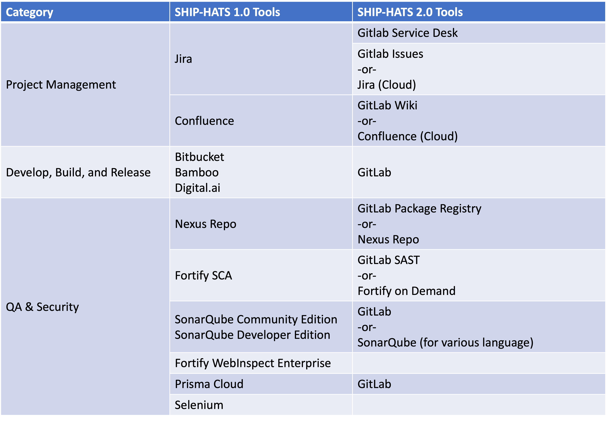

# SHIP-HATS Migration Overview

We are upgrading to SHIP-HATS 2.0. **SHIP-HATS 2.0 will be running on GitLab**, offering a seamless experience for Agencies to implement an end-to-end SaaS-based CI/CD solution.
<!--
**Topics**
- [Change Summary](#change-summary)
- [Why this Change is Essential](#why-this-change-is-essential)
- [Key Benefits](#key-benefits)
-->
## Change Summary

<!---->

|Stage|Tools in 1.0|Tools in 2.0 |Tools in 2.0|
|---|---|---|---|
|-|-|**GitLab Native**|**Alternative Tool**|
|Access|OpenVPN|TechPass & SEED|TechPass & SEED|
|Plan|Jira|GitLab Issues|Jira Cloud (new!)	
|Plan|Confluence|GitLab Wiki| Confluence Cloud (new!)	
|Plan|Thinking Hats|Gitlab Security Dashboard|NA	
|Develop|Bitbucket|GitLab CI/CD|NA|
|Build|Bamboo|GitLab CI/CD|NA|
|Build|Nexus Repository Pro|GitLab Package Registry|Nexus Repository Pro|
|Build|Nexus Intelligence/Nexus IQ Server|GitLab Dependency Scanning|Nexus Intelligence/Nexus IQ Server|
|Build Testing|Fortify Static Code Analyzer	|GitLab SAST|Fortify-on-Demand SAST(new!)
|Other Tests|SonarQube Community/Developer Edition|GitLab Code Quality Scanning Tool |SonarQube Community/Developer Edition
|Other Tests|Fortify WebInspect Enterprise|GitLab DAST|Fortify-on-demand DAST (new!)
|Other Tests|NA|GitLab Container Scanning|NA
|Other Tests|pCloudy Test Farm|NA|pCloudy Test Farm
|Other Tests|Purple HATS|GitLab (Pa11y)|Purple HATS
|Deploy & Release|Digital.ai|GitLab CI/CD|NA|

### Pipeline Definition Format

CI/CD pipeline in SHIP-HATS 2.0 uses [YAML](https://en.wikipedia.org/wiki/YAML) for configuration. 

## Why this Change is Essential
Atlassian is sunsetting the support for self-hosted Bitbucket and Bamboo. Therefore, we must replace these tools.  

We are taking the opportunity to move to GitLab (a SaaS model) that enables you to enjoy the benefits of a more progressive CI/CD product with value-added features. Moving from self-hosted COTS to GitLab also enables us to focus our engineering efforts on supporting you with more comprehensive CI/CD templates and other resources to help you get started faster.

## Key Benefits

- **A modernized and updated CI/CD platform:** Stronger integration of CI and CD tools making it easier for agencies to adopt CD using GitLab 
- **Ease of compliance:** Automated DevSecOps capabilities and pipeline-as-a-code to comply with the new DevSecOps Policy easily 
- **Performance Management Dashboard:** Value-Stream Measurement capabilities that allow Agencies to capture key industry metrics, such as lead time to deployment and deployment frequency, to monitor the effectiveness of their DevSecOps practices 
- **Ease of access:** Secure and VPN-less access to the SHIP-HATS 2.0 platform  

?> **Note:** The benefits will be rolled out in phases.
