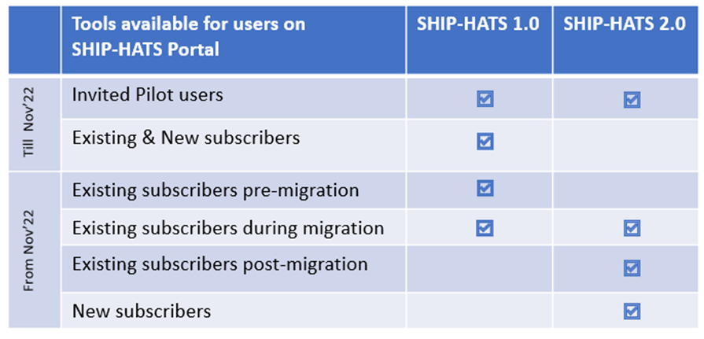

# What to Expect

We are upgrading to SHIP-HATS 2.0, which will be running on GitLab, offering a more seamless experience for Agencies to implement an end-to-end SaaS-based CI/CD solution.

**Topics**
- [Timelines](#timelines)
- [Pricing](#pricing)
- [Tools available on Portal](#tools-available-on-portal)
- [Staggered Migration](#staggered-migration)
- [Tooling Strategy](#tooling-strategy)

## Timelines

| **Timeline** | **Key Milestone** | **Status** |
| --- | --- | --- |
|  Q4' FY21 | <ul><li>SaaS CI/CD tool evaluation completed</li><li>High-level [migration approach](ship-hats-migration#migration) ready</li><li>[Training approach](ship-hats-migration#training) ready</li><li>Migration documentation launched</li></ul> |  **Completed**|
|  Q1' FY22 | <ul><li>Complete tool procurement</li></ul> |  **Completed** |  
|  Q2' FY22 | <ul><li>SHIP-HATS 2.0 Announcement</li><li>Test with pilots (by invitation only)</li><li>Launch SHIP-HATS 2.0 Training</li><li>Open Migration Booking slots</li></ul>|  To be started |  

?> Support for SHIP-HATS 1.0 will continue for **at least 1 year** from the roll out of SHIP-HATS 2.0 for all users. 

## Key Tool Decommission Dates

[Key Tool Decommission Dates](key-tool-decommission-dates.md ':include')

## Pricing
For all planning purposes, you can refer to current [Standard Pricing](https://sgdcs.sgnet.gov.sg/sites/IDA-GoSync/gdspdd-ai/ship/_layouts/15/start.aspx#/SitePages/Pricing.aspx) (can be accessed by Public Officers on the Intranet). We will announce the details on the new subscription prices by end of Q2’ FY22. We will help Agencies migrate the current subscription to SHIP-HATS 2.0 subscription model including signing of an updated Service Agreements. 

## Tools available on Portal

## Staggered Migration
 
We want our users to have minimal disruptions. We will fine tune the migration steps during pilots. We will open appointment slots for migration planning in Q2 and SHIP-HATS 2.0 will be open for all from November. 

In Q3' FY22, we will be inviting Agencies to start migration. For more information on how to choose projects for migration, refer to [System for Early Migration](ship-hats-migration-annex#systems-for-early-migration) in the Annex section. 

<!--
## Tooling Strategy

[Tooling Strategy](tooling-strategy.md ':include')

-->