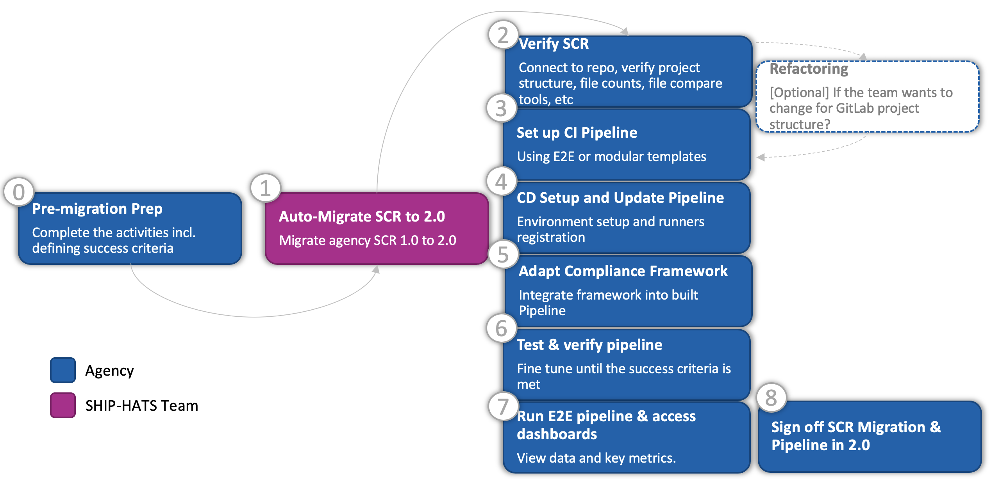
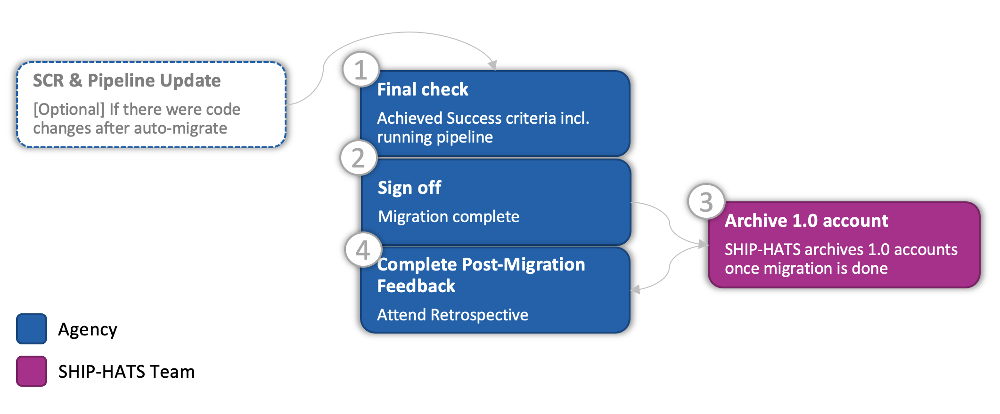
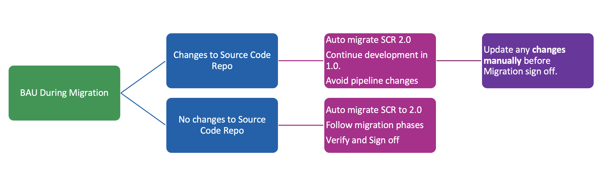

# Migration Approach

## Migration Phases

Following table provides high-level migration phases and key activities. 

|Phase|Set up & Test|Go Live|
|---|---|---|
|Core Activity|1. Auto-migrate SCR to 2.0   2. Set up pipeline using E2E or modular templates  3. Test & Verify|1. Final updates & verification in 2.0|
|Sign offs|SCR and pipeline in 2.0|Migration completion & switch off 1.0|

## Migration Steps

The following images show the steps that you must complete to migrate to SHIP-HATS 2.0 during the [two phases](#migration-phases):

### Phase Set up & Test

### Phase Go Live

## What happens to BAU during migration

Agencies have access to SHIP-HATS 1.0 until they complete migration. 

The following images shows activities to ensure business as usual during migration: 

## Migration Support

Following table shows two support options available during migration:

## Estimate Effort

### To estimate effort, complete the following steps:

1. Understand Migration activities
    - Tech prep
    - Source Code Repo Migration
    - Pipeline set up using templates
1. Review current pipeline
1. Identify any project requires refactoring
1. Identify if your project requires CD setup in advance and agency environment setup

## Book Migration Slots

### What is a Migration slot?

These are 6, 9, or 12-week long windows available for Agency to complete their migration.

### How it works
1. Each subscriber book one slot based on when they want to migrate by 31 December 2022. We recommend moving all projects in the same slot.
1. Choose a support option:
    
    |Migration Support|Link to book slot|
    |---|---|
    |Guided Migration Slots|[https://go.gov.sg/shiphats2-booking-guided](https://go.gov.sg/shiphats2-booking-guided)
    Self-led Migration Slots|[https://go.gov.sg/shiphats2-booking-self](https://go.gov.sg/shiphats2-booking-self)
1. A SHIP-HATS consultant is assigned per subscriber for guidance during this period
1. Agency completes migration by the end of the slot

