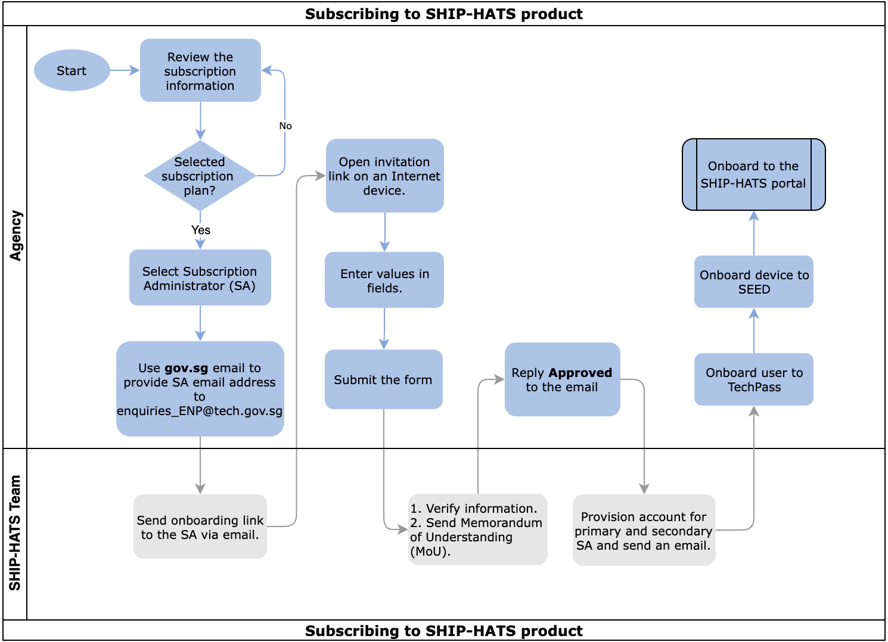

# Onboard to SHIP-HATS

The following topic provides details for **onboarding to SHIP-HATS after GA** in January 2023. 

!> **Important:** After GA in January 2023, SA can use the [TechBiz service to subscribe to SHIP-HATS](https://docs.developer.tech.gov.sg/docs/techbiz-documentation/) to [onboard to the SHIP-HATS product](#onboarding-steps).

## Onboarding steps

To onboard or subscribe to SHIP-HATS, the [Subscription Administrator (SA)](#user-roles-and-permissions) must complete the following steps:

|Step|Task|Owner|
|---|---|---|
|1| Review and decide the [Subscription](subscription) required.|[Subscription Administrator (SA)](#user-roles-and-permissions)
|2 |After GA in January 2023, you can use the **[TechBiz service to subscribe to SHIP-HATS](https://docs.developer.tech.gov.sg/docs/techbiz-documentation/) to onboard to the SHIP-HATS product**.|  SA

## Post onboarding steps
After you have onboarded or subscribed to the SHIP-HATS product via the TechBiz service, complete the following steps:

|Step|Task|Owner|
|---|---|---|
|1|[Onboard to the SHIP-HATS Portal](https://docs.developer.tech.gov.sg/docs/ship-hats-portal/onboarding-to-portal)     If you are using an Internet device to onboard to the SHIP-HATS portal, your device must be [Onboarded to SEED](https://docs.developer.tech.gov.sg/docs/security-suite-for-engineering-endpoint-devices/#/) before SA can [Onboard to the SHIP-HATS Portal](https://docs.developer.tech.gov.sg/docs/ship-hats-portal/onboarding-to-portal).|SA
|2|[Create a project](https://docs.developer.tech.gov.sg/docs/ship-hats-portal/manage-projects) |SA
|3|[Invite a Project Administrator (PA)](https://docs.developer.tech.gov.sg/docs/ship-hats-portal/manage-admins)|SA  
|4|[Provision GitLab](https://docs.developer.tech.gov.sg/docs/ship-hats-portal/manage-tools)|[Project Administrator (PA)](#user-roles-and-permissions)|
|5|[Log in to GitLab on your SEED device](https://docs.developer.tech.gov.sg/docs/ship-hats-tools/gitlab/gitlab-login)  SHIP-HATS 2.0 GitLab: https://sgts.gitlab-dedicated.com/ |PA|
|6|Navigate to your GitLab group  `https://sgts.gitlab-dedicated.com/WOG/<agencyname>/<groupname>`|PA|
|7|Verify GitLab Group created during TechBiz Subscription onboarding|PA|
|8|[Add SSH Key to securely communicate with GitLab](communicate-using-ssh-keys)|PA
|9|[Add a GPG (for signed commits) from your SEED Device](signing-commits-with-gpg)|PA
|9|Set up Environment Connectivity via [AWS VPC Endpoint](aws-vpc-endpoint) or [IPsec Tunnel](ipsec-tunnel)    This is an optional step.|PA|
|10|[Set up GitLab Runners](gitlab-runners)    This is an optional step.|PA

## What's next 

- [Onboard additional users in the SHIP-HATS portal](https://docs.developer.tech.gov.sg/docs/ship-hats-portal/onboarding-users)
- [Create additional projects in the SHIP-HATS portal as needed](https://docs.developer.tech.gov.sg/docs/ship-hats-portal/manage-projects)
- [Add project tools or SHIP-HATS services via SHIP-HATS portal](https://docs.developer.tech.gov.sg/docs/ship-hats-portal/manage-tools)
- [Add applications/projects for project tools](https://docs.developer.tech.gov.sg/docs/ship-hats-portal/manage-applications)

## User roles and permissions

[User roles and permissions](user-roles-permissions.md ':include')

<!--**Topics**
- [Prerequisites](#prerequisites)
- [Subscribing](#subscribing)
-->

<!--
## Prerequisites

- Make sure that you have the required [Subscription](subscription).
- A session is active for 20 minutes. Therefore, we recommend having the following details before clicking the onboarding link that you receive in your email: 
    |Information|Particulars Required|Notes|
    |---|---|---|
    |Details of the Primary and Secondary Subscription Admins|Name Email Mobile Number|For more information, refer to *User roles and permissions* content below.|
    |Details of the Billing contact|Name Email Contact Number Address  Sub Business Unit code details|Sub Business Unit (SUB BU) is not your Department code. Please work with your finance team for the SUB BU code.|
    |Approval of the subscription by a MIC (Manager In-Charge).|The approver of the subscription has to be Deputy Director and above for signatory.|None|
    |Approver Details|Name Email Designation|None| 
- The onboarding link only lasts for 14 days. If you require an extension, send an email to [enquiries_ENP@tech.gov.sg](mailto:enquiries_ENP@tech.gov.sg).

## Subscribing 

The following image and table outlines the steps that you must complete to get started with SHIP-HATS. After you have completed these steps, you will need to perform additional steps to onboard to the SHIP-HATS portal and configure the tools that you want to use.  

These tasks may be completed by multiple people in your organization and SHIP-HATS team. However, these tasks must be completed in the specified order. All steps are required unless otherwise noted.
-->
<!---->
<!--

  

|Step|Task|Owner|
|---|---|---|
|1|[Review the Subscription information](subscription).|Agency|
|2|Use your `gov.sg` email to send a request to [enquiries_ENP@tech.gov.sg](mailto:enquiries_ENP@tech.gov.sg) with the email address of your Primary Subscription Admin (SA).|Agency|
|3|Send onboarding link to the SA via email.|SHIP-HATS|
|4|Open the invitation link on an Internet device, enter the fields, and then submit the onboarding form.|Agency|
|5|Verify the information and send an email with the Memorandum of Understanding (MoU) to the approver nominated in the onboarding form.|SHIP-HATS|
|6|Reply `Approved` after receiving the email.|Agency Approver|
|7|SHIP-HATS Team provisions account for the Primary and Secondary SA.|SHIP-HATS |
|8|Send an email to SAs indicating that their account has been provisioned.|SHIP-HATS |
|9|[Onboard to TechPass](https://docs.developer.tech.gov.sg/docs/techpass-user-guide/onboard-public-officers-using-non-se-machines).|Agency|
|10|[Onboard to SEED](https://docs.developer.tech.gov.sg/docs/security-suite-for-engineering-endpoint-devices/#/).|Agency|
|11|[Onboard to the SHIP-HATS Portal](https://docs.developer.tech.gov.sg/docs/ship-hats-portal/onboarding-to-portal).| Subscription Admin (SA)|

-->

<!--
### What's Next
- [Complete the setup in the SHIP-HATS portal](https://docs.developer.tech.gov.sg/docs/ship-hats-portal/#/onboarding-to-portal)
- [Invite Users via the SHIP-HATS Portal](https://docs.developer.tech.gov.sg/docs/ship-hats-portal/#/manage-users?id=invite-users) 

### Related Topics
- [User roles and permissions](https://docs.developer.tech.gov.sg/docs/ship-hats-portal/#/user-roles-and-permissions)-->

<!--

1. Use gov.sg email to send a request to [enquiries_ENP@tech.gov.sg](mailto:enquiries_ENP@tech.gov.sg) with the email address of your Primary Subscription Admin (SA).  
1. The SA receives the onboarding link via email.
1. Open the invitation link on an Internet device, enter the fields, and then submit the onboarding form. 
1. SHIP-HATS Team verifies the information. 
1. System will send an email with the Memorandum of Understanding (MoU) to the approver nominated in the onboarding form. 
1. Agency's approver is required to reply 'Approved’ after receiving the email. 
1. After approver replies, SHIP-HATS Team provisions the Primary SA and Secondary SA's account. 
1. SAs will receive an email to inform that your account is provisioned. 
1. SAs log into [SHIP-HATS Portal](http://ship.gov.sg) after their accounts have been provisioned and send the [invitation link](https://docs.developer.tech.gov.sg/docs/ship-hats-documentation/#/manage-users?id=invite-users) to their users for them to self-create accounts and approve the user accounts.
-->

