# Step 2: Onboard to SHIP-HATS

?> Complete these steps in the **[SHIP-HATS Portal](https://portal.ship.gov.sg/)**.

You can **[access video for onboarding to SHIP-HATS portal](https://youtu.be/DCJQEOX0HIA?t=2558)**.

## Step 2a: Access SHIP-HATS Portal

**To access the SHIP-HATS portal**

1. Go to the [SHIP-HATS portal](https://portal.ship.gov.sg/).
1. Click **Login with TechPass**.

1. If you are a **new user**:
    1. Enter your **Enter your TechPass details**, and then click **Next**.  
        You will be redirected to the GCC log-in page. 
    1. Enter your TechPass email address along with the verification code from the Authenticator app, and then click sign in. 

    5. Read through the **TechPass** Terms of Use, and then click **Accept**.

    6. Read through the **TechPass MDM** Terms of Use, and then click **Accept**.
1. If you are an **existing user**, select your TechPass account.  
1. Under your name, select **Switch account**, and then select the account that you created in TechBiz.  

    You have successfully linked your TechPass to SHIP-HATS. You can directly log in using TechPass for future access.  

    The **Overview** page appears, providing the dashboard view of the subscription account. 

    <kbd>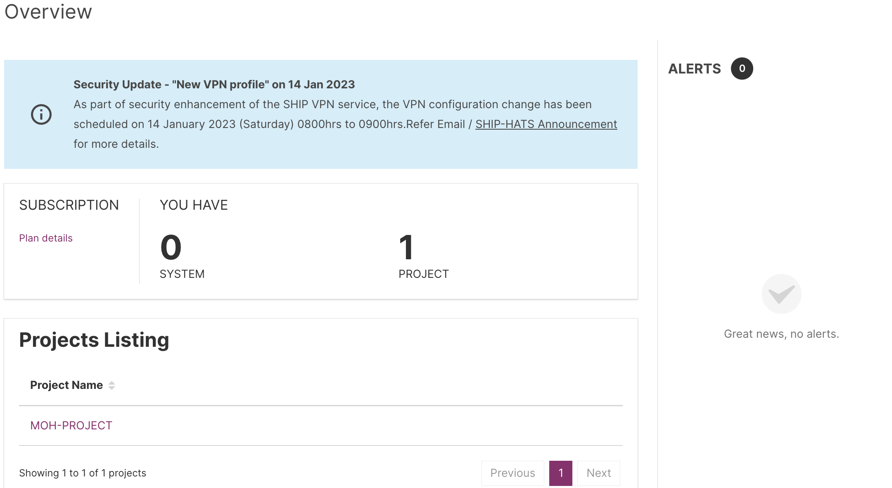</kbd>    

## Step 2b: Verify Users and System (s)

Subscription Admin (SA) and Project Admin (PA) can view all users associated with a subscription account and their roles in their account if the users were added in the [TechBiz portal](https://portal.techbiz.suite.gov.sg/).

**To view users**

1. Log in to the [SHIP-HATS portal](https://portal.ship.gov.sg/).  

   > **Tip:** Make sure that you are in the required account. 

1. From the side menu, click **Users > All Users**.  

   A list of users appears, along with following details:

   >**Note:** Users will appear here only if they were added in the [TechBiz portal](https://portal.techbiz.suite.gov.sg/).

   

   |Column|Description|
   |---|---|
   **Name**|Indicates the name of the user.  If *First Name* and *Last Name* were not provided when creating a new user account, only email address will appear in this column. If a user is a Subscription Admin, it is indicated by the label **Subscr Admin** beside the username.
   **Project Role**|Indicates whether a user is a Project Admin.
   **GitLab**|Indicates whether the user is consuming GitLab tools quota from the current subscription. The quota consumed/quota available is indicated at the top of the screen. For example, *5 / 8 GitLab quota consumed.* 
   **Jira/Confluence**| Indicates whether the user is consuming the Jira/Confluence tools quota from the current subscription. The quota consumed/quota available is indicated at the top of the screen. For example, *1 / 3 Jira/Confluence quota consumed.*
   **Sonatype**|Indicates whether the user is consuming Sonatype tools quota from the current subscription. The quota consumed/quota available is indicated at the top of the screen. For example, *1 / 1 Sonatype quota consumed.*
   **Last Login**|Indicates the date and time when the user logged in the last time. The time indicated is based on data captured until the daily scheduled job runs.

## Step 2c: Create Project

Subscription Admin (SA) can create new projects in SHIP-HATS.

**To create a new project**

1. From the side menu, click **Workspace**.
    
    The **Systems** screen appears, displaying all the systems added to your subscription.

    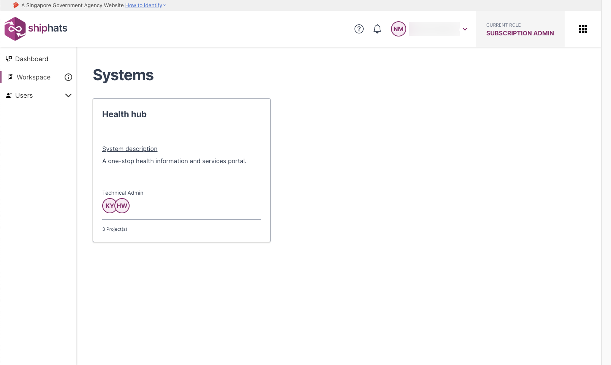

1. Select the System to which you want to add a project. 

    The **Projects** screen appears, displaying all the previously added projects. 

    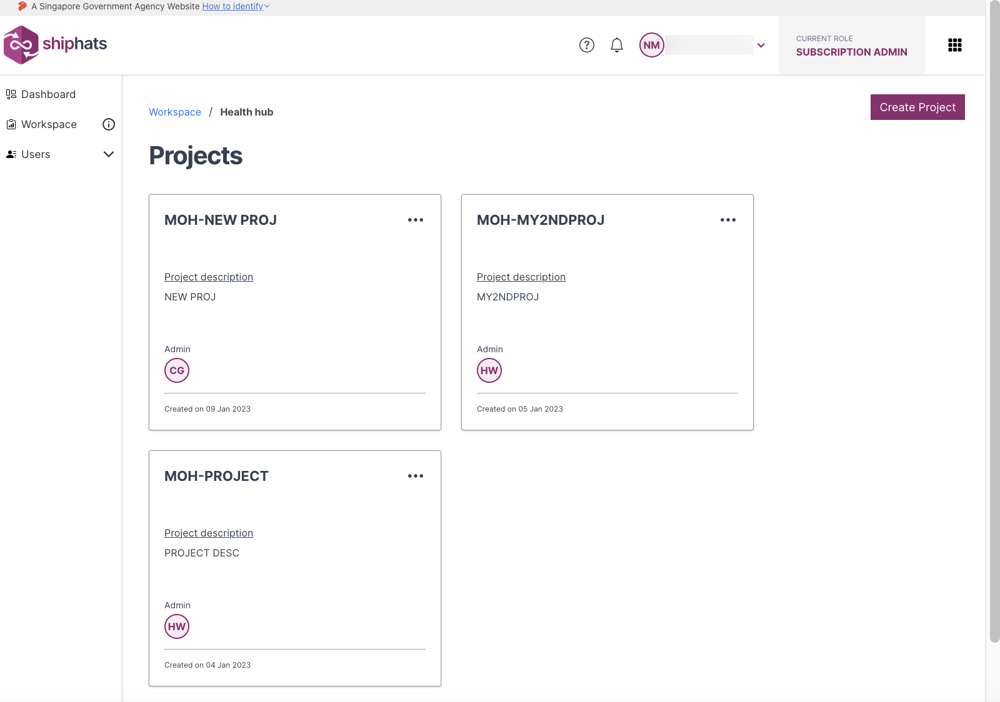

1. Click **Create Project**.  

    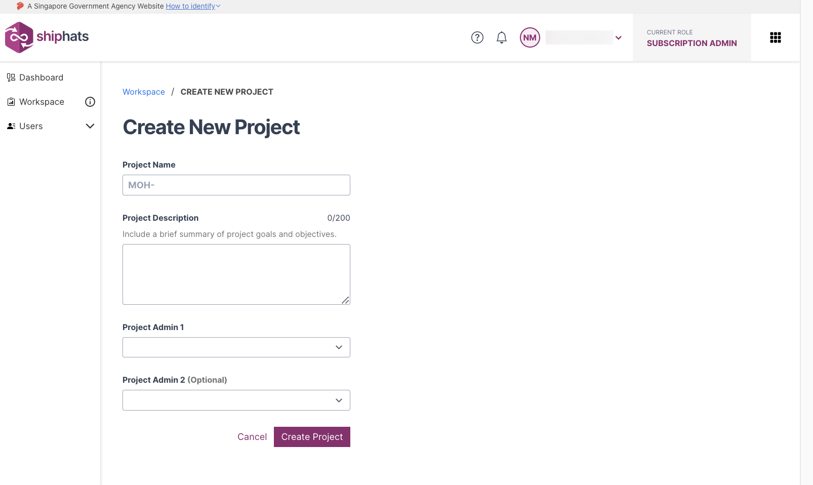

1. Provide information in the following fields:

    |Field|Description|
    |---|---|
    |**Project Name**| Specify name of the project. Your agency name is prefixed to the project name automatically. 
    |**Project Description**| Specify details of the project. 
    |**Project Admin 1**| Select Project Admin from the drop-down list. Users will appear here only if they were added in the [TechBiz portal](https://portal.techbiz.suite.gov.sg/).<!--If you want to invite new users, click **Invite here**. If *First Name* and *Last Name* were not provided when creating a new user account, email address will appear in the drop-down list.-->
    |**Project Admin 2**| This is an optional field. Select a second Project Admin from the drop-down list. Users will appear here only if they were added in the [TechBiz portal](https://portal.techbiz.suite.gov.sg/).<!--If *First Name* and *Last Name* were not provided when creating a new user account, email address will appear in the drop-down list.--> 
1. Click **Create Project**.  
    
    A message appears, indicating **Project Created Successfully**. The created project appears on the **Projects** screen.

    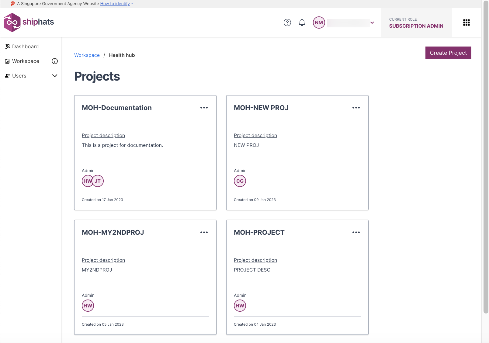

## Step 2d: Assign Project Admins

Subscription Admins can add Project Admins using the SHIP-HATS portal. When creating a project in an account, it is mandatory to specify at least one Project Admin. SAs can add additional PAs anytime in the future.  

**To add a project admin**

1. From the side menu, click **Workspace**.

    > **Tip:** 

    The **Systems** screen appears, displaying all the systems added to your subscription.

    

1. Select the System. 

    The **Projects** screen appears, displaying all the previously added projects. 

    

1. Locate the project for which you want to add a Project Admin, and then click three dots for more options.

    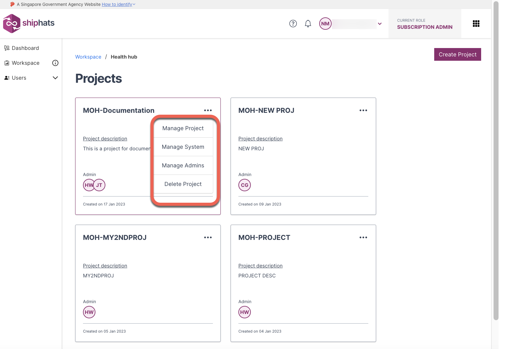

1. Click **Manage Admins** > **Add New**.  

    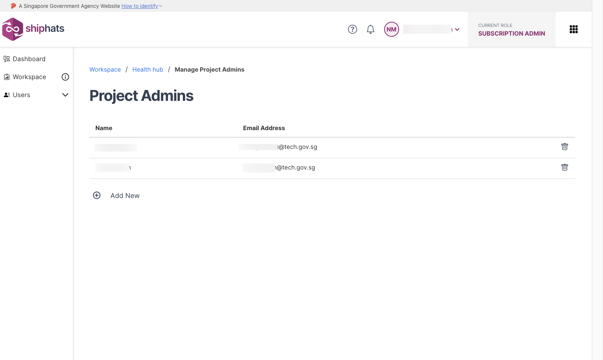

1. In the **Select Admin** drop down list, select the required user.

    >**Note:** Users will appear here only if they were added in the [TechBiz portal](https://portal.techbiz.suite.gov.sg/). <!--If *First Name* and *Last Name* were not provided when creating a new user account, email address will appear in the drop-down list.-->

    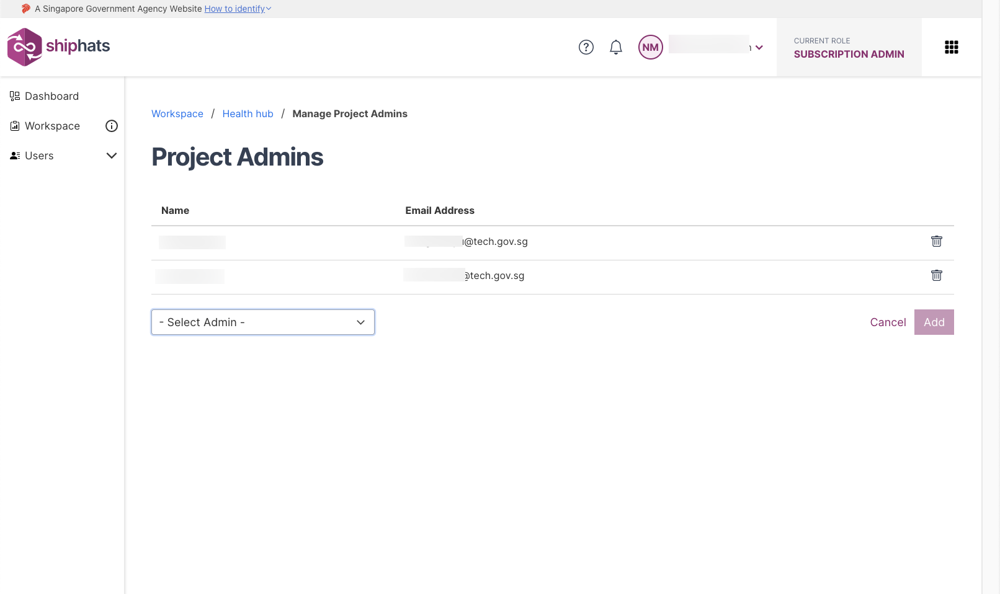

1. Click **Add** to add this user as a project admin.  
   
   After a user is successfully added, an email notification will be sent to the requesting SA with copy sent to other SA and the newly added PA.

## Step 2e: Add GitLab

SA or PA can add the tools (GitLab and add-ons) under the **Subscribed Tools** section based on the tools subscribed in the [TechBiz portal](https://portal.techbiz.suite.gov.sg/).  

**To add tools**

1. From the side menu, click **Workspace**.
    
    The **Systems** screen appears, displaying all the systems added to your subscription.

    

1. Select the System for which you want to view projects. 

    The **Projects** screen appears, displaying all the previously added projects. 

    

1. Locate the project to which you want to add a tool, and then click the project.

    **Project Description** screen appears, displaying the **Subscribed Tools** that the SA added in the TechBiz portal. You can also view **Not Subscribed Tools** that SA can subscribe via the TechBiz portal.

    > **Note:** Alternately, click three dots for more options, and then click **Manage Project**.

    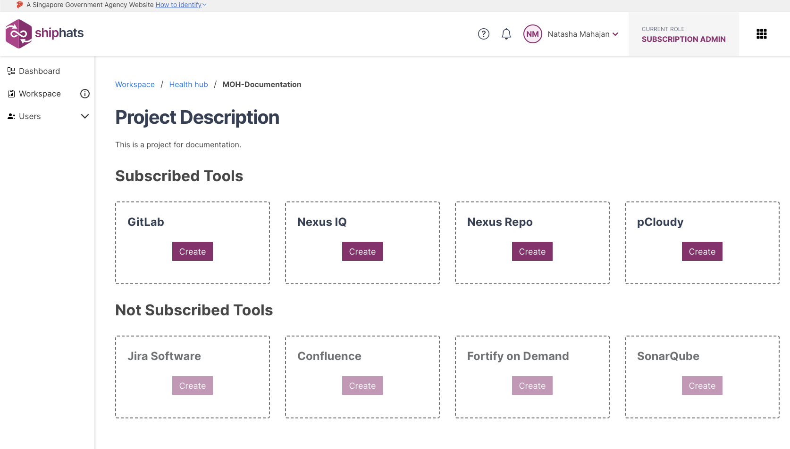

1. Locate the tool that you want to add, click **Create**, and follow the specific steps in table for the tool that you want to add.

    |Available Tools (Base)|Steps|
    |---|---|
    |**GitLab**|Make sure that at least 1 Project Admin has a GitLab account and is added to the TechPass group. Provide value in the **GitLab Group Name** field. <!-- If you cannot find your system in the drop-down list, follow the steps to [Declare a DGP System](declare-dgp-systems).-->   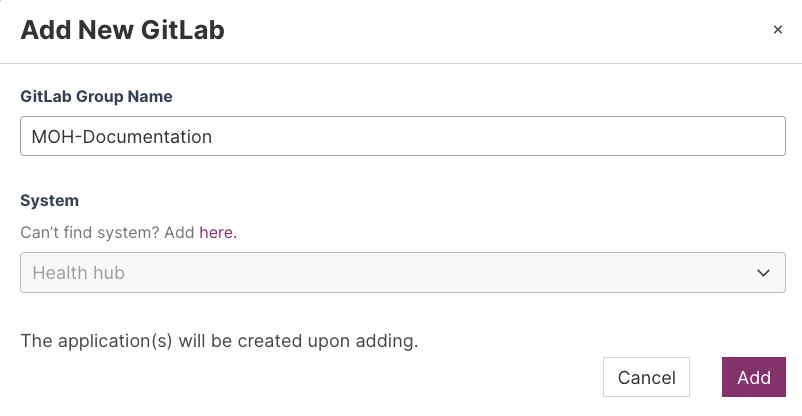
    |**Nexus IQ**|Provide values in the **Application Name** and **Application ID** fields.|
    |**Nexus Repo**|Submit a [service request](https://jira.ship.gov.sg/servicedesk/customer/portal/11/) to add this tool.
    |**pCloudy**|The **Add New pCloudy Application** popup appears, displaying the allowed number of parallel shared mobile device tests.|

    |Available Tools (Add-ons)|Steps|
    |---|---|
    |**Confluence**|Make sure that you have subscribed to this product via the TechBiz portal for it to be listed in **Subscribed Tools**. Provide value in the **Project Name** field.   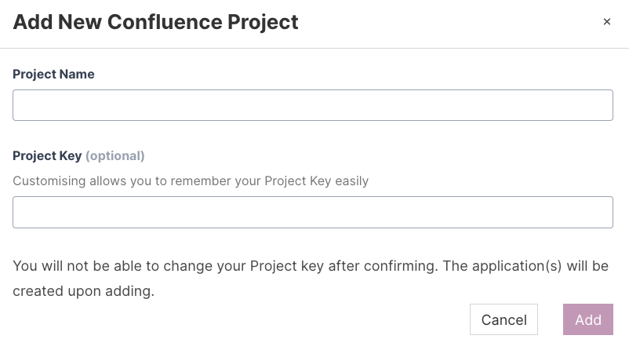
    |**Fortify on Demand**| Make sure that you have subscribed to this product via the TechBiz portal for it to be listed in **Subscribed Tools**. Provide value in the **Application Name** and **Release name** fields. **Release name** is an optional field.      
    |**Jira**|Make sure that you have subscribed to this product via the TechBiz portal for it to be listed in **Subscribed Tools**. Provide value in the **Project Name** field.  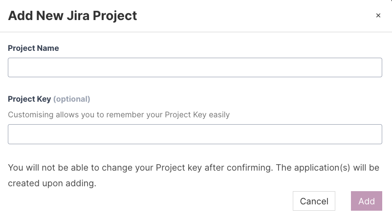
    |**Prisma Cloud**|Make sure that you have subscribed to this product via the TechBiz portal for it to be listed in **Subscribed Tools**. Provide value in the **App name** field.|
    |**SonarQube**|Make sure that you have subscribed to this product via the TechBiz portal for it to be listed in **Subscribed Tools**. Make sure that you have logged in to [SonarQube Community Edition](https://sonar.hats.stack.gov.sg/sonar) or [SonarQube Developer Edition](https://sonar1.hats.stack.gov.sg/sonar) at least once. provide values in the **Application Type** and **App Name** fields.  

    >**Note:** After you reach the quota, the respective tool name(s) will be disabled in the **Select Tool** drop-down list. If you still want to add these tools, send an email to [enquiries_ENP@tech.gov.sg](enquiries_ENP@tech.gov.sg).    

1. Click **Add**.   
    
    The selected project tool (GitLab in our example) is added.

    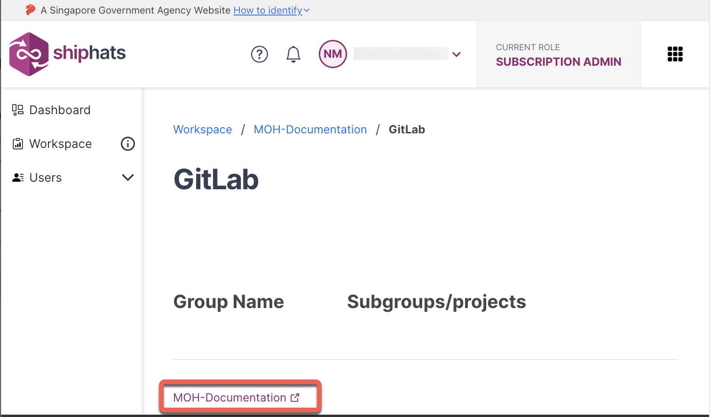    

## Whats' Next 

- [Step 3: Configure GitLab](configure-gitlab) 

