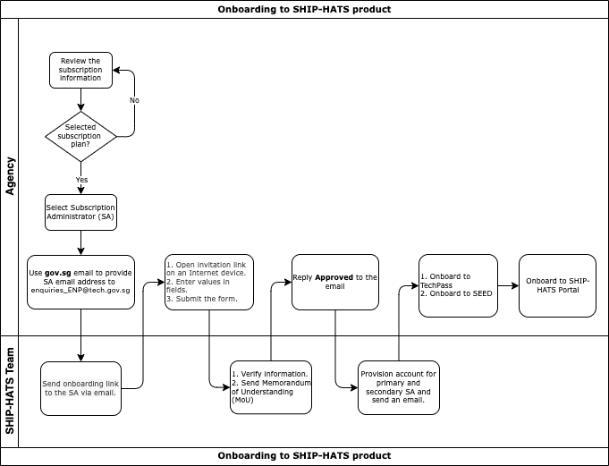

# Onboarding to SHIP-HATS

**Topics**
- [Prerequisites](#prerequisites)
- [Onboarding](#onboarding)

## Prerequisites

- Make sure that you have the required [Subscription](subscription).
- A session is active for 20 minutes. Therefore, we recommend having the following details before clicking the onboarding link that you receive in your email: 
    |Information|Particulars Required|Notes|
    |---|---|---|
    |Details of the [Primary and Secondary Subscription Admins](https://docs.developer.tech.gov.sg/docs/ship-hats-documentation/#/user-roles-permissions?id=sa-permissions)|Name Email Mobile Number|For more information, refer to [User Roles and Permissions](user-roles-permissions).|
    |Details of the Billing contact|Name Email Contact Number Address  Sub Business Unit code details|Sub Business Unit (SUB BU) is not your Department code. Please work with your finance team for the SUB BU code.|
    |Approval of the subscription by a MIC (Manager In-Charge).|The approver of the subscription has to be Deputy Director and above for signatory.|None|
    |Approver Details|Name Email Designation|None| 
- The onboarding link only lasts for 14 days. If you require an extension, send an email to [enquiries_ENP@tech.gov.sg](mailto:enquiries_ENP@tech.gov.sg).

## Onboarding 

The following image and table outlines the steps that you must complete to get started with SHIP-HATS. After you have completed these steps, you will need to perform additional steps to configure the tools that you want to use.  

These tasks may be completed by multiple people in your organization and SHIP-HATS team. However, these tasks must be completed in the specified order. All steps are required unless otherwise noted.

<!---->

  

|Step|Task|Owner|
|---|---|---|
|1|[Review the Subscription information](subscription).|Agency|
|2|Use your `gov.sg` email to send a request to [enquiries_ENP@tech.gov.sg](mailto:enquiries_ENP@tech.gov.sg) with the email address of your Primary Subscription Admin (SA).|Agency|
|3|Send onboarding link to the SA via email.|SHIP-HATS|
|4|Open the invitation link on an Internet device, enter the fields, and then submit the onboarding form.|Agency|
|5|Verify the information and send an email with the Memorandum of Understanding (MoU) to the approver nominated in the onboarding form.|SHIP-HATS|
|6|Reply `Approved` after receiving the email.|Agency Approver|
|7|SHIP-HATS Team provisions account for the Primary and Secondary SA.|SHIP-HATS |
|8|Send an email to SAs indicating that their account has been provisioned.|SHIP-HATS |
|9|[Onboard to TechPass](https://docs.developer.tech.gov.sg/docs/techpass-user-guide/#/onboard-public-officers-using-non-se-machines).|Agency|
|10|[Onboard to SEED](https://docs.developer.tech.gov.sg/docs/security-suite-for-engineering-endpoint-devices/#/).|Agency|
|11|[Onboard to the SHIP-HATS Portal](https://docs.developer.tech.gov.sg/docs/ship-hats-portal-guide/#/access-ship-hats-portal).| Subscription Admin (SA)|

### What's Next
- [Complete the set up in the SHIP-HATS portal](https://docs.developer.tech.gov.sg/docs/ship-hats-portal-guide/#/configure-portal)
- [Invite Users via the SHIP-HATS Portal](https://docs.developer.tech.gov.sg/docs/ship-hats-portal-guide/#/manage-users?id=invite-users) 

<!--

1. Use gov.sg email to send a request to [enquiries_ENP@tech.gov.sg](mailto:enquiries_ENP@tech.gov.sg) with the email address of your Primary Subscription Admin (SA).  
1. The SA receives the onboarding link via email.
1. Open the invitation link on an Internet device, enter the fields, and then submit the onboarding form. 
1. SHIP-HATS Team verifies the information. 
1. System will send an email with the Memorandum of Understanding (MoU) to the approver nominated in the onboarding form. 
1. Agency's approver is required to reply 'Approved’ after receiving the email. 
1. After approver replies, SHIP-HATS Team provisions the Primary SA and Secondary SA's account. 
1. SAs will receive an email to inform that your account is provisioned. 
1. SAs log into [SHIP-HATS Portal](http://ship.gov.sg) after their accounts have been provisioned and send the [invitation link](https://docs.developer.tech.gov.sg/docs/ship-hats-documentation/#/manage-users?id=invite-users) to their users for them to self-create accounts and approve the user accounts.
-->