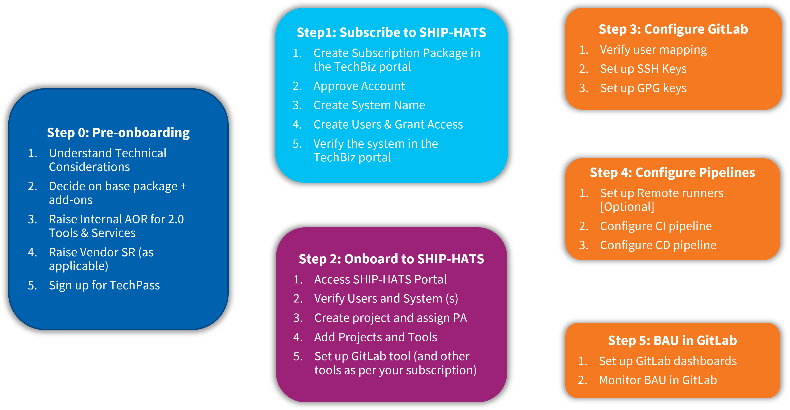
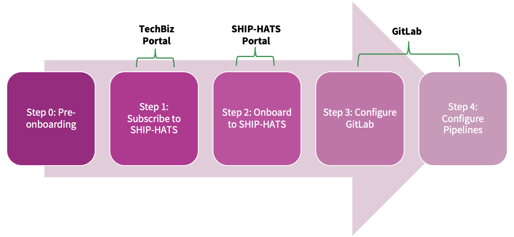

# Onboarding to SHIP-HATS

The following topic provides details for **onboarding to SHIP-HATS**.

<!---->

The above image provides high level steps to complete onboarding to SHIP-HATS. Detailed steps are provided below along with documentation links to complete the steps. 

## Step 0: Pre-onboarding

|Activity|[Performed by](#performed-by-roles)|GovTech Supporting Guide|
|---|---|---|
|Decide on base package + add-ons|[Agency PM](#performed-by-roles)|[Subscription](subscription)  [Tooling strategy](ship-hats-tools?id=tooling-strategy)
|Raise Internal AOR for 2.0 Tools & Services|[Agency PM](#performed-by-roles)|[Sample AOR (Accessible to Public Officers via intranet](https://go.gov.sg/sh2indicative)
|Raise Vendor SR (as applicable)|[Agency PM](#performed-by-roles)|NA|
|Sign up for [TechPass](https://portal.techpass.gov.sg/public/home)|[All](#performed-by-roles)|[Onboard to TechPass](https://docs.developer.tech.gov.sg/docs/techpass-user-guide/onboard-public-officers-using-non-se-machines)

## Step 1: Subscribe to SHIP-HATS

?> Complete these steps in the **[TechBiz Portal](https://portal.techbiz.suite.gov.sg/)**. Public Officers can access **[how-to videos for subscription via TechBiz](https://sgdcs.sgnet.gov.sg/sites/IDA-GoSync/gdspdd-ai/ship/Shared%20Documents/Forms/AllItems.aspx?id=%2Fsites%2FIDA-GoSync%2Fgdspdd-ai%2Fship%2FShared%20Documents%2FSHIP-HATS%202%2E0%2FOnboarding%20how-to%20videos)** via Intranet.

|Activity|[Performed by](#performed-by-roles)|GovTech Supporting Guide|  
|---|---|---|
|Log in to the TechBiz portal|[Agency PM](#performed-by-roles)|[Log in to TechBiz portal](https://docs.developer.tech.gov.sg/docs/techbiz-documentation/log-in-to-TechBiz-portal)
|Create Subscription Package|[Agency PM](#performed-by-roles)|[TechBiz account](https://docs.developer.tech.gov.sg/docs/techbiz-documentation/techbiz-account)  |[Request for TechBiz account](https://docs.developer.tech.gov.sg/docs/techbiz-documentation/request-for-techbiz-account)
|Approve Account|DD or above|[Approve or reject TechBiz account](https://docs.developer.tech.gov.sg/docs/techbiz-documentation/approve-or-reject-techbiz-account)
|Create System Name|[Agency PM](#performed-by-roles)|[Manage TechBiz system](https://docs.developer.tech.gov.sg/docs/techbiz-documentation/manage-techbiz-system)  [Create TechBiz system](https://docs.developer.tech.gov.sg/docs/techbiz-documentation/create-techbiz-system)
|Add and configure products|[Agency PM](#performed-by-roles)|[Add and configure products](https://docs.developer.tech.gov.sg/docs/techbiz-documentation/add-and-configure-products)
|Select the required Tool(s) and Add users|[Agency PM](#performed-by-roles)|[Manage user access for subscribed SGTS products](https://docs.developer.tech.gov.sg/docs/techbiz-documentation/manage-user-access-subscribed-sgts-products)  You must subscribe to required Tools (e.g. GitLab) and add-ons as needed (e.g. Jira/Confluence), and then add users for each of the subscribed tools.

## Step 2: Onboard to SHIP-HATS

?> Complete these steps in the **[SHIP-HATS Portal](https://portal.ship.gov.sg/)**.

|Activity|[Performed by](#performed-by-roles)|GovTech Supporting Guide|  
|---|---|---|
|Access SHIP-HATS Portal|[Agency PM](#performed-by-roles) & [Technical POC](#performed-by-roles)|[Access portal](https://docs.developer.tech.gov.sg/docs/ship-hats-portal/access-ship-hats-portal)
|Verify Users and System (s)|[Agency PM](#performed-by-roles) & [Technical POC](#performed-by-roles)|[Manage users](https://docs.developer.tech.gov.sg/docs/ship-hats-portal/manage-users)
|Create project and assign PA|[Agency PM](#performed-by-roles) & [Technical POC](#performed-by-roles)|[Manage projects](https://docs.developer.tech.gov.sg/docs/ship-hats-portal/manage-projects)  [Manage admins](https://docs.developer.tech.gov.sg/docs/ship-hats-portal/manage-admins)
|Add Projects|[Agency PM](#performed-by-roles) & [Technical POC](#performed-by-roles)|[Manage projects](https://docs.developer.tech.gov.sg/docs/ship-hats-portal/manage-projects)
|Add GitLab tool (and other tools as per your subscription)|[Technical POC](#performed-by-roles)|[Manage tools](https://docs.developer.tech.gov.sg/docs/ship-hats-portal/manage-tools)

## Step 3: Configure GitLab

?> Complete these steps in the **[GitLab](https://sgts.gitlab-dedicated.com/) tool**.

|Activity|[Performed by](#performed-by-roles)|GovTech Supporting Guide|  
|---|---|---|
|Verify user mapping|[Technical POC](#performed-by-roles)|1. In SHIP-HATS Portal, click **GitLab group.**   2. In GitLab, Click **Subgroup information** > **Members**
|Set up SSH keys|Developer|[Communicate using SSH keys](communicate-using-ssh-keys)
|Set up and GPG keys|Developer|[Sign commits with GPG](signing-commits-with-gpg)

## Step 4: Configure Pipelines

?> Complete these steps in the **[GitLab](https://sgts.gitlab-dedicated.com/) tool**.

|Activity|Description|[Performed by](#performed-by-roles)|GovTech Supporting Guide|  
|---|---|---|---|
|Set up Remote runners [Optional]  **Note:** You can complete this step in parallel with Configure CI Pipeline|If you are using Remote runners, you can connect to SHIP-HATS using:   **AWS VPC Endpoint**   or   **IPsec Tunnel**|[Technical POC](#performed-by-roles)|[Runners](runners)  [AWS VPC Endpoint](aws-vpc-endpoint)  or   [IPsec Tunnel](ipsec-tunnel)
|Configure CI pipeline|1. Copy the E2E template into your own repository and update the project variables|[Technical POC](#performed-by-roles)|[E2E Templates](pipeline-templates?id=list-of-templates)
||2. Modify your pipeline using the Modular template [Optional]  This is an optional step. If the E2E template does not meet your requirement, you can modify your pipeline using the Modular templates for any additional capabilities.|[Technical POC](#performed-by-roles)|[Common Templates (Modular)](pipeline-templates?id=list-of-templates)
||3. Apply Compliance Framework|[Technical POC](#performed-by-roles)|[Compliance Framework](compliance-framework)
|Configure CD pipeline  (non-production & production)| Execute deployment successfully on non-production and production|[Technical POC](#performed-by-roles)|[E2E Templates](pipeline-templates?id=list-of-templates)

?> After you have completed above setup, you can use **[GitLab dashboards](dashboards)** and review **[DORA metrics](dashboards)** to ensure BAU in GitLab.

### Performed by (roles)

|Performed by (roles)| Description|  
|---|---|
**All** |All Customers team members involved in the onboarding process
**Agency PM**| The Project Manager that acts on behalf of the Customer Agency (needs to be a public officer).
**Technical POC** |The Technical Point of Contact, typically someone with some management authority & the most technically competent member within the Customer Agency team (can be in-house or outsourced).

## What's next 

- [Onboard additional users in the SHIP-HATS portal](https://docs.developer.tech.gov.sg/docs/ship-hats-portal/onboarding-users)
- [Create additional projects in the SHIP-HATS portal as needed](https://docs.developer.tech.gov.sg/docs/ship-hats-portal/manage-projects)
- [Add project tools or SHIP-HATS services via SHIP-HATS portal](https://docs.developer.tech.gov.sg/docs/ship-hats-portal/manage-tools)
- [Add applications/projects for project tools](https://docs.developer.tech.gov.sg/docs/ship-hats-portal/manage-applications)

## User roles and permissions

[User roles and permissions](user-roles-permissions.md ':include')