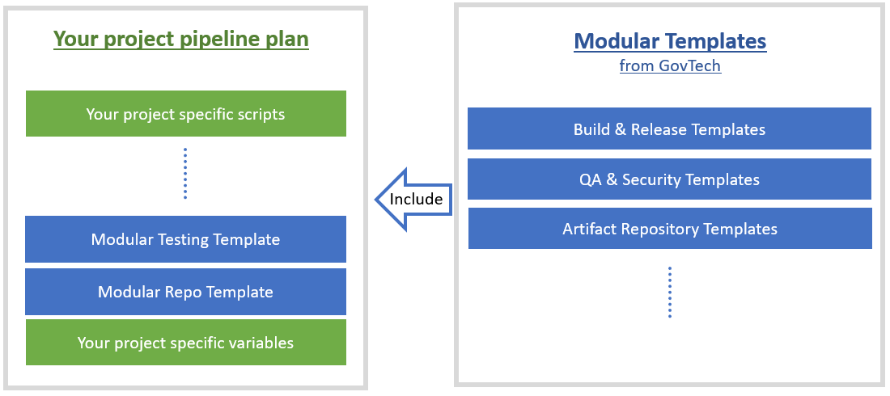

# Pipeline Templates

SHIP-HATS Pipeline templates are reusable configuration files that developers can use to configure instead of building from the scratch. The templates help agencies to incorporate best practices for security compliance and performance metrics.  

SHIP-HATS Templates aims to help you construct their CI/CD pipelines efficiently by providing blackbox building blocks for you to include in their pipelines. It favours "write once, use anywhere", and is open for [InnerSourcing](https://about.gitlab.com/topics/version-control/what-is-innersource/). 

<!--
**Topics**
- [Types of Templates](#types)
- [List of Templates](#list-of-templates)
-->

## Types

Following types of templates will be provided:

- **End-to-End Reference templates:** An end-to-end CI/CD workflow for a specific use case such as .Net application hosted in Azure App Service, Java application hosted in AWS EC2, etc.  
    
- **Modular templates:** A stand-alone basic template for invoking build, test, deploy tools, etc.   
    

## List of Templates  

This section provides a high level of overview of templates to expect for migrating to SHIP-HATS 2.0 to help the agencies plan the migration.

> **Notes:** 
>- After you have onboarded to SHIP-HATS 2.0, you can [log in to GitLab](https://sgts.gitlab-dedicated.com/) to refer to complete list of [SHIP-HATS Templates](https://sgts.gitlab-dedicated.com/WOG/GVT/ship/ship-hats-templates). If you do not have access to GitLab, you may [access mirror templates in BitBucket](https://bitbucket.ship.gov.sg/projects/CLGLAB/repos/gitlab-mirror-ship-hats-templates/browse) for reference only. 
>- For GitLab CI/CD examples, refer to [https://docs.gitlab.com/ee/ci/examples/](https://docs.gitlab.com/ee/ci/examples/).

<!-- We will update the link to templates after SHIP-HATS 2.0 is ready. You can bookmark this page as we will update details on existing and upcoming templates regularly. --> 

- [Common templates](#common-templates)
- [Testing/scanning templates](#testingscanning-templates)
- [Nexus Repo templates](#nexus-repo-templates)
- [Reference pipelines](#reference-pipelines)
- [E2E templates](#e2e-templates)

## Common templates

Following [Common/Modular templates](https://sgts.gitlab-dedicated.com/wog/gvt/ship/ship-hats-templates/-/tree/main/templates) are available for use.

?> If you do not have access to GitLab, you may [access mirror templates in BitBucket](https://bitbucket.ship.gov.sg/projects/CLGLAB/repos/gitlab-mirror-ship-hats-templates/browse/templates) for reference only. 

|Template|Description|Template Type|
|---|---|---|
|[Build and push docker image](https://sgts.gitlab-dedicated.com/wog/gvt/ship/ship-hats-templates/-/tree/main/templates#file-gitlab-ci-docker-buildyml)|This template allows you to build and push docker image to private registry in one single action which is defined in the "script" key.|Modular Template|
|[Readiness check for web application](https://sgts.gitlab-dedicated.com/wog/gvt/ship/ship-hats-templates/-/tree/main/templates#file-gitlab-ci-check-app-readinessyml)|This template allows you to check if a web application is ready by querying the URL and searching for a given text in a loop until a given wait duration.|Modular Template
|[Readiness check for docker service](https://sgts.gitlab-dedicated.com/wog/gvt/ship/ship-hats-templates/-/tree/main/templates#file-gitlab-ci-check-app-readinessyml)|This template allows you to check if a web application is ready by querying the URL and searching for a given text in a loop until a given wait duration.|Modular Template
|[AZ CLI invocation](https://sgts.gitlab-dedicated.com/wog/gvt/ship/ship-hats-templates/-/tree/main/templates#file-gitlab-ci-azureyml)|This template allows you to invoke Azure CLI commands.|Modular Template
|[Depcheck for NPM projects](https://sgts.gitlab-dedicated.com/wog/gvt/ship/ship-hats-templates/-/tree/main/templates#file-gitlab-ci-nodejs-commonyml)|This template allows you to perform depcheck for their npm projects to identify unused dependencies.|Modular Template
|[AWS identity federation](https://sgts.gitlab-dedicated.com/wog/gvt/ship/ship-hats-templates/-/tree/main/templates#file-gitlab-ci-awsyml)|This template allows you to invoke AWS CLI within the *script* key.|Modular Template
|[AWS Secret Retrieval](https://sgts.gitlab-dedicated.com/wog/gvt/ship/ship-hats-templates/-/tree/main/templates#file-gitlab-ci-awsyml)|This template allows you to invoke AWS CLI within the *script* key.|Modular Template
|[AWS EKS kubectl](https://sgts.gitlab-dedicated.com/wog/gvt/ship/ship-hats-templates/-/tree/main/templates#file-gitlab-ci-kubectl-awsyml)|This template allows you to invoke kubectl commands within the *script* key. |Modular Template
|[Container Signing](https://sgts.gitlab-dedicated.com/wog/gvt/ship/ship-hats-templates/-/tree/main/templates#file-gitlab-ci-container-signingyml)|This template allows you to sign image in an OCI registry.|Modular Template
|[Blob Signing and Verification](https://sgts.gitlab-dedicated.com/wog/gvt/ship/ship-hats-templates/-/tree/main/templates#file-gitlab-ci-blob-signingyml)|This template allows you to sign standard files.|Modular Template
|[Checksum Verification](https://sgts.gitlab-dedicated.com/wog/gvt/ship/ship-hats-templates/-/tree/main/templates#file-gitlab-ci-checksum-verifyyml)|This template allows you to pass/fail a pipeline by matching the MD5 checksum of a remote docker image with a supplied one.|Modular Template
|[Delete Images from GitLab Container Registry](https://sgts.gitlab-dedicated.com/wog/gvt/ship/ship-hats-templates/-/tree/main/templates#file-gitlab-ci-docker-deleteyml)|This template allows you to delete image together with its cosign signature from GitLab Container Registry.|Modular Template

## Testing/scanning templates 

Following [Testing/Scanning templates](https://sgts.gitlab-dedicated.com/wog/gvt/ship/ship-hats-templates/-/tree/main/templates) are available for use.

?> If you do not have access to GitLab, you may [access mirror templates in BitBucket](https://bitbucket.ship.gov.sg/projects/CLGLAB/repos/gitlab-mirror-ship-hats-templates/browse/templates) for reference only. 

|Template|Description|Template Type|
|---|---|---|
|[Nexus IQ scan](https://sgts.gitlab-dedicated.com/wog/gvt/ship/ship-hats-templates/-/tree/main/templates#file-gitlab-ci-nexus-iq-scanyml)|This template allows you to perform nexus iq scan on archives or directories.|Modular Template
|[Robot framework](https://sgts.gitlab-dedicated.com/wog/gvt/ship/ship-hats-templates/-/tree/main/templates#file-gitlab-ci-run-testyml)|This template allows you to run integration testing with the robot framework and generate individual reports.|Modular Template
|[FOD SAST](https://sgts.gitlab-dedicated.com/wog/gvt/ship/ship-hats-templates/-/tree/main/templates#file-gitlab-ci-run-fod-scanyml)|This template allows you to do Fortify SAST and generate a Gitlab UI-compatible report.|Modular Template
|[FOD DAST](https://sgts.gitlab-dedicated.com/wog/gvt/ship/ship-hats-templates/-/tree/main/templates#file-gitlab-ci-run-fod-scanyml)|This template allows you to do Fortify SAST and generate a Gitlab UI-compatible report.|Modular Template
|[Sonarqube Scan](https://sgts.gitlab-dedicated.com/wog/gvt/ship/ship-hats-templates/-/tree/main/templates#file-gitlab-ci-sonarqubeyml)|This template allows you to perform Sonarqube scan of your code using the command 'sonar-scanner'.|Modular Template
|[Sonarqube Scan for Maven](https://sgts.gitlab-dedicated.com/wog/gvt/ship/ship-hats-templates/-/tree/main/templates#file-gitlab-ci-sonarqubeyml)|This template allows you to perform SonarQube scan of your code using the command 'sonar-scanner'. |Modular Template
|[Sonarqube Scan for .NET Core](https://sgts.gitlab-dedicated.com/wog/gvt/ship/ship-hats-templates/-/tree/main/templates#file-gitlab-ci-sonarqubeyml)|This template allows you to perform SonarQube scan of your code using the command 'sonar-scanner'. |Modular Template
|[Sonarqube Scan for .NET Framework](https://sgts.gitlab-dedicated.com/wog/gvt/ship/ship-hats-templates/-/tree/main/templates#file-gitlab-ci-sonarqubeyml)|This template allows you to perform Sonarqube scan of your code using the command 'sonar-scanner'. |Modular Template
|[Sonarqube Output Report](https://sgts.gitlab-dedicated.com/wog/gvt/ship/ship-hats-templates/-/tree/main/templates#file-gitlab-ci-sonarqubeyml)|This template allows you to perform Sonarqube scan of your code using the command 'sonar-scanner'. |Modular Template
|[Aquasec Trivy scan](https://sgts.gitlab-dedicated.com/wog/gvt/ship/ship-hats-templates/-/tree/main/templates#file-gitlab-ci-aquasec-trivy-scanyml)|This template allows you to scan an image in a .tar or .tar.gz format, or from a remote image registry, using Aquasec Trivy and generate a Gitlab UI-compatible report.|Modular Template
|[Prisma container scan](https://sgts.gitlab-dedicated.com/wog/gvt/ship/ship-hats-templates/-/tree/main/templates#file-gitlab-ci-run-hatstwistcliyml)|This template allows you to scan an image from a build using Prisma Cloud (Twistlock) and generate a Gitlab UI-compatible report.|Modular Template
|[Kubesec scan](https://sgts.gitlab-dedicated.com/wog/gvt/ship/ship-hats-templates/-/tree/main/templates#file-gitlab-ci-k8yml)||Modular Template
|[Purple hats](https://sgts.gitlab-dedicated.com/wog/gvt/ship/ship-hats-templates/-/tree/main/templates#file-gitlab-ci-run-purple-hatsyml)|This template allows you to perform a Purple Hats scan on either sitemap/website/login.|Modular Template
|[pCloudy Tests](https://sgts.gitlab-dedicated.com/wog/gvt/ship/ship-hats-templates/-/tree/main/templates#file-gitlab-ci-pcloudy-testyml)|This template allows you to upload an application file to pCloudy.|Modular Template
|[Generate FOD SAST and DAST reports](https://sgts.gitlab-dedicated.com/wog/gvt/ship/ship-hats-templates/-/tree/main/templates#file-gitlab-ci-create-fod-reportyml)|This template allows you to create SAST GitLab reports for FOD.|Modular Template
|[Postman API](https://sgts.gitlab-dedicated.com/wog/gvt/ship/ship-hats-templates/-/tree/main/templates#file-gitlab-ci-postmanyml)|This template allows you to run API testing using Postman (newman CLI) with test reports generated inside reports folder.|Modular Template
|[FOD SAST MSBuild](https://sgts.gitlab-dedicated.com/wog/gvt/ship/ship-hats-templates/-/tree/main/templates#file-gitlab-ci-run-fod-scanyml)|This template allows you to do Fortify SAST and generate a Gitlab UI-compatible report.|Modular Template

## Nexus Repo templates 

Following [Nexus Repo templates](https://sgts.gitlab-dedicated.com/wog/gvt/ship/ship-hats-templates/-/tree/main/templates) are available for use.

?> If you do not have access to GitLab, you may [access mirror templates in BitBucket](https://bitbucket.ship.gov.sg/projects/CLGLAB/repos/gitlab-mirror-ship-hats-templates/browse/templates) for reference only. 

|Template|Description|Template Type|
|---|---|---|
|[`docker pull` fr Nexus Repo](https://sgts.gitlab-dedicated.com/wog/gvt/ship/ship-hats-templates/-/tree/main/templates#file-gitlab-ci-nexus-docker-pullyml)|This template allows you to pull a docker image through SHIP Nexus Repository docker-proxy in the "before_script" key for a job.|Modular Template
|[`docker push` to Private Repo](https://sgts.gitlab-dedicated.com/wog/gvt/ship/ship-hats-templates/-/tree/main/templates#file-gitlab-ci-docker-pushyml)|This template allows you to push docker image to private registry.|Modular Template
|[Configure to use Nexus Repo for NPM](https://sgts.gitlab-dedicated.com/wog/gvt/ship/ship-hats-templates/-/tree/main/templates#file-gitlab-ci-nexus-configureyml)|This template allows you to set SHIP-HATS Nexus Repo as npm config registry.|Modular Template
|[Maven artefact publish to Nexus Repo](https://sgts.gitlab-dedicated.com/wog/gvt/ship/ship-hats-templates/-/tree/main/templates#file-gitlab-ci-publish-to-nexusyml)|This template allows you to publish maven artefacts to SHIP-HATS Nexus Repo as the main job script.|Modular Template
|[Nodejs artefact publish to Nexus Repo](https://sgts.gitlab-dedicated.com/wog/gvt/ship/ship-hats-templates/-/tree/main/templates#file-gitlab-ci-publish-to-nexusyml)|This template allows you to publish maven artefacts to SHIP-HATS Nexus Repo as the main job script.|Modular Template
|[NuGet artefact publish to Nexus Repo using NuGet CLI](https://sgts.gitlab-dedicated.com/wog/gvt/ship/ship-hats-templates/-/tree/main/templates#file-gitlab-ci-publish-to-nexusyml)|This template allows you to publish NuGet artefacts to SHIP-HATS Nexus Repo as the main job script.|Modular Template
|[NuGet artefact publish to Nexus Repo using dotNet CLI](https://sgts.gitlab-dedicated.com/wog/gvt/ship/ship-hats-templates/-/tree/main/templates#file-gitlab-ci-publish-to-nexusyml)|This template allows you to publish NuGet artefacts to SHIP-HATS Nexus Repo as the main job script.|Modular Template

## Reference pipelines

<!--You can access following examples of E2E CI pipeline using SHIP-HATS templates [here](https://sgts.gitlab-dedicated.com/wog/gvt/ctmo/reference-pipelines): -->

Following [E2E CI pipeline examples using SHIP-HATS templates](https://sgts.gitlab-dedicated.com/wog/gvt/ctmo/reference-pipelines) are available for use. 

?> If you do not have access to GitLab, you may [access mirror templates in BitBucket](https://bitbucket.ship.gov.sg/projects/CLGLAB) for reference only. 

|Template|Description|Mirror|
|---|---|---|
[javaap](https://sgts.gitlab-dedicated.com/wog/gvt/ctmo/reference-pipelines/javaapp)| Example end to end CI pipeline for a sample 3-tier application hosted in AWS EC2|[Mirror template in BitBucket for reference only if you do not have access to GitLab](https://bitbucket.ship.gov.sg/projects/CLGLAB/repos/gitlab-mirror-reference-pipelines-javaapp/browse)
[javadockerapp](https://sgts.gitlab-dedicated.com/wog/gvt/ctmo/reference-pipelines/javadockerapp)| Example end to end CI pipeline for sample containerized Java application hosted in AWS EKS|[Mirror template in BitBucket for reference only if you do not have access to GitLab](https://bitbucket.ship.gov.sg/projects/CLGLAB/repos/gitlab-mirror-reference-pipelines-javadockerapp/browse)
[netapp](https://sgts.gitlab-dedicated.com/wog/gvt/ctmo/reference-pipelines/netapp) |Example end to end CI pipeline for sample containerized .NET applications hosted in Azure App Service|[Mirror template in BitBucket for reference only if you do not have access to GitLab](https://bitbucket.ship.gov.sg/projects/CLGLAB/repos/gitlab-mirror-reference-pipelines-netapp/browse)
[netdocker](https://sgts.gitlab-dedicated.com/wog/gvt/ctmo/reference-pipelines/netdocker)| Example end to end CI pipeline for sample containerized .NET Core application hosted in AWS Fargate|[Mirror template in BitBucket for reference only if you do not have access to GitLab](https://bitbucket.ship.gov.sg/projects/CLGLAB/repos/gitlab-mirror-reference-pipelines-netdocker/browse)
[nodetsapp](https://sgts.gitlab-dedicated.com/wog/gvt/ctmo/reference-pipelines/nodetsapp) |Example end to end CI pipeline for sample Node.js typescript application hosted in Azure App Service|[Mirror template in BitBucket for reference only if you do not have access to GitLab](https://bitbucket.ship.gov.sg/projects/CLGLAB/repos/gitlab-mirror-reference-pipelines-nodetsapp/browse)

## E2E templates

Following [end to end pipeline templates](https://sgts.gitlab-dedicated.com/wog/gvt/ship/e2e-templates) are available for use.

?> If you do not have access to GitLab, you may [access mirror templates in BitBucket](https://bitbucket.ship.gov.sg/projects/CLGLAB/repos/gitlab-mirror-ship-hats-templates/browse/templates) for reference only. 

|Template|Description|Template Type|
|---|---|---|
[SHIP-HATS Docker Image CI Pipeline Templates](https://sgts.gitlab-dedicated.com/wog/gvt/ship/e2e-templates/ship-hats-docker-image-ci-pipeline-templates)|This template allows you to deliver a compliant CI pipeline for a standard docker application (regardless of language) considering best practices as well as security aspects.|End to end Template
[SHIP-HATS Docker Multi Services App E2E Templates](https://sgts.gitlab-dedicated.com/wog/gvt/ship/e2e-templates/ship-hats-docker-multi-services-app-e2e-templates)|This template allows you to deliver a compliant CI/CD pipeline for a standard docker application (regardless of language) considering best practices as well as security aspects.|End to end Template
[SHIP-HATS Docker Single Service App E2E Templates](https://sgts.gitlab-dedicated.com/wog/gvt/ship/e2e-templates/ship-hats-docker-single-service-app-e2e-templates)|This template allows you to deliver a compliant CI/CD pipeline for a standard docker application (regardless of language) considering best practices as well as security aspects.|End to end Template
[SHIP-HATS Webapp E2E Templates](https://sgts.gitlab-dedicated.com/wog/gvt/ship/e2e-templates/ship-hats-webapp-e2e-templates)|This template allows you to deliver a compliant CI/CD pipeline for a standard web application (regardless of language) considering best practices as well as security aspects.|End to end Template

> **Note:** The End-to-End Reference templates are derived from the Bamboo plan templates provided by GovTech SVC Clusters & Technology Management Office (CTMO) in SHIP-HATS 1.0.  

## Mirror Templates

If you do not have access to GitLab, you may [access mirror templates in BitBucket](https://bitbucket.ship.gov.sg/projects/CLGLAB) for reference only. 

<!--

|Templates|Description|Template Type|  
|---|---|---|  
.NET Application |An end-to-end CI pipeline for a sample .NET application hosted in Azure App Service|End-to-End   
.NET Docker Application|An end-to-end CI pipeline for sample containerized .NET Core application hosted in AWS Fargate | 	End-to-End  
Node.js Typescript Application 	|An end-to-end CI pipeline for sample Node.js typescript application hosted in Azure App Service | 	End-to-End  
Java Application|An end-to-end CI pipeline for a sample Java application hosted in AWS EC2 | 	End-to-End  
Java Docker Application |An end-to-end CI pipeline for a sample containerized Java application hosted in AWS EKS | 	End-to-End  
Docker Pull from Nexus Repo |A modular template to pull a docker image through SHIP Nexus Repository docker-proxy. 	|Modular for Build & Release  
NPM Configuration for Nexus Repository 	|A modular template to set Nexus Repository as NPM config registry.|Modular for Build & Release   
Maven artefacts publish to Nexus  	|A modular template to publish maven artefacts to SHIP-HATS Nexus Repository.|Modular for Build & Release   
Nexus IQ  	|A modular template to perform Nexus IQ scan on files or directories. 	|Modular for QA & Security   
Robot Framework 	|A modular template to run integration test with the Robot Framework and generate individual reports |Modular for QA & Security
Fortify On Demand SAST 	|A modular template to analyze application source code for exploitable vulnerabilities. |Modular for QA & Security
Fortify On Demand DAST 	|A modular template to identify vulnerabilities in deployed web applications and services. |Modular for QA & Security
SonarQube 	|A modular template to analyze source code and provide analysis for the code quality of a project. |Modular for QA & Security
Prisma container image scan  	|A modular template to scan container images for potential vulnerabilities. |Modular for QA & Security
Purple HATS 	|A modular template to assess whether a product is you-friendly to people with disabilities (PWDs). |Modular for QA & Security  
Readiness check for web application| 	A modular template to check if a web application is ready by querying the URL and searching for a given text in a loop until a given wait duration. 	|Other Modular templates 
Azure Command Line Interface 	|A modular template to invoke Azure CLI commands. |Other Modular templates 
Depcheck for NPM Projects 	|A modular template to perform depcheck for NPM projects to identify unused dependencies. |Other Modular templates 
AWS identity federation 	|A modular template to assume an AWS IAM role in AWS account of the you. |Other Modular templates 

-->