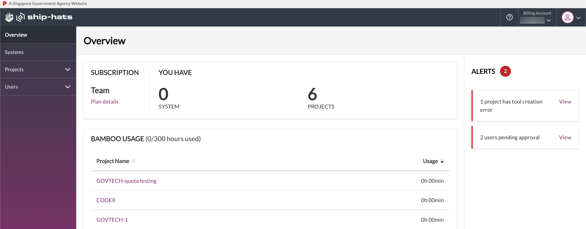

# Access SHIP-HATS portal

**Topics**
- [Prerequisites](#prerequisites)
- [Log in](#log-in)
- [View dashboard](#view-dashboard)
- [View user profile](#view-user-profile)
- [Log out](#log-out)

## Prerequisites

- Before you start, you must have been [invited and onboarded to SHIP-HATS](https://docs.developer.tech.gov.sg/docs/ship-hats-getting-started-guide/#/onboarding-to-ship-hats?id=onboarding) by SHIP-HATS.
- Make sure that you have setup SEED and TechPass.

## Log in

<!-- tabs:start -->

### **Log in**

**To log in to the SHIP-HATS portal**

1. Go to the [SHIP-HATS portal](https://www.ship.gov.sg/).
2. Click **Log In**.

    <kbd></kbd>

3. Enter your **Username**, **Password**, and then click **Login**.
    - If you are an SA or PA, the **Overview** page appears. For more details, refer to the [View dashboard](#view-dashboard) section.
    - If you are a regular user, the **Profile** page appears. For more details, refer to the [View user profile](#view-user-profile) section.

    <kbd></kbd>

<!--
explain the page and left nav briefly.
-->

### **Log in via TechPass**

**To log in to the SHIP-HATS portal using TechPass**

1. Go to the [SHIP-HATS portal](https://www.ship.gov.sg/).
2. Click **Log In with TechPass**.

    <kbd></kbd>

3. Enter your **Enter your TechPass details**, and then click **Next**.

    <kbd></kbd>

    You will be redirected to the GCC log-in page. 
1. Enter your TechPass email address along with the verification code from the Authenticator app and click sign in. 

    <kbd></kbd>

5. Read through the **TechPass** Terms of Use, and then click **Accept**.

    <kbd></kbd>

6. Read through the **TechPass MDM** Terms of Use, and then click **Accept**.

    <kbd></kbd>

You have successfully linked your TechPass to SHIP-HATS. You can directly log in using TechPass for future access.  
<!--Is there any step missing here?--> 
- If you are an SA or PA, the **Overview** page appears. For more details, refer to the [View dashboard](#view-dashboard) section.
- If you are a regular user, the **Profile** page appears. For more details, refer to the [View user profile](#view-user-profile) section.

<!-- tabs:end -->

## View dashboard
The **Overview** page of the subscription account gives the dashboard view of the subscription account. Only Subscription Admin (SA) and Project Admin (PA) can access this dashboard to view the following details:

- Subscription tier for the Billing Account. By default, you view the subscription details of the first account to which you were added as SA or PA. You can [switch account](manage-account), as needed.
- [Plan details](manage-accounts)
- Number of projects hosted on this account
- Number of users added to this account
- Projects using shared Bamboo agents and their usage quota 
- Announcements about SHIP-HATS services, maintenance notice, generic subscription updates, and any urgent or important messages
    <kbd>

>**Note:** The term **Overview** and **Dashboard view** may be used interchangeably.

<kbd></kbd>

## Log out 
When you are done with your activities on the portal, you can log out as shown below.

### To log out from the SHIP-HATS portal
- Hover over your profile icon, and then click **Log out**.
    
    <kbd></kbd>

- If you are inactive for five minutes on the portal, the system prompts you with the following message. Click **Yes, Keep me signed in** to continue your session.

    <kbd></kbd>

- If you are inactive for 10 minutes on the portal, the system prompts you with the following message:

    <kbd></kbd>

### Related topics
  - [Manage account](manage-account)
  - [Manage users](manage-users)
  - [Manage user groups](manage-user-groups)
  - [Manage projects](manage-projects)
  - [Declare DGP systems](declare-dgp-systems)