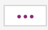

# Manage Project Admins
This section explains how a Subscription Admin creates SHIP-HATS projects and how Project Admin manages these projects by adding the required users and tools.

<!--
- [Add project admins](#add-project-admins)
- [Remove Project Admins]()
-->

## [Add project admins](#add-project-admins)

Subscription Admins can add Project Admins using the SHIP-HATS portal. When creating a project in an account, it is mandatory to specify at least one Project Admin. SAs can add any additional PAs anytime in the future.  

> **Note:** The number of PAs each project is entitled to is based on the [subscription tier](https://www.developer.tech.gov.sg/products/categories/devops/ship-hats/subscription) quota for which the agency has subscribed.

### To add a project admin:

1. From the side menu, click **Projects** > **All Projects** to view all the projects in this subscription account. If needed, refer to Switch account.
2. Locate the project and click **Manage**.

    <kbd></kbd>

3. Click the edit icon. **Manage Admin** panel is displayed.

    <kbd></kbd>

4. Click **Add another** to select the required user from the drop-down list.

    <kbd></kbd>

    >**Note:** If *First Name* and *Last Name* were not provided when creating a new user account, email address will appear in the drop-down list.
5. Click **Add** to add this user as a project admin. Once successfully added, an email notification will be sent to the requesting SA with copy sent to the other SA and the newly added PA.

>**Note:** To know how to remove a Project Admin, refer to **Remove User**.

## Remove project admins

Subscription Admin can remove a project as long as no tool has been added to it.

### To remove a project admin:

1. From the side menu, click **Projects** > **All Projects** to view all the projects in this subscription account. If needed, refer to [Switching account](https://docs.developer.gov.sg/docs/ship-hats-documentation/#/manage-account?id=switch-account).
2. Locate the project and click **Manage**. You will see  beside the project name as shown below.

    <kbd></kbd>

3. Click the three dots and then choose **Remove project**.