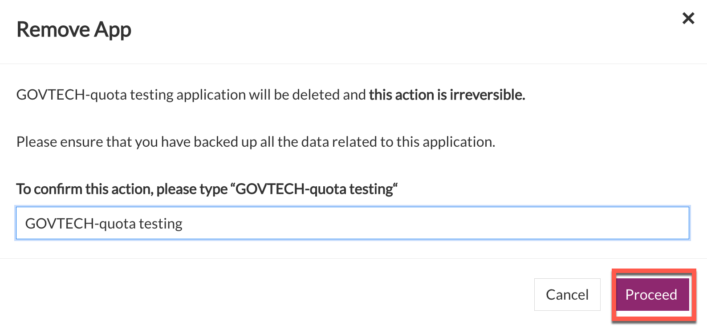
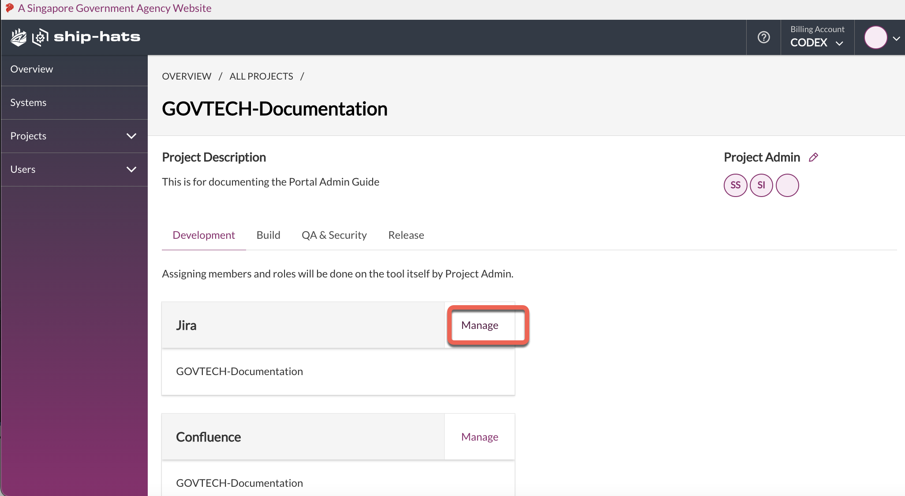

# Manage Projects
This section explains how a Subscription Admin creates SHIP-HATS projects and how Project Admin manages these projects by adding the required users and tools.
- [Create new projects](#create-new-projects)
- [View projects](#view-projects)
- [Remove projects](#remove-projects)
- [Remove project tools](#remove-project-tools)
- [Add project tools](#add-project-tools)
- [Add project admins](#add-project-admins)
- [Add project tools](#add-project-tools)
- [Create Project tool with customised project key](#creation-of-project-tool-with-customised-project-key)
- [Manage users within a Project Tool](#manage-users-within-a-project-tool)

## [Create new projects](#create-new-projects)

Subscription Admin (SA) can create new projects in SHIP-HATS and manage them. SAs assign Project Admins (PA). Both SA and PA can manage the projects by adding project tools and add users.

### To create a new project:

1. From the side menu, click **Projects** > **Create New**.  

>**Tip:** Alternatively, if you are viewing **All Projects**, click **Create Project**.  

<kbd></kbd>

2. Provide information in the following fields:

    - **Project Name:** Specify name of the project. 
    - **Project Description**: Specify details of the project. 
    - **Project Admin 1:** Select Project Admin from the drop-down list. If *First Name* and *Last Name* were not provided when creating a new user account, email address will appear in the drop-down list.
    - **Project Admin 2:** This is an optional field. Select a second Project Admin from the drop-down list. If *First Name* and *Last Name* were not provided when creating a new user account, email address will appear in the drop-down list. 
3. Click **Create Project**. The created project details are displayed as shown below.

    <kbd></kbd>

SA or PA can add tools and additional PAs. 
> **Note:** The number of PAs each project is entitled to is based on the [subscription tier](https://www.developer.tech.gov.sg/products/categories/devops/ship-hats/subscription) quota for which the agency has subscribed.

## [View projects](#view-projects)

SA and PAs of a subscription account can view all the projects of the subscription account.

### To view a project in a subscription account:

1. From the side menu click **Projects** > **All Projects**.

    Tile view of all the projects in this subscription account is displayed. If needed, refer to Switch account

    <kbd></kbd>

2. Click **Manage** to view tools that are currently added to the project.

## [Remove projects](#remove-projects)

Subscription Admin can remove a project as long as no tool has been added to it.

### To remove a project:

1. From the side menu, click **Projects** > **All Projects** to view all the projects in this subscription account. If needed, refer to [Switching account](https://docs.developer.gov.sg/docs/ship-hats-documentation/#/manage-account?id=switch-account).
2. Locate the project and click **Manage**. You will see  beside the project name as shown below.

    <kbd></kbd>

3. Click the three dots and then choose **Remove project**.

## [Remove project tools](#remove-project-tools)
Subscription Admin and Project Admin can remove a tool/app when it is not required. These tools are Jira, Confluence, Bitbucket, Fortify, and WebInspect. 

1. Go to **Projects> All Projects> Manage**.
2. Click **Manage** on the tool you’d like to remove. 
3. Select **Remove App** from the dropdown menu. 

    

4. Click **Remove**

    

5. Enter the required action  

    

## [Add project admins](#add-project-admins)

Subscription Admins can add Project Admins using the SHIP-HATS portal. When creating a project in an account, it is mandatory to specify at least one Project Admin. SAs can add any additional PAs anytime in the future.  

> **Note:** The number of PAs each project is entitled to is based on the [subscription tier](https://www.developer.tech.gov.sg/products/categories/devops/ship-hats/subscription) quota for which the agency has subscribed.

### To add a project admin:

1. From the side menu, click **Projects** > **All Projects** to view all the projects in this subscription account. If needed, refer to Switch account.
2. Locate the project and click **Manage**.

    <kbd></kbd>

3. Click the edit icon. **Manage Admin** panel is displayed.

    <kbd></kbd>

4. Click **Add another** to select the required user from the drop-down list.

    <kbd></kbd>

    >**Note:** If *First Name* and *Last Name* were not provided when creating a new user account, email address will appear in the drop-down list.
5. Click **Add** to add this user as a project admin. Once successfully added, an email notification will be sent to the requesting SA with copy sent to the other SA and the newly added PA.

>**Note:** To know how to remove a Project Admin, refer to **Remove User**.

## [Add project tools](#add-project-tools)

SA or PA can add the required project tools as explained below. You can add tools for Development, Build, QA &amp; Security and Release phases as per the tools quota allotted for your subscription type. Note that currently you need to raise a [service request](https://jira.ship.gov.sg/servicedesk/customer/portal/11/) for adding the following:

- Build tool - Nexus IQ and Nexus Repo
- Release and Deploy tool- Digital.ai Release and Digital.ai Deploy

> **Note:** SA and PA must have logged in to SonarQube at least once before proceeding to create applications in SonarQube.

### To add project tools:

1. From the side menu, click **Projects** > **All Projects** to view all the projects in this subscription account. If needed, refer to Switch account.
2. Locate the project and click **Manage**.

    <kbd></kbd>

3. Go to the required tab and click **Add tool**.
4. For example, go to **Development** tab and click **Add tool**.

    <kbd></kbd>

5. Select the required tool and click **Add**. This tool gets integrated with your SHIP-HATS project and a project is automatically created in the tool with the same name. For example, in this case, the SHIP-HATS project name is _Govtech-Documentation_ and hence the Jira project inherits this name.

    <kbd></kbd>

You can add build tools other than Nexus IQ and Nexus Repo in the same manner from the **Build** tab.

>**Notes:**
>- While adding tools such as WebInspect Fortify SCA under the **QA &amp; Security** tab, the system displays the quota remaining for your subscription as shown below.
><kbd></kbd>
>- Once you have reached the quota, the respective tool name(s) will be disabled in the **Select Tool** drop-down list. If you still want to add these tools, please do raise a [service request](https://jira.ship.gov.sg/servicedesk/customer/portal/11/).

## [Creation of Project tool with customised project key](#creation-of-project-tool-with-customised-project-key)
Subscription Admin (SA) and Project Admin (PA) can customise the project keys when adding app tools on SHIP-HATS. This is currently applicable for Jira, Bitbucket, and Confluence.  

### To customise project key: 

1. Go to **Projects> All Projects>** > Manage > to view and select the relevant project. 
2. Click Add tool under **Development** tab.
3. Choose the required tool.

    

4.  Select **Customise Project Key**.

    

5. Enter the required project key. It can only have 2-10 characters, consisting of uppercase letters A-Z and numbers from0-9. First character must be an alphabet. 

    

<!--CODEX-49288 https://gdsjira.ship.gov.sg/browse/PORTAL-2133 -->

## Manage Users within a Project Tool

Subscription Admin and Project Admin can manage users within a project tool or app when it is not required. These tools are Bamboo, Bitbucket, Confluence, and JIRA. 

### To manage users for your project tool or app:

1. Go to **Projects** > **All Projects**.

    <kbd></kbd>

1. Navigate to your project, and then select **Manage**.

    <kbd></kbd>

1. Click **Manage** on the project tool whose users you want to manage. 

    <kbd></kbd>

1. In the **Manage Tool** window that appears, from the dropdown, select **Manage users**. 

    <kbd></kbd>

1. To manage users, follow the on-screen instructions. 

    >**Note:** The link to tool or app server, includes the project key that you selected. This enables you to get to the project in the tool or app server directly. This is applicable for all Atlassian apps (Bamboo, Bitbucket, Confluence, and JIRA).  
    >
    ><kbd></kbd>
