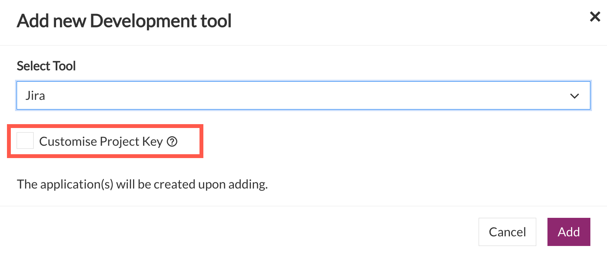

# Manage Tools

**Topics**
- [Add project tools](#add-project-tools)
- [Create project tool with customised project key](#create-project-tool-with-customised-project-key)
- [Manage users within a project tool](#manage-users-within-a-project-tool)
- [Remove project tools](#remove-project-tools)
- [Add applications to a project tool](#add-applications-to-a-project-tool)
- [Retrieve token](#retrieve-token)
- [Remove applications from a project tool](#remove-applications-from-a-project-tool)

## Add project tools

SA or PA can add the required project tools as explained below. You can add tools for Development, Build, QA and Security, and Release phases as per the tools quota allotted for your subscription tier. 

>**Note:** SA and PA must have logged in to SonarQube at least once before proceeding to create applications in SonarQube.

### To add project tools

1. From the side menu, click **Projects** > **All Projects** to view all the projects in this subscription account. If needed, refer to Switch account.
2. Locate the project, and then click **Manage**.

3. Go to the required tab, and then click **Add tool**. For example, go to **Development** tab, and then click **Add tool**.

    <kbd></kbd>

5. Select the required tool, and then click **Add**. This tool gets integrated with your SHIP-HATS project and a project is automatically created in the tool with the same name. For example, in this case, the SHIP-HATS project name is _Govtech-Documentation_ and hence the Jira project inherits this name.

    <kbd></kbd>

You can add build tools other than Nexus IQ and Nexus Repo in the same manner from the **Build** tab.

>**Notes:**
>- While adding tools such as WebInspect Fortify SCA under the **QA &amp; Security** tab, the system displays the quota remaining for your subscription as shown below.
><kbd></kbd>
>- Once you have reached the quota, the respective tool name(s) will be disabled in the **Select Tool** drop-down list. If you still want to add these tools, please do raise a [service request](https://jira.ship.gov.sg/servicedesk/customer/portal/11/).

## Create project tool with customised project key
Subscription Admin (SA) and Project Admin (PA) can customise the project keys when adding app tools on SHIP-HATS. This is currently applicable for Jira, Bitbucket, and Confluence.  

### To customise project key 

1. Go to **Projects** > **All Projects**.
1. Identify your project and click **Manage**. 
2. Under the **Development** tab, click **Add tool**.
3. Choose the required tool.

    

4.  Select **Customise Project Key**.

    

5. Enter the required project key. A project key can include 2-10 characters, consisting of uppercase letters A-Z and numbers from 0-9. First character must be an alphabet. 

    

## Add applications to a project tool

### To add an application to a project tool

## Manage users within a Project Tool

Subscription Admin and Project Admin can manage users within a project tool or app when it is not required. 

### To manage users for your project tool or app

1. Go to **Projects** > **All Projects**.

    <kbd></kbd>

1. Navigate to your project, and then select **Manage**.

    <kbd></kbd>

1. Click **Manage** on the project tool whose users you want to manage. 

    <kbd></kbd>

1. In the **Manage Tool** window that appears, from the dropdown, select **Manage users**. 

    <kbd></kbd>

1. To manage users, follow the on-screen instructions. 

    >**Note:** The link to tool or app server, includes the project key that you selected. This enables you to get to the project in the tool or app server directly. This is applicable for all Atlassian apps (Bamboo, Bitbucket, Confluence, and JIRA).  
    >
    ><kbd></kbd>

## Retrieve token 

### To retrive token

## Remove project tools
Subscription Admin and Project Admin can remove a tool/app when it is not required. These tools are Jira, Confluence, Bitbucket, Fortify, and WebInspect. 

### To remove a project tool

1. Go to **Projects> All Projects> Manage**.
2. Click **Manage** on the tool you want to remove. 
3. Select **Remove App** from the dropdown menu. 

    

4. Click **Remove**.

    

5. Enter the required action. 

    

## Remove applications from a project tool

### to remove an app
