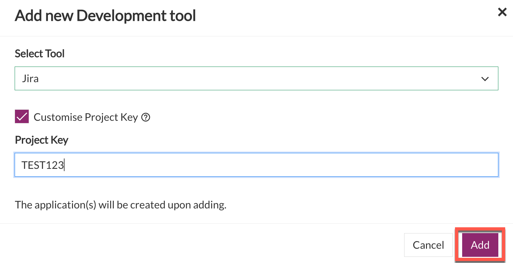

# Manage tools and applications

**Topics**
- [Add project tools](#add-project-tools)
- [Create project tool with customized project key](#create-project-tool-with-customised-project-key)
- [Add applications to a project tool](#add-applications-to-a-project-tool)
- [Manage user groups within a project tool](#manage-user-groups-within-a-project-tool)
- [Manage user within a project tool](#manage-users-within-a-project-tool)
- [Retrieve token](#retrieve-token)
- [Renew token](#renew-token)
- [Remove user groups from a project tool](#remove-user-groups-from-a-project-tool)
- [Remove project tools](#remove-project-tools)
- [Remove applications from a project tool](#remove-applications-from-a-project-tool)

## Add project tools

SA or PA can add the required project tools as explained below. You can add tools for **Development**, **Build**, **QA &amp; Security**, and **Release** phases as per the tools quota allotted for your subscription type. 

### To add project tools

1. From the side menu, click **Projects** > **All Projects** to view all the projects in this subscription account. If needed, refer to [Switch account](manage-account).
1. Locate the project to which you want to add a tool, and then click **Manage**.
1. Go to the required tab, and then click **Add tool**. Follow the steps in table for the tool that you want to add.

    |Tab|Available Tools|Steps|
    |---|---|---|
    |Development|Jira|<ol><li>Click the **Select Tool** drop-down list, and select **Jira**.</li><ol>|
    |Development|Confluence|<ol><li>Click the **Select Tool** drop-down list, and select **Confluence**.</li><ol>|
    |Development|Bitbucket|<ol><li>Click the **Select Tool** drop-down list, and select **Bitbucket**.</li><ol>
    |Build|Bamboo|<ol><li>Click the **Select Tool** drop-down list, and select **Bamboo**.</li><ol>
    |Build|Nexus IQ|<ol><li>Click the **Select Tool** drop-down list.</li><li> Provide values in the **App Name** and **App ID** fields.</li><ol>|
    |Build|Nexus Repo|<ol><li>Submit a [service request](https://jira.ship.gov.sg/servicedesk/customer/portal/11/) to add this tool.</li><ol>|
    |QA &amp; Security|pCloudy Device Farm & HATS Browser Farm|<ol><li>Click the **Select Tool** drop-down list, and select **pCloudy Device Farm & HATS Browser Farm**.</li><ol>|
    |QA &amp; Security|SonarQube - Community Edition|Make sure that you have logged in to [SonarQube](https://sonar.hats.stack.gov.sg/sonar) at least once.<ol><li>Click the **Select Tool** drop-down list.</li><li> Provide values in the **App Name** and **App ID** fields.</li><ol>|
    |QA &amp; Security|SonarQube - Developer Edition|Make sure that you have logged in to [SonarQube](https://sonar1.hats.stack.gov.sg/sonar) at least once.<ol><li>Click the **Select Tool** drop-down list.</li><li> Provide values in the **App Name** and **App ID** fields.</li><ol>|
    |QA &amp; Security|Fortify SCA & WebInspect|<ol><li>Click the **Select Tool** drop-down list.</li><li> Provide values in the **App Name** field.</li><ol>|
    |QA &amp; Security|Container Image Scanner|<ol><li>Click the **Select Tool** drop-down list.</li><li> Provide values in the **Scanner Type** and **App Name** fields.</li><ol>|
    |Release|NA|<ol><li>Submit a [service request](https://jira.ship.gov.sg/servicedesk/customer/portal/11/) to add the tools.</li><ol>.|
    
    >**Note:** After you reach the quota, the respective tool name(s) will be disabled in the **Select Tool** drop-down list. If you still want to add these tools, send an email to enquiries_ENP@tech.gov.sg.    
1. Click **Add**.   
    
    The selected project tool and application is added.

## Create project tool with customised project key
Subscription Admin (SA) and Project Admin (PA) can customise the project keys when adding app tools on SHIP-HATS. This is currently applicable for Jira, Bitbucket, and Confluence.  

### To customise project key 

1. Go to **Projects** > **All Projects**.
1. Identify your project and click **Manage**. 
1. Under the **Development** tab, click **Add tool**.
1. Choose the required tool.

    

1.  Select **Customise Project Key**.

    

1. Enter the required project key. A project key can include 2-10 characters, consisting of uppercase letters A-Z and numbers from 0-9. First character must be an alphabet. 

    

## Add applications to a project tool

By default, when you add a project tool, an application is added. However, you can add additional applications to the following tools:
- Container Image Scanner
- Fortify SCA & WebInspect
- Nexus IQ
- SonarQube - Community Edition
- SonarQube - Developer Edition

### To add an application to a project tool
1. Go to **Projects** > **All Projects**.

    <kbd></kbd>

1. Navigate to your project, and then click **Manage**.
1. Go to the required tab, and then click **Add another** under the project tool to which you want to add another application.  
    The **Add new tool** window appears. 
1. Provide values in the available fields, and then click **Add**.    
    The new application is added.

## Manage user groups within a project tool

As a Subscription Admin or a Project Admin, you can manage following within a project tool or app:  
- User groups
- Permissions or Roles  

You can manage user groups and permissions/roles for the following tools:
- Nexus IQ
- SonarQube

### To manage user groups for your project tool or app

1. Go to **Projects** > **All Projects**.

    <kbd></kbd>

1. Navigate to your project, and then click **Manage** on the project tool for which you want to manage/add user groups. 

1. In the **Manage Tool** window that appears, from the dropdown, select **Manage/add user group**. 
    - **SonarQube:** Provide values in the **App Name** and **User Group** fields, and then select the required permissions. The **Browse** permission is selected by default along with any other permission.

        <kbd>
    - **Nexus IQ:** Provide value in the **User Group** field, and then select the required roles.
        
        <kbd></kbd> 
1. Click **Update**.
    The permissions or roles are updated in the portal as well as respective tools. Any permissions assigned via portal will override the previously assigned permissions in NexusIQ at the app level.

## Manage users within a Project Tool

As a Subscription Admin or a Project Admin, you can manage users within a project tool or app. You can manage users for the following tools:
- Confluence
- JIRA
- Nexus IQ

### To manage users for your project tool or app

1. Go to **Projects** > **All Projects**.

    <kbd></kbd>

1. Navigate to your project, and then select **Manage**.
1. Go to the required tab, and then click **Manage** on the project tool whose users you want to manage. The **Manage Tool** window appears. 

    Follow the steps in table for the tool that you want to add.

    |Tab|Available Tools|Steps|
    |---|---|---|
    |Development|Jira|<ol><li>Click the **Manage/add user** drop-down list, and follow the on-screen instructions.</li><ol>|
    |Development|Confluence|<ol><li>Click the **Manage/add user** drop-down list, and follow the on-screen instructions.</li><ol>|
    |Build|Nexus IQ|<ol><li>Click the **Manage/add user** drop-down list.</li><li>Select the **User** drop-down list, and select a user.</li><li>Select the role that you want to assign to the user.</li><li>Click **Update**.</li><ol>|
    |QA &amp; Security|SonarQube|<ol><li>Click the **Manage/add user** drop-down list, and follow the on-screen instructions.</li><ol>|

    >**Note:** For the Atlassian apps (Confluence and JIRA), in the **Manage Tool** window, the link to tool or app server, includes the project key that you selected. This enables you to get to the project in the tool or app server directly. 
    >
    ><kbd></kbd>

## Retrieve token 

You can retrieve token for the following project tools:  

- Fortify SCA & WebInspect 
- Container Image Scanner
- Nexus IQ
- pCloudy Device Farm & HATS Browser Farm
- SonarQube

### To retrieve token
1. Go to **Projects** > **All Projects**.

    <kbd></kbd>

1. Navigate to your project, and then click **Manage** on the project tool for which you want to retrieve the token. 
1. In the **Manage Tool** window that appears, from the dropdown, select **Token for bamboo pipeline**. 
1. If requested, select the app name.
    The token appears under the **Token/Decoded Token ID** field. 
1. Click the **Copy** button next to the token to copy the token.

## Renew Token

You can renew token for the following tools:
- Fortify SCA & WebInspect
- SonarQube

### To renew an expired token

1. From the side menu, click  **Projects**  >  **All Projects**  to view all the projects in this subscription account. If needed, refer to [**Switch account**](https://docs.developer.tech.gov.sg/docs/ship-hats-documentation/#/manage-account?id=switch-account).
2. Find the project, and then click  **Manage**.
3. Click **QA &amp; Security**.

4. Click **Manage**. 
    
    The **Manage Tool** pane is displayed.

5. Click the drop-down arrow, and then choose **Token**. The option may vary based on tool selected.

6. Click **Renew Token**.

    <kbd></kbd>
    A message appears, indicating that the token renewal is in progress. 

    <kbd></kbd>

1. Refresh the page to get the new token. 

## Remove user groups from a project tool

As a Subscription Admin or a Project Admin, you can remove permissions and roles within a project tool or app for the following tools:
- Nexus IQ
- SonarQube

### To remove user groups for your project tool or app

1. Go to **Projects** > **All Projects**.

    <kbd></kbd>

1. Navigate to your project, and then click **Manage** on the project tool for which you want to manage/add user groups. 
1. In the **Manage Tool** window that appears, from the dropdown, select **Manage/add user group**. 
1. In the **App Name** and **User Group** fields, select the App and user group for which you want to update permissions or roles.  
1. Next to the permissions or roles that you want to remove, clear the check box, and then click **Update**. 
The permissions or roles are updated.

## Remove project tools

As a Subscription Admin or a Project Admin, you can remove a tool or an app when it is not required. You can remove the following tools: 
- Confluence
- Fortify SCA & WebInspect
- Jira
- Nexus IQ
- SonarQube

### To remove a project tool

1. Go to **Projects** > **All Projects**.
1. Navigate to the project whose tool you want to remove, and then click **Manage**.
1. On the tool that want to remove, click **Manage**.  
    The **Manage Tool** window appears.
1. From the dropdown, select **Remove App**. 
    **Select App to Remove:** appears, displaying a list of apps. 

    

1. Next to the app that want to remove, click **Remove**.  
    The **Remove** window appears.

    
1. Enter the requested information, and then click **Proceed**.  

    
    The selected app is removed. If this the last app for the tool, the project tool is also removed. 

## Remove applications from a project tool

You can remove app from the following project tools:
- Confluence
- Container Image Scanner
- Fortify SCA & WebInspect
- Jira
- Nexus IQ
- SonarQube

### To remove an app

1. Go to **Projects** > **All Projects**.
1. Navigate to your project, and then click **Manage**.
1. On the tool, click **Manage**.  
    The **Manage Tool** window appears.
1. From the dropdown, select **Remove App**. 
    **Select App to Remove:** appears, displaying a list of apps. 

    

1. Next to the app that want to remove, click **Remove**.  
    The **Remove** window appears.

    
1. Enter the requested information, and then click **Proceed**.  

    
    The selected app is removed. If this the last app for the tool, the project tool is also removed. 
