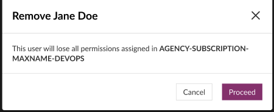

# Manage User Groups

Using the user groups, as an SA or a PA, you can:
- Group multiple users together
- Assign tool's permissions to a group
- Assign same permissions or roles to all users in a group

**Topics**

- [Create user groups](#create-user-groups)
- [Access user groups](#access-user-groups)
- [Add users to user groups](#add-users-to-user-groups)
- [Remove user groups](#remove-user-groups)
- [Remove users from user groups](#remove-users-from-user-groups)

## Create user groups

As an SA/PA, you can create user groups based on quota specified for your projects based on your subscription.  

### To create a user group
1. From the side menu, click **Users** > **All User Groups**. 
1. Click **Create Group**.  
   The **Create New User Group** window appears.  
   >**Note:** If you have consumed the quota available for user groups, the **Create Group** button is disabled. If you want to continue to add user groups beyond the available quota limit, create a service request.
1. Enter values in the following fields:     
   |Field|Description|
   |---|---|
   **Group Name**|Enter name for the group. Make sure that the group name meets the following criteria: <ul><li>Group name must be alphanumeric</li><li>Group name must be less than 40 characters</li><li>Group name can contain only `-` and `_` special characters</li></ul>|
   |**Group Description**|Enter description for the group. You can add upto 250 characters.|
   **Group Members**|Select users to be added to the group from the drop-down list. You can select active users in the current subscription only. Though inactive (suspended) users will also appear in the list, you cannot add them as group members.|

   <kbd></kbd>

1. Click **Create Group**.  
   The user group is created and appears under the **Group Name** column in the **All User Groups** window. 

   <kbd></kbd>

## Access user groups

### To access a user group
1. From the side menu, click **Users** > **All User Groups**.  

   The **All User Groups** window appears, displaying all the user groups listed under the **Group Name** column.  
   At the top, you can view the quota consumed and available. In the image below, you can see available quota is 200 and number of groups created is 100.  

   <kbd></kbd>

## Add users to user groups

### To add users to user groups

1. From the side menu, click **Users** > **All User Groups**.
1. Next to the user group to which you want to add a new user, under **Actions**, select **Manage**.   
1. In **Add users**, select additional users, and then click **Add**.  
   The newly added user appears under the **Name** column.

   <kbd></kbd>

## Remove users from user groups

### To remove a user from a user group
1. From the side menu, click **Users** > **All User Groups**.
1. Next to the user group to which you want to add a new user, under **Actions**, select **Manage**.
1. Under the **Name** column, next to the user that you want to remove, click **Remove**.  
A pop-up appears indicating that the selected user will lose all the permissions assigned to the user group.  

   <kbd></kbd>
1. Click **Proceed**.  
   The user is removed.

## Remove user groups

### To remove a user group
1. From the side menu, click **Users** > **All User Groups**.
1. Next to the user group to which you want to add a new user, under **Actions**, select **Remove group**.  
   A pop-up message appears indicating that the users in this user group will lose all permissions assigned to it.  

   <kbd></kbd>
1. Click **Proceed**.  
   The user group is removed. 

### Related Topics
- [Manage users](manage-users)
