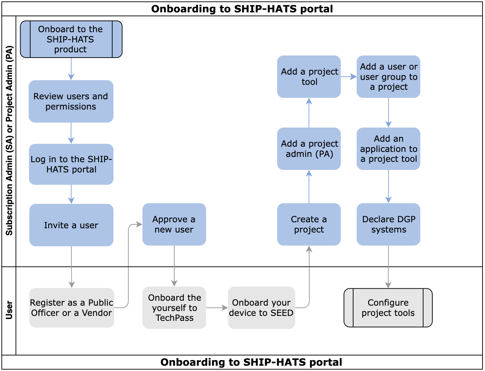

# Onboarding to SHIP-HATS Portal

The following image and table outlines the steps that you must complete to configure the SHIP-HATS portal. After you have completed these steps, you will need to perform additional steps to configure the tools that you want to use.

These tasks may be completed by multiple people in your organization and SHIP-HATS team. However, these tasks must be completed in the specified order. All steps are required unless otherwise noted.

  

|Step|Task|Owner|
|---|---|---|
|1|[Review users and permissions](user-roles-and-permissions)|Subscription Admin (SA)|
|2|[Log in to the SHIP-HATS portal](access-ship-hats-portal)|SA|
|3|[Invite a user](onboarding-users)|SA|
|4|[Register an account as a Public Officer or a Vendor](onboarding-users)|Public Officer or Vendor|
|5|[Approve a new user](onboarding-users)|SA|
|6|[Onboard the user to TechPass](https://docs.developer.tech.gov.sg/docs/techpass-user-guide/#/)|User|
|7|[Onboard the devices to SEED](https://docs.developer.tech.gov.sg/docs/security-suite-for-engineering-endpoint-devices/#/)|User|
|8|[Create a project](manage-projects)|SA|
|9|[Add a project admin](manage-admins)|SA|  
|10|[Add a project tool](manage-tools)|SA or Project Admin (PA)|
|11|[Add user or a user group to a project](manage-tools)|SA or PA|
|12|[Add an application to a project tool](manage-applications)|PA|
|13|[Declare DGP systems](declare-dgp-systems)|Agency This is an optional step.|    

### What's Next
- [Configure Project Tools](https://docs.developer.tech.gov.sg/docs/ship-hats-tools-guide/#/tools-overview).

<!--
**Topics**

- [Prerequisites](#prerequisites)
- [OpenVPN Deprecation](#openvpn-deprecation)

- [Configure Portal](#configure-portal)

## Prerequisites

Make sure that you have set up the following accounts:

- [TechPass]()
- [SEED]()

## OpenVPN Deprecation

If you have migrated from SHIP-HATS 1.0, you must onboard to TechPass and SEED. OpenVPN will be deprecated what is the timeline?.

## Configure Portal -->

<!--

https://jira.ship.gov.sg/browse/CODEX-179569
-->