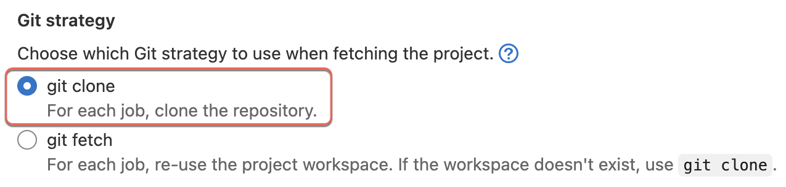

# Runners

Runners **run the CI/CD pipelines**. The Pipeline **jobs are assigned** to available Runners. Runners **execute the work** you defined in your GitLab pipeline jobs.

You can install Runners on your local machine, VM, Docker container, or any cloud infrastructure.

Runners are supported on Linux, Windows, MacOS, and FreeBSD

### GitLab Runner Executor

GitLab Runner Executor **determines the environment** in which a job will run: 
- VM via a hypervisor such as VirtualBox
- Shell
- Remote SSH
- Docker
- Kubernetes
- Custom executor

### GitLab Tags

You can **configure Tags** on the GitLab Runner. **Reference tags** in a GitLab pipeline **specify which runners should be used for the job**.

## Types of Runners

In SHIP-HATS 2.0 platform, there are 2 types of runners:  

|SHIP-HATS Shared Runners|Self-hosted Remote Runners|
|---|---|
|- Hosted by SHIP-HATS team   - Created on-demand |- Dedicated machines that are set-up and managed by agencies  - Can be configured for Group or Project level access  - Can connect to SHIP-HATS via the *IPSec tunnel* or *VPC endpoint* if they are hosted on GCC AWS or CC AWS
|- No overheads for Agencies as they do not need to maintain runners - Available for all SHIP-HATS users at no additional costs!|- Agencies bear the costs of hosting their own runners  - Agencies have full-control of the runners

## 1. SHIP-HATS Shared Runners
<!--The shared runners are hosted by the SHIP-HATS team. There are 4 variants in the shared runner pool. These runners are easily accessible to users and are scalable on demand.-->

These runners are: 
- Hosted by SHIP-HATS team 
- Created on-demand 
- Available for all SHIP-HATS users at no additional costs!
- No overheads for Agencies as they do not need to maintain runners

There are 4 variants: 

<!--
1. [CStack Runner]()
1. [Docker Runner]()
1. [Windows Runner](#windows-runner)
1. GitLab Shared Runner on SaaS: The GitLab shared runner on SaaS may replace the above runners when available in the future. 
-->

|Runner|Executor|Tags|Privileged|Cache Enabled|Run Untag|
|---|---|---|---|---|---|
|[CStack Runner](#1-cstack-runner)|kubernetes|cstack non_privileged no_root|FALSE|YES|YES|
|[Docker Runner](#2-docker-runner)|docker + machine|ship_docker non_privileged|FALSE|YES|NO|
|[Windows Runner](#3-windows-runner)|shell|ship_windows|N/A|YES|NO|
|GitLab Shared Runner on SaaS|The GitLab shared runner on SaaS may replace the above runners when available in the future. 

## 1. CStack Runner

!> We recommend using this runner by default.

- Run as non-root
- Run as 65533 user
- Uses Container Stack in SGTS

|Runner|Executor|Tags|Privileged|Cache Enabled|Run Untag|Version|
|---|---|---|---|---|---|---|
|CStack Runner|kubernetes|cstack non_privileged no_root|FALSE|YES|YES|NA|
 

## 2. Docker Runner

Use this runner to build a docker image.

- Run as root
- This runner is slower than CStack Runner for use cases that can run both runners.
- We have removed privileged access for SHIP-HATS shared runner. This affects build of systems that used the shared runners with docker-in-docker. 
- Use [Kaniko as a docker alternative](#docker-alternative-faqs). [Build and push docker image](https://sgts.gitlab-dedicated.com/wog/gvt/ship/ship-hats-templates/-/tree/main/templates#file-gitlab-ci-docker-buildyml)

|Runner|Executor|Tags|Privileged|Cache Enabled|Run Untag|Version|
|---|---|---|---|---|---|---|
|Docker Runner|docker + machine|ship_docker non_privileged|FALSE|YES|NO|NA|

## 3. Windows Runner

Use this runner for `.Net framework`. Note that a [clean up job](#note-the-following-when-using-windows-runner) is required at the beginning.

|Runner|Executor|Tags|Privileged|Cache Enabled|Run Untag|Version|
|---|---|---|---|---|---|---|
|Windows Runner|shell|ship_windows|N/A|YES|NO|- OS: MS Windows Server 2019 Base - Git: 2.36.1 - Visual Studio 2022 version 17.0 - .Net framework 4.8 development tools| 

### **Libraries**

|Component|Path|
|---|---|
**JAVA_HOME**|  C:\Program Files\OpenJDK\openjdk-11.0.15_10
**Git**|  C:\Program Files\Git
**Visual Studio IDE**|
**MSBuild17_PATH**| C:\Program Files\Microsoft VisualStudio\2022\BuildTools\MSBuild\Current\Bin
**MSBuild16_PATH**| C:\Program Files (x86)\Microsoft VisualStudio\2019\BuildTools\MSBuild\Current\bin 
**MSBuild15_PATH**| C:\Program Files (x86)\Microsoft VisualStudio\2017\BuildTools\MSBuild\Current\bin 
**.NET SDK**|C:\Windows\Microsoft.NET\Framework64\v4.0.30319 - v4 (64 bit)  C:\Windows\Microsoft.NET\Framework\v4.0.30319 -v4(32 bit)
**AppDeployment Toolkit**|C:\PADT\Toolkit
**VS2017_TEST_PATH**|C:\Program Files (x86)\Microsoft VisualStudio\2017\TestAgent\Common7\IDE\CommonExtensions\Microsoft\TestWindow
**VS2019_TEST_PATH**|C:\Program Files (x86)\Microsoft VisualStudio\2019\TestAgent\Common7\IDE\CommonExtensions\Microsoft\TestWindow
**VS2022_TEST_PATH**|C:\Program Files (x86)\Microsoft VisualStudio\2017\TestAgent\Common7\IDE\CommonExtensions\Microsoft\TestWindow
**Microsoft VS Code**|C:\Program Files\Microsoft VS Code Chocolatey v1.1.0 Scoop nano 6.3-7 Vim

### **Note the following when using Windows Runner:**

- Windows Runner has been set to run one job per instance at a time. 
- Windows Runner includes a cleanup job to remove all the downloaded and build artefacts after the job completes. For this cleanup job to work, you must use `git clone` (instead of `git fetch`) in your.NET project settings. If you use `git fetch`, the folder becomes unremovable.
    To change the project settings, you can follow one of the following methods:
    - Go to **Settings** > **CI/CD** > **General Pipelines** > **Git strategy**, and then select **Git clone**.

    

    OR  
    - Enforce `git clone` in your `gitlab-ci.yml` file by setting the `GIT_Strategy` variable to: `GIT_STRATEGY: clone`

    

-  Since the cleanup job has been enabled in Windows Runner to clean up everything after the job completes, you must push the artefacts to their repository (e.g. Nexus) to ensure data safety.
- You must complete the necessary cleanup after the build is completed by deleting any password or confidential files that might have been created or downloaded during the build job (e.g., docker config).

## 2. Self-hosted Remote Runners

<!--The agency-hosted remote runners are the dedicated machines that are set-up and managed by agencies. These runners can connect to SHIP-HATS via the *IPSec tunnel* or *VPC endpoint* if they are hosted on GCC AWS or CC AWS.--> 

These runners are:
- Dedicated machines that are set-up and managed by agencies
- Can be configured for Group or Project level access
- Can connect to SHIP-HATS via the *IPSec tunnel* or *VPC endpoint* if they are hosted on GCC AWS or CC AWS

For these runners: 
- Agencies bear the costs of hosting their own runners
- Agencies have full-control of the runners

## Remote Runner Registration

- Group or Project owner can obtain runner token through the UI.
- Registered runner has access to the project code
- Review properly when granting group/project level permission.

<!--
### Remote Bamboo Agent vs Remote Gitlab Runner Registration

## Remote Runner Architecture

### Manage self-hosted runners
### Configure runners 

#### Configure runners for deployment to GCC

## Choosing a runner
### When to use which runner
### Include Docker  Images with Kaniko
-->
### GitLab Runner monitoring

The GitLab runner has embedded Prometheus metrics HTTP server for monitoring.
- Runner business logic metrics (current running jobs?)
- Go-specific process metrics (garbage collection, memory stats)
- General process metrics (memory, CPU utilization )
- Build version information

<!--## Common Errors-->

## Recommended Approach

- SHIP-HATS Shared  Runners is highly recommended 
- Remote runner for what we don’t support example iOS 
- Unlike Bamboo, in GitLab, there is a more robust runner mechanism with sufficient runners to support parallel jobs

Therefore, to save costs, agencies should consider using the SHIP-HATS Shared  Runners except for highly urgent projects that require dedicated runners. 

## Docker Alternative FAQs

>**Tip:** Click the question or triangle to view the answer.

  
<b>What docker alternatives are available to replace docker commands?</b>
 

In [SHIP-HATS Templates](pipeline-templates) (from tag v1.0.4), the docker alternative tools used in our templates include Kaniko, Skopeo, and Crane. 

 

  
<b>Why can't SHIP-HATS Templates use one tool (e.g. Buildah or Podman) to replace all docker commands? </b>
 
<!--Why multiple docker alternative tools are available in SHIP-HATS Templates?-->

In our testing, Buildah and Podman require minimally some elevated capabilities on runner to work. These elevated capabilities are undesirable in a shared runner model as they allow host escape. So, SHIP-HATS Templates leverage several tools that do not require such runner settings to fulfil some docker commands. For example: 

<!--Based on the docker alternatives that we have identified and used in SHIP-HATS Templates, there isn't one tool that can replace docker commands completely. Therefore, we have included multiple docker alternatives that can perform certain operations that docker commands offer. -->

- Kaniko is able to build an image from a `Dockerfile` and push it to a registry. For example, it is ideal to replace `docker build` and `docker push` commands.
- Skopeo is known for copying an image from and to various storage mechanisms. For example, it is ideal to replace `docker tag`.
- Crane is a tool for interacting with remote images and registries. For example, it is ideal to replace `docker pull` and `docker push` (that cannot be performed by Kaniko and Skopeo).

 

  
<b>Are the docker alternatives identified able to fully replace the docker commands?</b>
 

No, there are certain functions that cannot be performed by the suggested docker alternatives, such as `docker run` and `docker compose`. You may consider using [GitLab services](https://docs.gitlab.com/ee/ci/services/) with your services designed to provide additional features which are network accessible.

 

  
<b>Docker alternative tools are insufficient for me and I would still need to run docker commands directly. What can I do?</b>
 

SHIP-HATS does not supply Docker-in-Docker (`dind`) or privileged shared runners. You need to self host privileged runner to use `dind` image for running docker commands directly. Refer to [Set up GitLab Runners documentation](gitlab-runners) to set up self-hosted GitLab Runner.

 

  
<b>Can the docker alternatives run on non-root and non-privileged runners (CStack runners)?</b>
 

Based on our testing on docker alternatives, Skopeo and Crane can run on non-root and non-privileged runners (tags: cstacks, non_privileged, no_root) whereas Kaniko can run on runners with root and non-privileged runners (tags: ship_docker, non_privileged).

 

  
<b>Are there any image or job templates that I can reference in my job if there are tasks that require multiple tools. For example, AWS assumes role with Kaniko to build and push image to AWS ECR.</b>
 

[Pipeline COE](https://sgts.gitlab-dedicated.com/pipelinecoe/containers) is an InnerSource project where custom images are built and shared across all projects. Most images in Pipeline COE are built from container base image that comes with multiple common tools (e.g., Wget, Git, curl, and JQ).

Please note that this project is a work in progress and the location of the images might be changed later. You may refer to the images there in your job should you find any one suitable.<!--You may refer to the images in your job to find something suitable to your requirements.--> 

If you are unable to find a suitable image in Pipeline COE, you may [raise a request](https://jira.ship.gov.sg/servicedesk/customer/portal/11) or if you find an image that can add on the tools that you require, you may edit the Dockerfile and raise an MR for platform team to review and approve. 

 

<!--
## Upcoming for Runners

-->

### Related topics

- [Set up GitLab Runners](gitlab-runners)
- [GitLab Runner](https://docs.gitlab.com/runner/)
