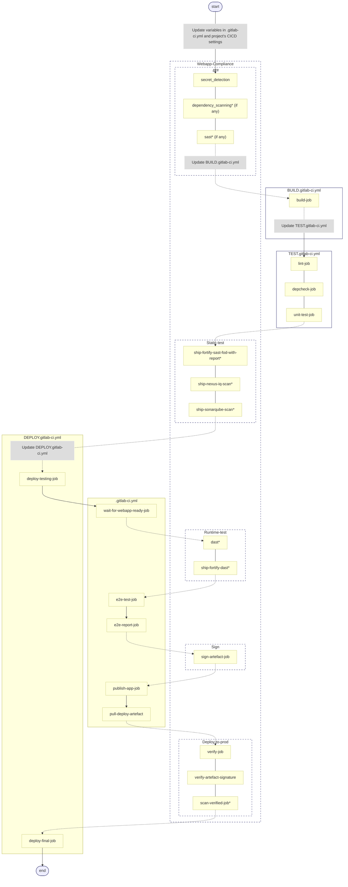

### CI/CD Flow Diagram

```mermaid
flowchart TD
   subgraph "TEST.gitlab-ci.yml"
   s1[lint-job] --- s2[depcheck-job]
   s2 --- s3[unit-test-job]
   end
   subgraph "BUILD.gitlab-ci.yml"
   b1[build-job] -.- a3["Update TEST.gitlab-ci.yml"] --> s1
   end
   subgraph "DEPLOY.gitlab-ci.yml"
   d1[deploy-testing-job]
   d3[deploy-final-job]
   end
   subgraph ".gitlab-ci.yml"
   d1 --> d2[wait-for-webapp-ready-job]
   r1[e2e-test-job] --> r2[e2e-report-job]
   p1[publish-app-job] --> p2[pull-deploy-artefact]
   end
   subgraph "Webapp-Compliance"
	subgraph "Static-test"
		s3 -.-> j4[ship-fortify-sast-fod-with-report*]
		j4 --- j5[ship-nexus-iq-scan*]
		j5 --- j6[ship-sonarqube-scan*]
		end
		subgraph "Sign"
		j9[sign-artefact-job]
		end
		subgraph ".pre"
		j1[secret_detection] --- j2["dependency_scanning* (if any)"]
		j2 --- j3["sast* (if any)"]
		j3 -.- a2["Update BUILD.gitlab-ci.yml"] -.-> b1
		end
		subgraph "Runtime-test"
		d2 -.-> j7[dast*]
		j7 --- j8[ship-fortify-dast*]
		j8 -.-> r1
		end     subgraph "Deploy-to-prod"
		p2 -.-> j10[verify-job]
		j10 --- j11[verify-artefact-signature]
		j11 --- j12[scan-verified-job*]
		j12 -.-> d3
	end
   end
   subgraph "DEPLOY.gitlab-ci.yml"
   j6 -.- a4["Update DEPLOY.gitlab-ci.yml"] -.-> d1
   end
   subgraph ".gitlab-ci.yml"
   r2 -.-> j9
   j9 -.-> p1
   end
   n1([start]) --- a1["Update variables in .gitlab-ci.yml and project's CICD settings"] --> j1
   d3 --> n2([end])
   classDef default fill:#ffd,stroke:#cc7;
   classDef A fill:#ddd,stroke:#eee;
   class a1,a2,a3,a4 A;
   classDef F fill:#fff,stroke:#226;
   class .gitlab-ci.yml,BUILD.gitlab-ci.yml,TEST.gitlab-ci.yml,DEPLOY.gitlab-ci.yml F;
   classDef C fill:#fff,stroke:#226,stroke-dasharray: 5 5;
   class Webapp-Compliance,.pre,Static-test,Runtime-test,Sign,Deploy-to-prod C;
   classDef N fill:#eef,stroke:#226;
   class n1,n2 N;
```
