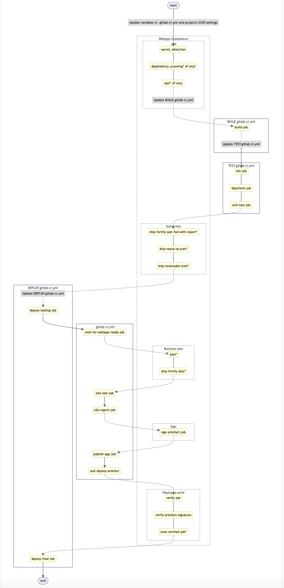

# Sample pipeline

The following section contains a sample pipeline that you can refer to estimate effort required for migration.

## Webapp E2E template

### Who should use the Webapp E2E template?

Devops engineers who need to deliver a compliant CI/CD pipeline for a standard web application (regardless of language) considering best practices and security aspects.

### Why should you use the Webapp E2E template?

Every E2E template includes:
- A compliant pipeline that ensures auto inclusion of checks, scan jobs, and reporting for you. You can apply the template to the compliant pipeline under **Project** > **Settings** > **Compliance framework**. 
- The skeleton abstracts that enables the devops engineers to focus only on how to build, test, and deploy the application while taking care of other considerations during usage.

## CI/CD Flow Diagram

To get started with the Webapp E2E template, refer to the flow diagram.

## Steps

To get started with the Webapp E2E template, complete the following steps:

1. **Add your webapp code** in the repository to build and deploy your webapp.
1. **Fill in `BUILD.gitlab-ci.yml`**

  Provide the relevant build job(s) to build your webapp, producing an artefact.  
  Expected format: `$OUTPUT_ARTEFACT`
1. **Fill in `TEST.gitlab-ci.yml`** 
  
  Provide the relevant test job(s) to test your webapp code. <!--Some examples provided are like unit testing, linting, dependency checks.--> This step is required because some testing (e.g., unit testing) is highly dependent on language or tools. 
  
  You can use the reporting feature of GitLab within the job. For more information, refer to the [GitLab reports](https://docs.gitlab.com/ee/ci/yaml/artifacts_reports.html) documentation. 
1. **Fill in `DEPLOY.gitlab-ci.yml`** 
  
  Provide the relevant deploy job(s) to deploy your webapp code. In the example, `deploy-testing-job` points to a testing environment while `deploy-final-job` points to a production environment.
  
  You can use `deploy-final-job` to test the deployment to final environment. The job is also referenced by the relative compliance pipeline. Therefore, you must not change the name of this job. This ensures that certain safeguarding measures are present before deploying to any high stake environment.
1. **Fill in variables in `.gitlab-ci.yml`**
  
  Provide values for variables for the pipeline to pass. The relative compliance pipeline that runs alongside with the main pipeline requires most of them. 
  
  If the compliance job fails, your overall pipeline will continue to pass. However, this may impact the quality or security aspects of your webapp.
1. **Provide sensitive variables**
    
  The sensitive variables provided below are required for the compliance to pass for your pipeline. You may consider adding them in your project's CI/CD variables.

    - Required: For Cosign artefacts:
      - COSIGN_PASSWORD
    - Optional: You must provide the following credentials if you want to use the specified tool:
      - For Sonarqube scan:
        - SONAR_TOKEN
        - SONAR_PROJECTKEY

  If credentials are not provided for the following tools, its corresponding GitLab Native Tools will be included in the pipeline.

  |Tools          |GitLab Native Tools| 
  |----------------|-----------|
  |Fortify SAST: <ul><li> FOD_PAT|[GitLab SAST](https://docs.gitlab.com/ee/user/application_security/sast/)|
  |Fortify DAST: <ul><li> FOD_PAT|[GitLab DAST](https://docs.gitlab.com/ee/user/application_security/dast/)|
  |Nexus IQ scan: <ul><li> NEXUS_IQ_USERNAME <li> NEXUS_IQ_PASSWORD <li> NEXUS_IQ_APP_ID <li> NEXUS_IQ_SCAN_OPTIONS (Optional; may be used to set scan for a stage for continuous monitoring by using the [--stage flag](https://help.sonatype.com/integrations/nexus-iq-cli))   See [how to turn on Continuous Monitoring for an application](https://help.sonatype.com/iqserver/managing/policy-management/continuous-monitoring-of-applications).|[GitLab Dependency Scanning](https://docs.gitlab.com/ee/user/application_security/dependency_scanning/)|

    - The following are required for the Webapp E2E template: 
      >**Note:** These are not required for compliance.

      For Nexus Repository publish:
        - NEXUS_REPO_USERNAME
        - NEXUS_REPO_PASSWORD

1. **Apply compliance framework**
  
  From your project, select **Settings** > **General** > **Compliance framework** > **ship-hats-webapp-compliance**.
  
  For more information, refer to the [ship-hats-webapp-compliance](https://sgts.gitlab-dedicated.com/WOG/ship-hats-compliance#template-webapp-compliance) documentation. These are accessible after onboarding to SHIP-HATS 2.0.

## Considerations

When using this end-to-end template:
  - Do **not** change the stages as it might impact the working of its relative compliance pipeline.
  - You may add or remove the jobs in `BUILD/TEST/DEPLOY.gitlab-ci.yml` with `# do not change the name of this job without making updates to .gitlab-ci.yml` to suit requirements for your webapp. However, you must update the change to `.gitlab-ci.yml` accordingly as it makes references to these jobs.
  - The development of this template might not fit all use cases. If you have a use case that this template is unable to accommodate, you can either raise an issue with us to consider or you may consider raising a merge request to share your use case template as this is an open source project.

<!--
## Working examples 

- [Nodets webapp](https://sgts.gitlab-dedicated.com/WOG/GVT/ship/e2e-templates/examples/nodets-webapp)
- [Python webapp](https://sgts.gitlab-dedicated.com/WOG/GVT/ship/e2e-templates/examples/python-webapp)
- CTMO working example link.

-->
