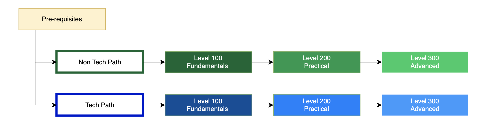

# Self-paced trainings

<!--This content has moved. Access latest content [here](./self-paced-trainings/overview.md).-->

To ensure we support at scale, anyone can access Self-paced trainings.

## Vision for DevSecOps with SHIP-HATS [15 min video]

<!--### [Vision for DevSecOps with SHIP-HATS](https://youtu.be/CeZs3nAK5gY) [15 min video]
-->
<ifigure>
<iframe title="YouTubeVideoPlayer" src="https://www.youtube.com/embed/CeZs3nAK5gY?showinfo=0" height="615" width="860" frameborder="0" allow="accelerometer; autoplay; encrypted-media; gyroscope; picture-in-picture" allowfullscreen></iframe>
</ifigure>

## Importance of CI/CD? [14 min video]

<!--### [Importance of CI/CD?](https://youtu.be/RlZCyexsJBc?t=260) [14 min video]
-->
<ifigure>
<iframe title="YouTubeVideoPlayer" src="https://www.youtube.com/embed/RlZCyexsJBc?t=260?showinfo=0" height="615" width="860" frameborder="0" allow="accelerometer; autoplay; encrypted-media; gyroscope; picture-in-picture" allowfullscreen></iframe>
</ifigure>

## DevSecOps

[DevSecOps](./self-paced-trainings/devsecops.md ':include')

# Non-Tech Path

[DevSecOps](./self-paced-trainings/non-tech-path.md ':include')

# Tech Path

[DevSecOps](./self-paced-trainings/tech-path.md ':include')

<!--
To ensure we support at scale, anyone can access Self-paced trainings. 

## Prerequisites

### Overview

- [Singapore Government Tech Stack](https://www.developer.tech.gov.sg/singapore-government-tech-stack/overview/index.html)
- [Vision for DevSecOps with SHIP-HATS](https://youtu.be/CeZs3nAK5gY)
- [Importance of CI/CD?](https://youtu.be/RlZCyexsJBc?t=260) 
- [DevSecOps policies](https://docs.developer.tech.gov.sg/docs/devsecops-playbook/)

### Know your tools

|Tools|Documentation learning resources|Video tutorials|
|---|---|---|
**GitLab**| [GitLab documentation](https://docs.gitlab.com/) | [Learn with GitLab Tutorials](https://docs.gitlab.com/ee/tutorials/)
**Jira**| [Jira documentation](https://www.atlassian.com/software/jira/guides/getting-started/overview) | [Learn with Jira Tutorials](https://www.youtube.com/watch?v=bvU1Plc31WQ)
**Confluence** |[Confluence documentation](https://www.atlassian.com/software/confluence/guides/get-started/confluence-overview) | [Learn with Confluence Tutorials](https://www.youtube.com/watch?v=EVgeukYoHZ4)
**Fortify on Demand**| [FOD documentation](https://sgp.fortify.com/Docs/en/index.htm)|[Learn with FOD Tutorials](https://www.youtube.com/watch?v=3pqc-vSr0Yo)
**Nexus IQ** |[Nexus IQ documentation](https://www.sonatype.com/nexus-iq-server)|[Learn with Nexus IQ Tutorials](https://www.youtube.com/watch?v=jYgZcs1TwQ8)
**SonarQube**| [SonarQube documentation](https://docs.sonarqube.org/latest/)|[Learn with SonarQube Tutorials](https://www.sonarqube.org/sonarqube-9-5/)

## DevSecOps Basic Quiz

Getting ready for SHIP-HATS 2.0? Take a short [DevSecOps Basic quiz](https://forms.office.com/pages/responsepage.aspx?id=2C5u0OVT90SBNoc86LqpOxwQKkSeUz5Anl_vW239zUZUNldQVlVIUEgwUTNMS0ZaMjc5WU0zMklQRyQlQCN0PWcu) to test your fundamentals. 

## Learning resources

### Webinar Series

For webinar series, refer to the [Learning events > Past events](https://docs.developer.tech.gov.sg/docs/ship-hats-getting-started/learning-events?id=past-events) section in this documentation. 

### Non Tech

|Level|Category|Courses|
|---|---|---|
100| Overview | [SHIP-HATS 2.0 Strategy & Updates](https://youtu.be/dRfI_zXgiHs) 
100| Overview|[Technical Architecture Video](https://youtu.be/aMARb5xd1qI)    [Technical Architecture Doc](architecture)|
100| Process|[Subscription for SHIP-HATS](subscription) 
100| Process | [Onboarding to SHIP-HATS](https://docs.developer.tech.gov.sg/docs/ship-hats-getting-started/onboard-to-ship-hats) |
100| Tools|[Using SHIP-HATS Portal](https://docs.developer.tech.gov.sg/docs/ship-hats-portal/)|
|100| Tools|[CI/CD Basics with GitLab](https://youtu.be/x0WZkNScbzs) | 
|100| Tools|[Developer Journey - Idea to Production](https://www.youtube.com/watch?v=4aGvMxRe9go)| 
100|Management|	GitLab as a PM Tool (Coming soon!)
100	|Management	|What are the [DORA metrics](https://cloud.google.com/blog/products/devops-sre/using-the-four-keys-to-measure-your-devops-performance)?
|100 |Management |[DevOps Metrics with GitLab](https://www.youtube.com/watch?v=Zh0uVUMyzLI)|
|200|Tools|[Understanding Templates](pipeline-templates) |
|200|Process|[Understanding Compliance Framework](https://youtu.be/jCCN_d0fCPM)|

### Tech Path

|Level|Category|Courses|
|---|---|---|
 100 |Overview| [Overview](https://youtu.be/dRfI_zXgiHs)    [Getting Started documentation](ship-hats-overview)
|100 | Overview| [Technical Architecture Video](https://youtu.be/aMARb5xd1qI)    [Technical Architecture Doc](architecture)
|100| Tools|[CI/CD Basics with GitLab](https://youtu.be/x0WZkNScbzs) | 
|100| Tools|[Developer Journey - Idea to Production](https://www.youtube.com/watch?v=4aGvMxRe9go) | 
100	|Tools|[Understand Pipeline Template Overview](pipeline-templates)   [Sample Pipeline](sample-pipeline)
|200 | Access| Access to SGTS: [TechPass for Developers](https://docs.developer.tech.gov.sg/docs/techpass-user-guide/)    Access to SGTS: [SEED for Developer Devices](https://docs.developer.tech.gov.sg/docs/security-suite-for-engineering-endpoint-devices/)
|200|Tools|[Review End to End Pipelines (For SHIP-HATS Users)](https://sgts.gitlab-dedicated.com/WOG/GVT/ship/ship-hats-templates)   Accessible after onboarding to SHIP-HATS 2.0.
|200|Tools|Review Modular Pipeline (For SHIP-HATS Users) (Coming soon!)
|200|Tools|[Apply Compliance Framework](https://sgts.gitlab-dedicated.com/WOG/ship-hats-compliance)    Accessible after onboarding to SHIP-HATS 2.0.

### Related topics
- [Developer Essentials for Public Sector](https://docs.developer.tech.gov.sg/docs/developer-essentials-for-public-sector/)

-->

<!--
The training journey has been divided into various sections and has been categorized into different levels based on different experience levels. The [Prerequisites](#prerequisites) section covers basic concepts that are required to understand the product. After you have familiarized yourself with basic concepts, take a [DevSecOps Basic Quiz](#devsecops-basic-quiz) to review your fundamentals. The [Learning Resources](#learning-resources) provides you various resources in the form of [Webinars](#webinar-series) has been divided into three sections to 

The Level 100 trainings cover introductory topics. In the first phase of training roll out, we will be focusing on this level. While the Level 200 trainings cover topics for practitioners who have hands-on experience of the introductory topics, the Level 300 trainings focus on topics for intermediate to expert practitioners.

To begin your learning journey, we recommend that you complete the [prerequisites](#prerequisites) section before you deep dive into the level-based [technical](#technical) and [non-technical](#non-technical) training resources.

-->
<!--

## Vision

-->

<!--

## For Project Manager & Business Analysts

|Category|Topics|
|---|---|
|Prerequisites|- [Read the recommended best practices in the DevSecOps playbook](https://docs.developer.tech.gov.sg/docs/devsecops-playbook/) - [Learn the CI/CD basics](https://docs.developer.tech.gov.sg/docs/devsecops-playbook/devsecops-playbook?id=elements-of-devsecops-continuous-integration-amp-continuous-delivery)|
|Products 101|- CI/CD with GitLab (Coming in September)
|Onboarding to SHIP-HATS|- Pricing & Subscription Overview (Coming in October) - [Subscription Process](https://docs.developer.tech.gov.sg/docs/ship-hats-getting-started/subscription) 

## For Developers

|Category|Topics|
|---|---|
|Prerequisites|- [Read the recommended best practices in the DevSecOps playbook](https://docs.developer.tech.gov.sg/docs/devsecops-playbook/) - [Learn the CI/CD basics](https://docs.developer.tech.gov.sg/docs/devsecops-playbook/devsecops-playbook?id=elements-of-devsecops-continuous-integration-amp-continuous-delivery)|
|Products 101|- CI/CD with GitLab (Coming in September)
|SHIP-HATS 101|- [Architecture Overview](https://docs.developer.tech.gov.sg/docs/ship-hats-getting-started/architecture) - Tools Overview (coming soon)

### Pre-requisites

- [Read the recommended best practices in the DevSecOps playbook](https://docs.developer.tech.gov.sg/docs/devsecops-playbook/)
- [Learn the CI/CD basics]()

|Pre-requisites||
|---|---|
[DevSecOps](https://docs.developer.tech.gov.sg/docs/devsecops-playbook/) – read the recommended best practices in the playbook|Tech Doc
CI/CD basics|Self-learn

### Products 101
- CI/CD with GitLab [Coming in September]
    - Video Playlist
- Should we list tutorials of non GitLab tools??|

|Products 101||
|---|---|
CI/CD with GitLab [Coming in September]|Video Playlist
Should we list tutorials of non GitLab tools??|

### Onboarding SHIP-HATS

- [Pricing & Subscription Overview [Coming in October]]()
- [Subscription Process](subscription) 

|Onboarding SHIP-HATS||
|---|---|
Pricing & Subscription Overview [Coming in October]|Video
Subscription Process |Tech Doc

### SHIP-HATS 101

- [Project management using SHIP-HATS Portal]()

|SHIP-HATS 101||
|---|---|
Project management using SHIP-HATS Portal|Tech Doc

## For Developers

### Prerequisites

- [Read the recommended best practices in the DevSecOps playbook](https://docs.developer.tech.gov.sg/docs/devsecops-playbook/)
- [Learn the CI/CD basics]()

### Products 101

- CI/CD with GitLab [Coming in September]
    - Video Playlist
- Should we list tutorials of non GitLab tools??
 

### SHIP-HATS 101

- [Architecture Overview](architecture)
- [Templates Overview](templates)
- [Tools Overview]()

|Topic|Resources|
|---|---|
Architecture Overview | Tech Doc
Templates Overview |Tech Doc
Tools Overview|Tech Doc
-->