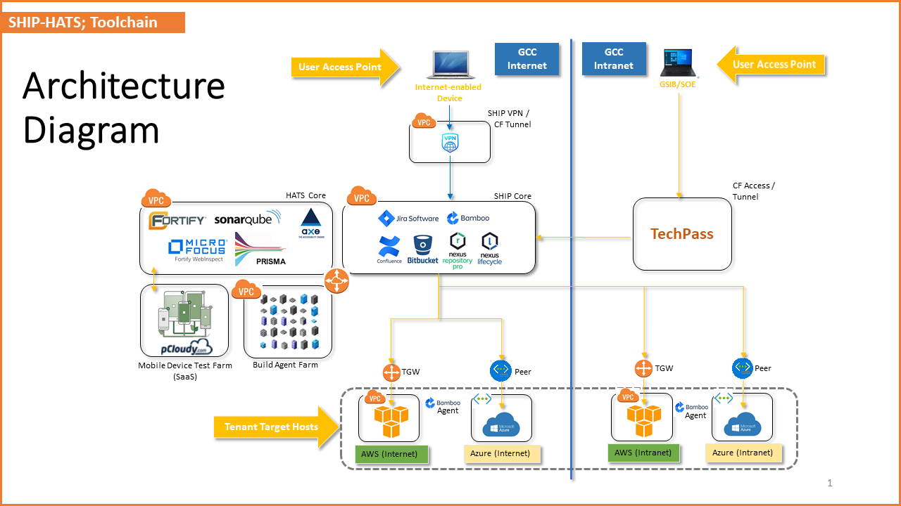

# SHIP-HATS Overview

**SHIP** is a continuous integration and continuous deployment (CI/CD) platform that automates the delivery of applications and simplifies policy clearance.

**HATS** is a functional test automation tool for web and mobile applications. It allows government developers to define end-to-end test scenarios and implement the test steps/actions, together with assertion checks.

By offering a common development platform, automating delivery of applications and simplifying policy clearance, SHIP-HATS establishes a consistent and automated way for continuous integration, continuous testing and delivery to create better quality products faster. 

The platform offers following features:
- **Visibility & Transparency:** Have a better understanding of how your project is being carried out
- **Speedy Time to Market:** Promotes faster delivery of features, fixes and updates
- **Reduce Procurement:** Access a range of tools instead of sourcing individually
- **SG Government Conformity:** SHIP-HATS is designed to be compliant to AIAS and IM8 policies

SHIP-HATS drives best practices and policy compliance requirements. The platform provides recommended configurations and recipes to accelerate the development work and provide greater transparency in software development activities to promote collaboration and to support auditing tasks.

**Topics**
- [Architecture](#architecture)
- [Tools in SHIP-HATS](#tools-in-ship-hats)
- [Subscription](#subscription)
- [User Roles and Permissions](#user-roles-and-permissions)

## Architecture

**Commercially Off the Shelf (COTS)** tools are available on SHIP-HATS with the right security and compliance settings. The following diagram shows how they work together to provide a seamless platform. For more information on tools, refer to the [Tools in SHIP-HATS](#tools-in-ship-hats) section.

### Terminology
The above diagram uses the following terminology:

| **Term** | **Description** |
| --- | --- |
| GSIB | Government Standard Image Build|
| GCC | Government Commercial Cloud |
| SOE | Standard ICT Operating Environment|
| VPC | Virtual Private Cloud|
| TWG | Transit Gateway|

## Tools in SHIP-HATS
 
The following section provide links to documentation and tutorials to learn the tools offered under **SHIP-HATS**. Note that these are not specific to SHIP-HATS but a pre-cursor to enable you to use these tools within SHIP-HATS effectively.  

### Project Management Tools

| **Tool** | **Description** | **Links** |
| --- | --- | --- |
| **Jira** | Project management tool that is used to view, track, and manage projects and the progress of your team's tasks or bugs for a sprint displayed in an agile board. | [Overview](https://www.atlassian.com/software/jira/guides/getting-started/overview) & [Tutorials](https://www.atlassian.com/software/jira/guides/getting-started/basics#step-2-pick-a-template) | 
| **Confluence** | Shared space for collaboration to view, access, and manage all tasks and problems for the entire team enforces the idea of shared responsibility. Shared knowledge and environment also encourages experimentation. | [Overview](https://www.atlassian.com/software/confluence/guides/get-started/confluence-overview#hosting-options) & [Tutorials](https://www.atlassian.com/software/confluence/guides/get-started/set-up) | 
| **Bitbucket** | Version control tool for software engineering team to collaborate on source code and integrate with software development tools to automate the release pipeline. | [Overview](https://www.atlassian.com/software/bitbucket/guides/getting-started/overview) & [Tutorials](https://www.atlassian.com/software/bitbucket/guides/basics/bitbucket-interface#your-work) |

### Build Tools

| **Tool** | **Description** | **Link** |
| --- | --- | --- |  
| **Bamboo** | Tool for Continuous Integration that enables constant merging and testing of code, which leads to early defect detection and saves time to fix merge issues. This also enables the development teams to receive rapid feedback on their work. |  [Overview](https://www.atlassian.com/software/bamboo) |

### QA & Security Tools

| **Tool** | **Description** | **Links** |
| --- | --- | --- |
| **Nexus Repository Manager** | Tool for artifact management to ensure that the development, build, and production environments deploy consistent artifacts. This tool helps in reducing errors due to differences in build artifacts. This tool also provides version control for release artifacts for better control and easier rollback. | [Overview](https://www.sonatype.com/product-nexus-repository) |  
| **Nexus IQ** | Tool for scanning application binaries and open source libraries for all popular formats, including NPM, Nuget, Maven, Bowser, and more. This tool continuously monitors and alerts users of open-source vulnerabilities. | [Overview](https://www.sonatype.com/nexus-iq-server) |  
| **pCloudy Test Farm** | Tool to run automated tests on browsers (desktop and mobile) and mobile apps. Automation is triggered from Bamboo using the [Robot Framework](https://robotframework.org/). | [Overview](https://www.pcloudy.com/) |
| **SonarQube** | Automatic code review tool to detect bugs, vulnerabilities, and code smell. 15 supported base languages include C#, Java, CSS, VB.NET, JavaScript, XML, TypeScript, Python, Flex, Kotlin, PHP, Go, Ruby, HTML, and Scala. | [Overview](https://docs.sonarqube.org/latest/) |
| **Fortify WebInspect** | Dynamic Application Security Testing (DAST) tool that identifies vulnerabilities in web applications and APIs while they are running in production. | [Overview & Free Trial](https://www.microfocus.com/en-us/products/webinspect-dynamic-analysis-dast/overview) |  |
**Fortify SCA** | Static Application Security Testing (SAST) tool that identifies security vulnerabilities in software source code. Developers find and fix security defects in real-time during the coding process, with integrations to IDEs. | [Overview](https://www.microfocus.com/en-us/products/static-code-analysis-sast/overview) |  

## Subscription

[SHIP-HATS](https://www.developer.tech.gov.sg/products/categories/devops/ship-hats/overview) manages its tenants through subscriptions. Only agencies can subscribe to SHIP-HATS, however, agencies can extend subscriptions to non-agency users, such as vendors. Following image shows the 4 subscription tiers (Starter, Squad, Team, and Tribe) and available add-ons for each service under SHIP-HATS.

 

 
<b>How does an agency subscribe to SHIP-HATS?</b>
 

1. Please send an email to <enquiries_ENP@tech.gov.sg> with the primary email contact. 
2. We will send an **Onboarding Form** to the Primary Contact to provide information such as subscription requirements, Start Date, details of Primary Contact, Secondary
 Contact, Agency Nominated Approver and Billing Contact.  
3. We review the information provided and email the Universal Service Terms (UST) and Service Sheet to the agency nominated approver for approval. 
4. Once approved, we provisioni Primary and Secondary subscription administrator accounts.

For vendors, kindly get in touch with the agency that you engage with for SHIP-HATS access.
 

 

 
<b>How much does it cost to subscribe to SHIP-HATS?</b>
 

Refer to <a href="https://sgdcs.sgnet.gov.sg/sites/IDA-GoSync/gdspdd-ai/ship/SitePages/Pricing.aspx"> pricing details</a> accessible via your GSIB/SOE machine.
 

 

 
<b>When does billing start for a subscription?</b>
 

Billing starts only from the first of the following month as we offer free subscription from the day of account provisioning until the first of the following month. 
For example, if account was provisioned on 5 February 2021, billing starts from 1 March 2021. We charge on a monthly basis, and agency receives invoices every quarter.
 

 

 
<b>Can there be users who just have “read-only” access? </b>
 

Yes. Note that users with read-only access are also counted as one of the users of that subscription.
 

 

 
<b>Can I upgrade or downgrade to a different tier and how do I do this?</b>
 

Yes. Subscription Administrator may upgrade or downgrade to a different tier by raising a [service request](https://jira.ship.gov.sg/servicedesk/customer/portal/11)ii. While you may upgrade to an upper tier anytime, you can downgrade to a lower tier after the Minimum Commitment Periodiii. 
 
For example, if TEAM tier was provisioned on 1 February 2021, the Subscription Administrator may raise a service request to upgrade to TRIBE tier anytime. If needed, you may request to downgrade to SQUAD or STARTER tiers after 1 August 2021.
 

 

 
<b>Can I add-on or scale-down tools or resources bundled along with my subscription?</b>
 

Yes. Subscription Administrator may add-on additional tools or resources any time and scale-down newly added tools after the Minimum Commitment Periodiii. Agency can scale up requirement at any point of time. To add on or scale-down the newly added tools, Subscription Administrator can raise a [service request](https://jira.ship.gov.sg/servicedesk/customer/portal/11)ii. 
 
For example, if TEAM tier was provisioned on 1 February 2021 and later you identify a need to have a total of 40 users, 400 shared agent hours and six applications to be scanned for vulnerabilities. In this case, you may add on 2 sets of eight users, 100 shared agent hours and two more apps to your subscription anytime. To remove these add-ons, Subscription Administrator can raise a service request after 1 August 2021.
 

 

 
<b>How do I cancel my subscription?</b>
 

Subscription Administrator can cancel the subscription. For more information, refer to the [Off-board an Account](https://docs.developer.tech.gov.sg/docs/ship-hats-documentation/#/manage-account?id=off-board-an-account) documentation. 
 

 

 
<b>Can I monitor resource utilisation at subscription and project levels? </b>
 

Yes, as a Subscription Administrator or a Project Administrator, you can monitor resource utilisation from your SHIP-HATS account.

Subscription Administrators can monitor Plan Details, Named Users, Projects and Bamboo utilisation hours at the subscription level while Project Administrators can monitor Named Users and Bamboo utilisation hours at the associated project level.
  

 
 

  
<b>How many projects can be associated with a subscription?</b>
 

| Tier name | Maximum no. of projects |
| ------------- |:-------------:|
| Starter       |       6             |
| Squad         |       12            |
| Team          |       24            |
| Tribe         |       48            |

 

 
  

 
<b>How does SHIP-HATS pricing compare with other commercially available CI/CD tools? </b>
 

Based on Total Cost of Ownership which includes set up and operating costs (including maintenance and audit), SHIP-HATS’ bundled pricing is approximately 60% more cost-efficient than subscribing to commercial licenses individually. Public officers can visit the [Competitive Pricing Assessment](https://sgdcs.sgnet.gov.sg/sites/IDA-GoSync/gdspdd-ai/ship/_layouts/15/WopiFrame2.aspx?sourcedoc=%7BACB6DFA8-2433-48B8-9A24-BABA8688B0F6%7D&file=SHIP-HATS%20Competitive%20Pricing%20Assessment.pdf&action=default&IsList=1&ListId=%7B609D81FE-D9DB-4B7D-8D1A-1F02CD38880C%7D&ListItemId=80) for a cost comparison with Azure DevOps and GitLab.
 

 

 
<b>Can I subscribe to individual tools like Jira or Confluence only?</b>
 
 
We are not offering tools individually now; our bundles have been carefully designed to enable agencies adopt good DevSecOps practices. However, if you are keen and have valid reasons, please let us know using [SHIP-HATS Enquiries](https://go.gov.sg/she) form so that we may assess the possibility based on the demand.
 

  

 
<b>Can I request for a trial subscription?</b>
 

Yes, we offer a 1-month trial account subject to availability. Agencies can reach <enquiries_ENP@tech.gov.sg> to request for trial accounts.
 

 

 
<b>What security classification is supported by SHIP-HATS?</b>
 

SHIP-HATS supports applications and content that are “Restricted” or below.
 

 
Can I use an existing email address to add a new user account?
 

No. Each user account requires a unique email address. For each new user account, you must use a new email address. 
 
 

 
<b>What are the Basic languages that are available for SonarQube add-on and who can buy them as add-on?</b>
 

[Languages](https://docs.sonarqube.org/latest/analysis/languages/overview/) supported by SonarQube's [Community edition](https://www.sonarsource.com/plans-and-pricing/community/) are the basic languages. Note that only tenants who have subscribed to **Starter** tier can buy this add-on as it is available by default for other tiers.
 

 

 
<b>Is there any add-on to support multiple branch analysis in SonarQube?</b>
 

Yes. You can add additional programming languages which extend your SonarQube Community edition capabilities to support the [Developer edition](https://www.sonarqube.org/developer-edition/) features and this includes multiple branch analysis. For more information on the languages supported, please refer to [languages](https://docs.sonarqube.org/latest/analysis/languages/overview/) supported by SonarQube.
 

 
[i] Depending on the agency’s response time to answer any follow-up queries raised by us, it may take 1-3 business days to provision the Subscription Administrator accounts. 
[ii] We take 1-3 business days to process a service request. 
[iii] Six consecutive months from the date of account provisioning. 

## User Roles and Permissions

[SHIP-HATS](https://www.developer.tech.gov.sg/singapore-government-tech-stack/toolchain/overview.html) tenants are managed through subscriptions. Following roles and permissions are available to agencies and vendors within the SHIP-HATS web portal:

| **Role** | **Description** | **Permissions** |  
| --- | --- | --- |
| **Subscription Administrator (SA)** | Each subscription is managed by SA. Only an agency user can be assigned as an SA and there can be up to two SAs per subscription. By default, an SA has all the rights in a subscription. SAs can view the limit of projects, project admins, and users quota within the SHIP-HATS Portal pages. | Refer to [SA Permissions](#sa-permissions) for detailed permissions. |
| **Project Administrator (PA)** | A subscription can have multiple projects and each project is managed by PAs. An Agency user or a vendor can be assigned as a PA.   **Note:** The number of PAs that can be added to a project through the SHIP-HATS portal vary based on your subscription tier level. PAs can view the limit of projects, project admins, and users quota within the SHIP-HATS Portal pages. | Refer to [PA Permissions](#pa-permissions) for detailed permissions. |  
| **User** | User is the default role for all the users from the Agency and vendors. | Refer to [User Permissions](#user-permissions) for detailed permissions. For tool-specific permissions, refer to [Tools Permissions](#tools-permissions).|  

### SA Permissions
- Manage a subscription including upgrading or downgrading to a different tier from [SHIP-HATS Portal](https://www.ship.gov.sg/). For more information, refer to the [Subscription FAQs](subscription).
- Add users to a subscription and manage their roles.
- Create and manage projects. While creating a project, it is mandatory to assign at least one Project Administrator (PA). The maximum number of PAs allowed depends on your subcription model.
- Request or remove additional resources for a subscription. For more information refer to the [SHIP-HATS Portal](https://www.ship.gov.sg/). For more information, refer to the [Subscription FAQs](subscription).

### PA Permissions
- Manage project from [SHIP-HATS Portal](https://www.ship.gov.sg/).
- Add users to a subscription and manage their roles. Note that only SA can assign PA role to a user.
- Add tools to project.
- Add users to a project and manage their roles within the tools.

### User Permissions
- Perform assigned functional roles and responsibilities within the associated tool(s).

### Tools Permissions  

For user roles and permissions related to tools, refer to respective [tool document area via the left navigation](tools-overview). 
<!--
- [Bitbucket User Roles and Permission](bitbucket-user-role)
- [Bamboo User Roles and Permission](bamboo-user-roles)
- [Confluence User Roles and Permission](confluence-user-role)
- [Jira User Roles and Permission](jira-user-role)
- [Fortify User Roles and Permissions](fortify-user-roles-and-permissions)
-->

