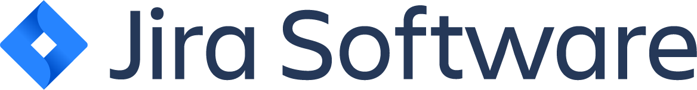
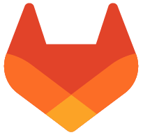
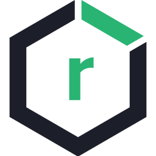
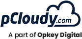

# SHIP-HATS Overview

**SHIP (Secure Hybrid Integration Pipeline)-HATS (Hive Agile Testing Solutions)** is a Continuous Integration/Continuous Delivery [CI/CD](https://en.wikipedia.org/wiki/CI/CD) component within SG Government Tech Stack (SGTS) with security and governance guardrails that enables developers to plan, build, test, and deploy code to production.  

- **SHIP** is a continuous integration platform that automates the delivery of applications and simplifies policy clearance.
- **HATS** is a continuous deployment platform that provides functional test automation tools for web and mobile applications. It allows government developers to define end-to-end test scenarios and implement the test steps/actions, together with assertion checks.

By offering a common development platform, automating delivery of applications and simplifying policy clearance, SHIP-HATS establishes a consistent and automated way for continuous integration, continuous testing and delivery to create better quality products faster. 

**Topics**

- [Learn why is CI/CD important](#learn-why-is-cicd-importanthttpsyoutuberlzcyexsjbct260)
- [Features](#features)
- [Architecture](#architecture)
- [Terminology](#terminology)
- [Tools in SHIP-HATS](#tools-in-ship-hats)

## [Learn why is CI/CD important](https://youtu.be/RlZCyexsJBc?t=260)

<ifigure> 
<iframe title="YouTubeVideoPlayer" src="https://www.youtube.com/embed/RlZCyexsJBc?t=260showinfo=0" height="500" width="790" frameborder="0" allow="accelerometer; autoplay; encrypted-media; gyroscope; picture-in-picture" allowfullscreen></iframe>
</ifigure>

<!--

-->

## Features

The SHIP-HATS platform offers following features:
- **Visibility & Transparency:** Have a better understanding of how your project is being carried out
- **Speedy Time to Market:** Promotes faster delivery of features, fixes and updates
- **Reduce Procurement:** Access a range of tools instead of sourcing individually
- **SG Government Conformity:** SHIP-HATS is designed to be compliant to AIAS and IM8 policies

SHIP-HATS drives best practices and policy compliance requirements. The platform provides recommended configurations and recipes to accelerate the development work and provide greater transparency in software development activities to promote collaboration and to support auditing tasks.

<!--
**Topics**
- [Architecture](#architecture)
- [Terminology](#terminology)
- [Tools in SHIP-HATS](#tools-in-ship-hats)
- [User Roles and Permissions](#user-roles-and-permissions)
-->

## Architecture

**Commercially Off the Shelf (COTS)** tools are available on SHIP-HATS with the right security and compliance settings. The following diagram shows how they work together to provide a seamless platform. 

For information on tools, refer to the [Tools in SHIP-HATS](#tools-in-ship-hats) section.

## Terminology
This documentation uses the following terminology:

| **Term** | **Description** |
| --- | --- |
| GSIB | Government Standard Image Build|
| GCC | Government Commercial Cloud |
| SOE | Standard ICT Operating Environment|
| VPC | Virtual Private Cloud|
| TGW | Transit GateWay|

## Tools in SHIP-HATS

The following section provide links to documentation and tutorials to learn the tools offered under **SHIP-HATS**. Note that these are not specific to SHIP-HATS but a pre-cursor to enable you to use these tools within SHIP-HATS effectively.  

For information on specific versions of Tools in SHIP-HATS, refer to the [Tools](https://docs.developer.tech.gov.sg/docs/ship-hats-tools-guide/#/tools-overview) guide. 

### Project Management Tools

| Tool | Description | Links |
| --- | --- | --- |
|Shared space for collaboration to view, access, and manage all tasks and problems for the entire team enforces the idea of shared responsibility. Shared knowledge and environment to encourage experimentation. With Confluence Cloud, Atlassian hosts your site for you to provide you immediate access to latest features.| [Overview](https://www.atlassian.com/software/confluence/guides/get-started/confluence-overview) & [Tutorial](https://www.atlassian.com/software/confluence/guides/get-started/set-up) |
|Project management tool that is used to view, track, and manage projects and the progress of your team's tasks or bugs for a sprint displayed in an agile board. With Jira Software Cloud, Atlassian hosts and sets up your Jira Software site in the cloud for you. This allows you to get started quickly and easily without the need to manage the technical complexity of hosting yourself. | [Overview](https://www.atlassian.com/software/jira/guides/getting-started/overview) & [Tutorial](https://www.atlassian.com/software/jira/guides/getting-started/basics) |

### Build Tools

| Tool | Description | Links |
| --- | --- | --- |  
|Tool for Continuous Integration that enables constant merging and testing of code, which leads to early defect detection and saves time to fix merge issues. This also enables the development teams to receive rapid feedback on their work. |  [Get Started with GitLab](https://docs.gitlab.com/ee/user/index.html) & [Tutorials](https://docs.gitlab.com/ee/tutorials/)|

### QA & Security Tools

| Tool | Description | Links |
| --- | --- | --- |
| **Nexus Repository Manager** | Tool for artifact management to ensure that the development, build, and production environments deploy consistent artifacts. This tool helps in reducing errors due to differences in build artifacts. This tool also provides version control for release artifacts for better control and easier rollback. | [Overview](https://www.sonatype.com/product-nexus-repository) & [Tutorials](https://help.sonatype.com/learning/repository-manager-3)|  
| Tool for artifact management to ensure that the development, build, and production environments deploy consistent artifacts. This tool helps in reducing errors due to differences in build artifacts. This tool also provides version control for release artifacts for better control and easier rollback. | [Overview](https://www.sonatype.com/product-nexus-repository) & [Tutorials](https://help.sonatype.com/learning/repository-manager-3)|
| **Nexus IQ** | Tool for scanning application binaries and open source libraries for all popular formats, including NPM, Nuget, Maven, Bowser, and more. This tool continuously monitors and alerts users of open-source vulnerabilities. | [Overview](https://www.sonatype.com/nexus-iq-server) & [Getting Started](https://help.sonatype.com/iqserver)|  
| **pCloudy Test Farm** | Tool to run automated tests on browsers (desktop and mobile) and mobile apps. Automation is triggered from Bamboo using the [Robot Framework](https://robotframework.org/). | [Overview](https://www.pcloudy.com/) & [Documentation](https://www.pcloudy.com/mobile-application-testing-documentation/index.php)|
| | Tool to run automated tests on browsers (desktop and mobile) and mobile apps. Automation is triggered from Bamboo using the [Robot Framework](https://robotframework.org/). | [Overview](https://www.pcloudy.com/) |
| **SonarQube** | Automatic code review tool to detect bugs, vulnerabilities, and code smell. 15 supported base languages include C#, Java, CSS, VB.NET, JavaScript, XML, TypeScript, Python, Flex, Kotlin, PHP, Go, Ruby, HTML, and Scala. | [Overview](https://docs.sonarqube.org/latest/) |
|  | Automatic code review tool to detect bugs, vulnerabilities, and code smell. 15 supported base languages include C#, Java, CSS, VB.NET, JavaScript, XML, TypeScript, Python, Flex, Kotlin, PHP, Go, Ruby, HTML, and Scala. | [Overview](https://docs.sonarqube.org/latest/) |
| **Fortify on Demand** | A tool that identifies vulnerabilities without the need for external infrastructure or resources. | [Overview & Free Trial](https://www.microfocus.com/en-us/cyberres/application-security/fortify-on-demand) |  
|  | A tool that identifies vulnerabilities without the need for external infrastructure or resources. | [Overview & Free Trial](https://www.microfocus.com/en-us/cyberres/application-security/fortify-on-demand) |  

<!--
## User Roles and Permissions

[SHIP-HATS](https://www.developer.tech.gov.sg/singapore-government-tech-stack/toolchain/overview.html) tenants are managed through subscriptions. Following roles and permissions are available to agencies and vendors within the SHIP-HATS web portal:

| **Role** | **Description** | **Permissions** |  
| --- | --- | --- |
| **Subscription Administrator (SA)** | Each subscription is managed by SA. Only an agency user can be assigned as an SA and there can be up to two SAs per subscription. By default, an SA has all the rights in a subscription. SAs can view the limit of projects, project admins, and users quota within the SHIP-HATS Portal pages. | Refer to [SA Permissions](#sa-permissions) for detailed permissions. |
| **Project Administrator (PA)** | A subscription can have multiple projects and each project is managed by PAs. An Agency user or a vendor can be assigned as a PA.   **Note:** The number of PAs that can be added to a project through the SHIP-HATS portal vary based on your subscription tier level. PAs can view the limit of projects, project admins, and users quota within the SHIP-HATS Portal pages. | Refer to [PA Permissions](#pa-permissions) for detailed permissions. |  
| **User** | User is the default role for all the users from the Agency and vendors. | Refer to [User Permissions](#user-permissions) for detailed permissions. For tool-specific permissions, refer to [Tools Permissions](#tools-permissions).|  

### SA Permissions
- Manage a subscription including upgrading or downgrading to a different tier from [SHIP-HATS Portal](https://www.ship.gov.sg/). For more information, refer to the [Subscription FAQs](subscription).
- Add users to a subscription and manage their roles.
- Create and manage projects. While creating a project, it is mandatory to assign at least one Project Administrator (PA). The maximum number of PAs allowed depends on your subcription model.
- Request or remove additional resources for a subscription. For more information refer to the [SHIP-HATS Portal](https://www.ship.gov.sg/). For more information, refer to the [Subscription FAQs](subscription).

### PA Permissions
- Manage project from [SHIP-HATS Portal](https://www.ship.gov.sg/).
- Add users to a subscription and manage their roles. Note that only SA can assign PA role to a user.
- Add tools to project.
- Add users to a project and manage their roles within the tools.

### User Permissions
- Perform assigned functional roles and responsibilities within the associated tool(s).

### Tools Permissions  

For user roles and permissions related to tools, refer to the Users and Permissions section in the [SHIP-HATS Tools guide](https://docs.developer.tech.gov.sg/docs/ship-hats-tools-guide/#/tools-overview). 
-->

<!--
- [Bitbucket User Roles and Permission](bitbucket-user-role)
- [Bamboo User Roles and Permission](bamboo-user-roles)
- [Confluence User Roles and Permission](confluence-user-role)
- [Jira User Roles and Permission](jira-user-role)
- [Fortify User Roles and Permissions](fortify-user-roles-and-permissions)
-->

