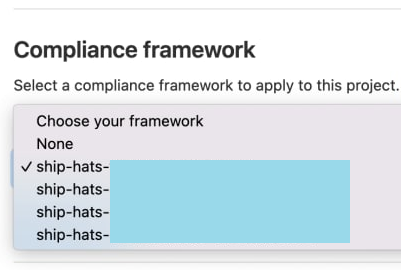

**[SHIP-HATS 2.0 Compliance Framework](https://sgts.gitlab-dedicated.com/WOG/ship-hats-compliance)** is based on [GitLab Compliance Framework](https://docs.gitlab.com/ee/administration/compliance.html) feature. 

Using this feature, you can automate the [DevSecOps practices](https://docs.developer.tech.gov.sg/docs/devsecops-playbook/) that we encourage all agencies to adopt based on industry pipeline security as well as IM8 DevSecOps standards. 

The following list provides few of the DevSecOps practices supported by the Compliance Framework: 

- SCA including Dependency scanning 
- SAST/DAST/Container scanning
- Gating before deployment to high stake environments
- Reports generation as part of provenance
- Signing and verification of signature on artefacts 
- Checksum verification of artefacts
- Use of artifactory

<!--You have the option to not use the compliance framework but you are highly recommended to do so in order to reap the benefits of practising DevSecOps.-->

We will continuously review and improve the compliance framework to help meet more standards. We recommend that you apply [compliance pipeline](https://sgts.gitlab-dedicated.com/WOG/ship-hats-compliance) when building your pipeline.

We strongly recommend use of Compliance templates provided as part of Compliance framework for the projects.

The Compliance Framework Templates have been named as such **ship-hats-xxxxx**. 

Using SHIP-HATS compliance templates, you can assure that your pipeline includes:
- Good secure pipeline practices 
- Apply most of the necessary scans and checks

?> **Note:** Agency that chooses to use its own configurations/templates will be required to have its own risk assessment, and to be consulted by their ACISO and MCISO.

## Sample Compliance Framework

<!--

## GitLab Infrastructure as Code (IaC) Scanning

IaC SAST scanning has now been integrated with the Compliance Framework. 

To use this feature, you must **get the latest version v1.0.3** of the [SHIP-HATS Compliance Template](https://sgts.gitlab-dedicated.com/wog/ship-hats-compliance/-/blob/main/README).

**By default, IaC SAST scanning is enabled.** We recommend that you use the default option if you are using GitOps. However, if you need to disable the IAC SAST scanning, you can set the `$IAC_SAST_DISABLED` to `true` in your project's CI/CD variables.

For more information, refer to following resources:

- [SHIP-HATS Compliance FAQ](https://sgts.gitlab-dedicated.com/wog/ship-hats-compliance/-/tree/main#faq)
- [IaC SAST scanning - Choice of tools](https://sgts.gitlab-dedicated.com/wog/ship-hats-compliance/-/tree/main#choice-of-tools)
- [GitLab Infrastructure as Code (IaC) Scanning](https://docs.gitlab.com/ee/user/application_security/iac_scanning/)

-->

## Additional Resources

- [SHIP-HATS Compliance](https://sgts.gitlab-dedicated.com/wog/ship-hats-compliance)
- [GitLab Compliance Framework](https://docs.gitlab.com/ee/administration/compliance.html)