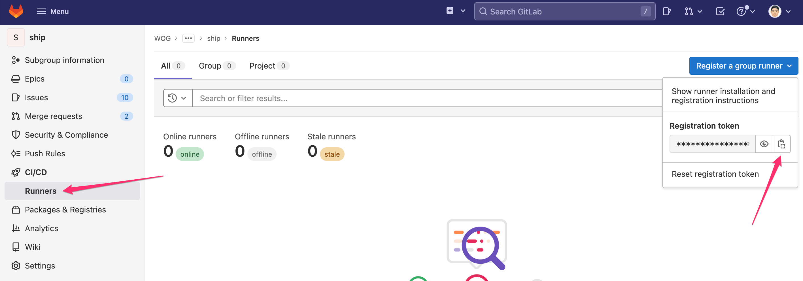
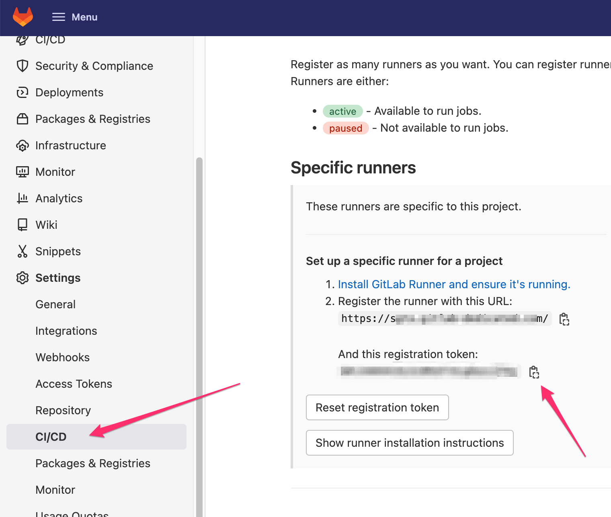

To set up GitLab runners:
1. [Review the prerequisites](#prerequisites)
1. [Retrieve your runner token](#retrieve-your-runner-token)
1. [Install the runner](#install-runner)

## Prerequisites

- Access to your hosted environment/VM.
- Network connectivity for private network link setup via [AWS](aws-vpc-endpoint) or [IPsec tunnel](ipsec-tunnel).

## Retrieve your runner token

Depending on your use case, you can configure one of the following runners: 
- [**Group runner:**](#to-retrieve-group-runner-token) These runners are shared among all the projects in the group.
- [**Project runner:**](#to-retrieve-project-runner-token) These runners are specific to one project.

### To retrieve group runner token

- Navigate to your group page and access the menu as shown below:

    

### To retrieve project runner token

- Navigate to your project setting page and access the menu as shown below:

    

## Install runner 

You can install runner in the following environments based on your setup:
- [Linux(amd64)](#environment-linux-amd64)
- [macOS (amd64)](#environment-macos-amd64)
- [Windows (amd64)](#environment-windows-amd64)
- [Docker](#environment-docker)
- [Kubernetes](#environment-kubernetes)

### Environment: Linux (amd64)

1. Download and install the following binary:

    ```
    # Download the binary for your system
    sudo curl -L --output /usr/local/bin/gitlab-runner https://gitlab-runner-downloads.s3.amazonaws.com/latest/binaries/gitlab-runner-linux-amd64
    
    # Give it permission to execute
    sudo chmod +x /usr/local/bin/gitlab-runner
    
    # Create a GitLab Runner user
    sudo useradd --comment 'GitLab Runner' --create-home gitlab-runner --shell /bin/bash
    
    # Install and run as a service
    sudo gitlab-runner install --user=gitlab-runner --working-directory=/home/gitlab-runner
    sudo gitlab-runner start
    ```

1. Run the following command to register the runner:

    ```
    sudo gitlab-runner register --url https://sgts.gitlab-dedicated.com/ --registration-token XXXXXXXXXXXXXXXXXXXXXXXXXXXXXXXXXXXXXXXXXXX

    ```

### Environment: macOS (amd64)

1. Download and install the following binary:

    ```
    # Download the binary for your system
    sudo curl --output /usr/local/bin/gitlab-runner https://gitlab-runner-downloads.s3.amazonaws.com/latest/binaries/gitlab-runner-darwin-amd64
    
    # Give it permission to execute
    sudo chmod +x /usr/local/bin/gitlab-runner
    
    # The rest of the commands execute as the user who will run the runner
    # Register the runner (steps below), then run
    cd ~
    gitlab-runner install
    gitlab-runner start
    ```

1. Run the following command to register the runner:

    ```
    gitlab-runner register --url https://sgts.gitlab-dedicated.com/ --registration-token XXXXXXXXXXXXXXXXXXXXXXXXXXXXXXXXXXXXXXXXXXX

    ```

### Environment: Windows (amd64)
1. Download and install the following binary:

    ```
    # Run PowerShell: https://docs.microsoft.com/en-us/powershell/scripting/windows-powershell/starting-windows-powershell?view=powershell-7#with-administrative-privileges-run-as-administrator
    # Create a folder somewhere on your system, for example: C:\GitLab-Runner
    New-Item -Path 'C:\GitLab-Runner' -ItemType Directory
    
    # Change to the folder
    cd 'C:\GitLab-Runner'
    
    # Download binary
    Invoke-WebRequest -Uri "https://gitlab-runner-downloads.s3.amazonaws.com/latest/binaries/gitlab-runner-windows-amd64.exe" -OutFile "gitlab-runner.exe"
    
    # Register the runner (steps below), then run
    .\gitlab-runner.exe install
    .\gitlab-runner.exe start

    ```

1. Run the following command to register the runner:

    ```
    ./gitlab-runner.exe register --url https://sgts.gitlab-dedicated.com/ --registration-token XXXXXXXXXXXXXXXXXXXXXXXXXXXXXXXXXXXXXXXXXXX

    ```

### Environment: Docker

- To install Runner in a container, follow the instructions described in the [GitLab documentation](https://docs.gitlab.com/runner/install/docker.html).


### Environment: Kubernetes

- To install Runner in Kubernetes, follow the instructions described in the [GitLab documentation](https://docs.gitlab.com/runner/install/kubernetes.html).

## Additional Resources

- [Install GitLab Runner](https://docs.gitlab.com/runner/install/)

