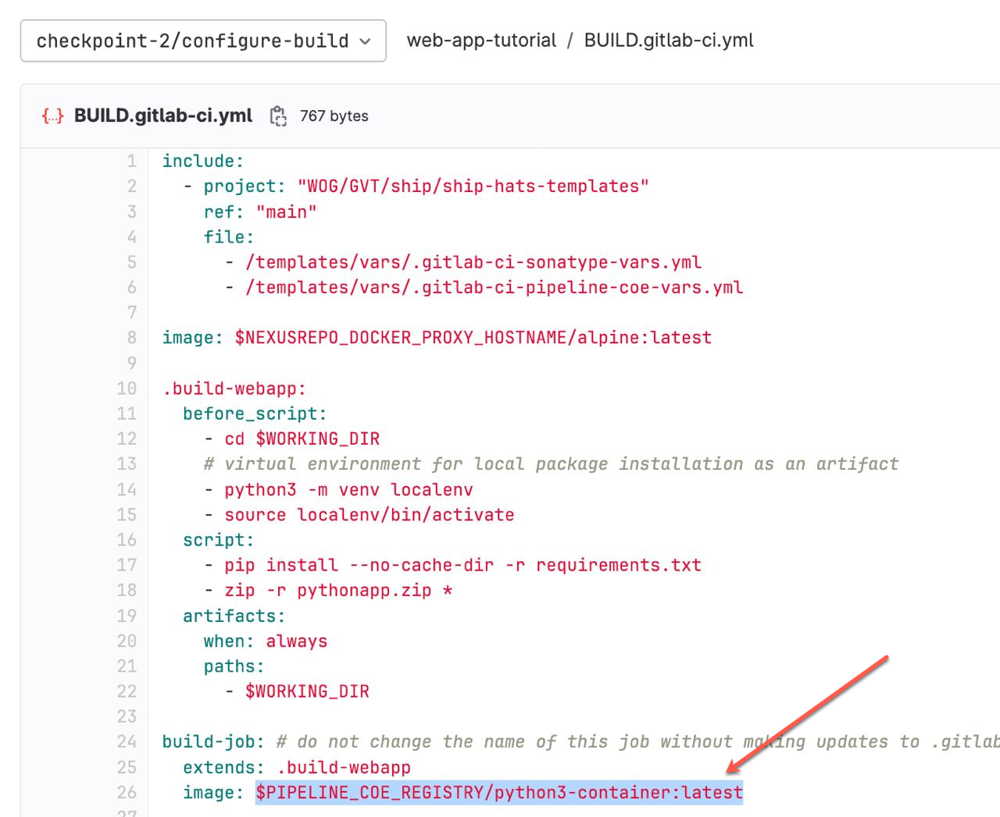

**[Pipeline COE](https://sgts.gitlab-dedicated.com/innersource/projects/sgts-pipelinecoe)** is a GitLab project that aims to **build and store images** that all users on SHIP-HATS GitLab dedicated can use. This feature is based on [GitLab DevSecOps Governance Framework (DGF)](https://gitlab-org.gitlab.io/professional-services-automation/pipelinecoe/pipeline-templates/#/). 

Using Pipeline COE, you can reduce redundancy by having a consolidated place where commonly used images by runners can be defined and stored. This enables you to get started quickly by using the available resources.

Pipeline COE is a repository of images that you can use in your pipeline for runner image configuration.

## Audience

CI/CD Pipeline authors 

## Benefits

Pipeline COE is an internal project (not a private project)  where all **logged in users are able to view, raise Merge Requests (MRs), and run pipelines on non-protected branches**.

## Key Features 

- Integrated container scanning in build pipeline to ensure all images in CR are scanned
- Curated repo by deprecating versions with security vulnerabilities with regular clean ups and scans
- Up to date & patched base images

?> **Note:** For Bamboo users, this process is similar to the maintenance of custom images on top of SHIP's golden image, where golden image is the equivalent base image in Pipeline COE.

## Using Pipeline COE

If you are looking for an image to define for runners to use, you can search in the available resources in the Pipeline COE. If you are not able to find an image as per your requirement, you can:

1. [Raise a service request](https://jira.ship.gov.sg/servicedesk/customer/portal/11) to update your role to **Developer** to add/change the image to the current project. SHIP-HATS team will then review and merge the request as per their approval process. 
1. If the requirement does not fit into any of the existing projects, [raise a service request](https://jira.ship.gov.sg/servicedesk/customer/portal/11) to create a project within Pipeline COE. You can then raise a **Merge Request (MR)** for the SHIP-HATS team to complete step 1.
1. For any additional help, please [raise a service request](https://jira.ship.gov.sg/servicedesk/customer/portal/11) to get support. 

## Approval Tips

- Make sure that **scans have passed** successfully.
- Make sure that there are **no deprecated versions**. To keep the images within Pipeline COE clean, we will deprecate versions with proper communication to users.  
    
    If there are versions that you require that are not supported or deprecated, you can make a copy of the image in your own container registries.

- Make sure that the **images are reusable**. If you have highly customised images or images that contains your specific development work, please store them in your own container registries.

## Future Enhancements

- Automation for announcements when an image is about to be deprecated
- Maintenance rules
- Add all users as developers as member to Pipeline COE

## Additional Resources

- [GitLab Image documentation](https://docs.gitlab.com/ee/ci/yaml/#image)
- [Run your CI/CD jobs in Docker containers](https://docs.gitlab.com/ee/ci/docker/using_docker_images.html)
- [GitLab DevSecOps Governance Framework (DGF) Documentation](https://gitlab-org.gitlab.io/professional-services-automation/pipelinecoe/pipeline-templates/#/)

<!--## Purpose

Using Pipeline COE, you can reduce redundancy by having a consolidated place where commonly used images by runners can be defined and stored. This enables you to get started quickly by using the available resources. 

Pipeline COE is a repository of images that you can include in various stages (For example, `Build.gitlab-ci.yml`) of a project's repository. You can build an end to end pipeline using the [Pipeline Templates](./pipeline-templates-snippet) as shown in the example image below:

-->
