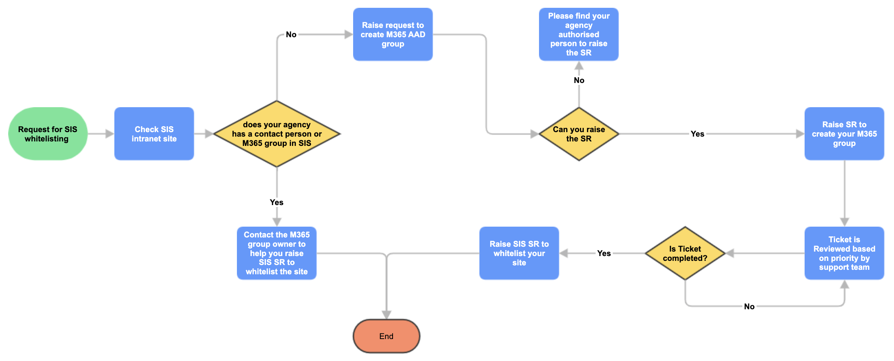

If you are using GSIB for your developer work and require to upload/download files from our dedicated GitLab (sgts.gitlab-dedicated.com), you can follow the below steps to whitelist 

## Steps

?> **Note:** This entire process can take up to 14 days to create a M365 group and add the site & group to the SIS whitelisting. Therefore, plan in advance. 

1.  Check SIS intranet site  [Secure Internet Surfing (SIS)](https://gccprod.sharepoint.com/sites/GOVTECH-digitalgov/digitalworkplaceproducts/SIS/SitePages/Home.aspx) (accessible via Intranet only).
1.  Check SIS if your Agency/Project/Team has a WOG Azure M365 AAD group (Users in this group can upload files to sites in step 1).    If your Agency/Project/Team has a AD group, reach out to the group owner to help add you into that group and raise a SIS SR to whitelist the site you want.     
1.  1f 1 and 2 are not available, you will need to follow the [SIS Process  available on intranet](https://gccprod.sharepoint.com/sites/GOVTECH-digitalgov/digitalworkplaceproducts/SIS/Shared%20Documents/Forms/AllItems.aspx?id=%2Fsites%2FGOVTECH%2Ddigitalgov%2Fdigitalworkplaceproducts%2FSIS%2FShared%20Documents%2FSecure%2DInternet%2DSurfing%2FProcesses%2FGuide%20%2D%20SIS%20File%20Upload%20URL%20Whitelisting%20Form%2Epdf&parent=%2Fsites%2FGOVTECH%2Ddigitalgov%2Fdigitalworkplaceproducts%2FSIS%2FShared%20Documents%2FSecure%2DInternet%2DSurfing%2FProcesses) and follow the below additional steps:
    1.  Find your authorised user to raise a SR to create an M365 group for the SIS whitelisting. The authorised person will be able to raise M365 group under **Your Agency name** > **ITSM**.  
          
        
    2.  Go to ITSM and Raise the SIS request to whitelist your site. You will need the the m365 group name and uuid from step 3.1.    
          
1.  After the SIS request is completed, test the file upload capabilities. If you encounter file upload error, please test using incognito mode. You may need to clear all cache and cookies and close & reopen the browser.

  
Following diagram shows the complete process for SIS Whitelisting:

