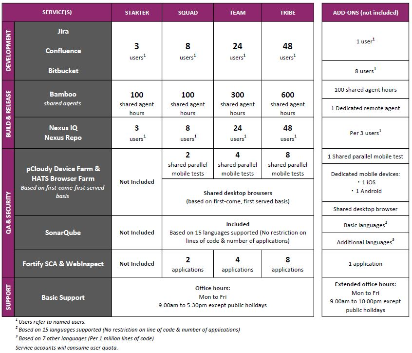

# Subscription

SHIP-HATS manages its tenants through subscriptions. Only agencies can subscribe to SHIP-HATS. However, agencies can extend subscriptions to non-agency users, such as vendors. 

> Subscription Admin (SA) can [log in to the TechBiz portal](https://docs.developer.tech.gov.sg/docs/techbiz-documentation/) to view pricing details.

## Overview

SHIP-HATS 2.0. is based on GitLab, specifically the Ultimate Tier of GitLab Dedicated SaaS in Singapore. The Ultimate Tier is GitLab’s highest offering and includes all components (what we will term as “GitLab-Native”) required in CI/CD including tools for planning, security testing, integration, and deployment.

Using all GitLab-Native tools will enable a user to benefit the most from the integrated GitLab solution. However, there are still some scenarios where an agency may choose an alternative tool (instead of the GitLab-Native tool) provided by another provider.

These tools are provided by SHIP-HATS as they are the best in-the-market at this point of time. For example, in Gartner’s Magic Quadrant for Application Security, Fortify-on-Demand is a clear leader while the GitLab-Native equivalent for SAST is still catching up. In this case, an agency that requires a more robust SAST tool may choose to use Fortify-on-Demand instead of the GitLab-Native offering. 

## Subscription Plans

- Subscription plan has been developed to promote GitLab-Native, where all integrated tools are available as add-ons.  
- Agencies pay for a Base sub fee and choose the number of users and add-ons.
- Ancillary Products are currently not cost recoverable from agencies. However, SEED/TechPass, is charged to GCC and SHIP-HATS.  Other tools are self-funded.

### Base plan

|Component|What's Included|Remarks|
|---|---|---|
Base Bundle   (Up to 50 GitLab licenses per bundle)|3 x GitLab Ultimate User License|Can add-on up to 47 more GitLab licenses   Fair Usage Policy – 1 GitLab license is entitled to up to 10 Gb
||Basic support (8:30 AM to 6 PM)|
||pCloudy shared|

## Add-ons

|Component|What's Included|Remarks|
|---|---|---|
Jira/Confluence|1 x Jira/Confluence License|Agencies to determine # of users that require this license
GitLab Ultimate|1 x GitLab Ultimate User License|Agencies to determine # of users that require this license
Sonatype Nexus IQ & Nexus Repo|1 x Nexus IQ   1 x Nexus Repo User License|Agencies to determine # of users that require this license
pCloudy Testing Farm|1 x pCloudy ios Device (dedicated)   1 x pCloudy Android Device (dedicated)|1 device can be used concurrently across multiple GitLab Projects, and tests can be run in parallel
SonarQube|1 x SonarQube Community Edition App  1 x SonarQube Dev Edition App|1 app can be used for 1 subscription (i.e. shared across GitLab projects)  1 app can be used for 1 subscription (i.e. shared across GitLab projects)
Fortify-on-Demand|1 x FOD App|1 app can be shared across multiple GitLab Projects, but tests cannot be run in parallel.
Additional support|Per hour (after 6 PM)|Outside office hours|

## Subscriptions vs User Accounts

- Agencies should tie individual users to one Subscription
  - A vendor may cut across subscriptions as agencies won’t know if the user is already tied to a Subscription. In this case, unfortunately, the same vendor may be charged more than once if the vendor is added to multiple Subscriptions in TechBiz.
- Users are only charged once in one Subscription account in TechBiz. However, within GitLab, they are free to allocate the user to various projects that cut across subscriptions
- Agencies should not include a user in more than one Subscription account, else they risk being charged more than once

## Subscription Pricing Plan
Proposed monthly charge in SHIP-HATS 2.0 per subscription. Each subscription will include:

- 10GB of data for GitLab
- pCloudy (shared mobile tests)
- Basic Support
- 3 x GitLab licenses (capped at 50 licenses per subscription)
  - per bundle
  - 1 sub can have more than one bundle

> Subscription Admin (SA) can [log in to the TechBiz portal](https://docs.developer.tech.gov.sg/docs/techbiz-documentation/) to view pricing details.

## Recommendations

Follow these recommendations to keep costs low: 
- Review actual usage – some agencies are purchasing more than they are using
- Consider GitLab-Native, where possible
- Share Fortify on Demand across applications if concurrent testing is not necessary

## FAQs

>**TIP:** Click the triangle or the question to view the answer.

 
<b> I am migrating from 1.0 to 2.0. How will pricing work for me?	 </b>
   

If you are migrating from 1.0 to 2.0, you will continue to pay 1.0 pricing until fully migrate to 2.0. After the complete migration, you will start paying as per 2.0 pricing. 

If you complete migration in mid of a month, you will continue to pay as per 1.0 pricing for that month. The 2.0 will commence from next month onwards.

 

 

 
<b>After migration, what happens to my existing projects and tools setup?  </b>
   

After your new subscription is approved and created via TechBiz, your projects and tools will be mapped to your new subscription.

 

 

 
<b> How does an agency subscribe to SHIP-HATS?	 </b>
   

You can [subscribe to SHIP-HATS via the TechBiz portal](https://docs.developer.tech.gov.sg/docs/ship-hats-getting-started/onboard-to-ship-hats).

 

 

 
<b>How much does it cost to subscribe to SHIP-HATS?  </b>
   

Subscription Admin (SA) can [log in to the TechBiz portal](https://docs.developer.tech.gov.sg/docs/techbiz-documentation/) to view pricing details. 

 

 

 
<b>When does billing start for a subscription?  </b>
   

Billing starts from the first of the following month as we offer free subscription from the day of account provisioning until the first of the following month. For example, if account was provisioned on 5 or 25 March 2023, billing starts from 1 April 2023. We charge on a monthly basis, however, overall invoicing will be quarterly. SA can [log in to the TechBiz portal](https://docs.developer.tech.gov.sg/docs/techbiz-documentation/) to view pricing details.

 

 
<b> Can there be users who just have “read-only” access? </b>
   

Yes. These users will be allocated a guest account. 

 

 
<b> Can I upgrade or downgrade to a different subscription plan and how do I do this? </b>
   

Yes. [Raise a service request](https://jira.ship.gov.sg/servicedesk/customer/portal/11) with your requirement.  

 

 
<b> Can I add-on or scale-down tools or resources bundled along with my subscription? </b>
   

Yes. [Raise a service request](https://jira.ship.gov.sg/servicedesk/customer/portal/11) with your requirement.  

 

 
<b> How do I cancel my subscription? </b>
   

Yes, Subscription Administrator can [raise a service request](https://jira.ship.gov.sg/servicedesk/customer/portal/11) to cancel subscription with one month notice as per the service sheet. 

 

 
<b> Can I monitor resource utilisation at subscription and project levels? </b>
   

Yes, as a Subscription Administrator or a Project Administrator, you can monitor resource utilisation from your SHIP-HATS account.

Subscription Administrators can monitor Plan Details, Named Users, Projects at the subscription level while Project Administrators can monitor Named Users at the associated project level.

For GitLab, you can view [GitLab dashboards](dashboards). 

 

 
<b>How many projects can be associated with a subscription?  </b>
   

Refer to the [Subscription plan](#subscription-plans) details. 

 

 

 
<b> Can I subscribe to individual tools like Jira or Confluence only? </b>
   

You can subscribe for [Base plan](#base-plan) and opt for [add-ons](#add-ons) as per your requirement.

 

 
<b>  Can I request for a trial subscription?</b>
   

Yes. [Raise a service request](https://jira.ship.gov.sg/servicedesk/customer/portal/11) with your requirement. 

 

 
<b>What security classification is supported by SHIP-HATS?  </b>
   

SHIP-HATS supports applications and content that are **Confidential Cloud Eligible (CCE)** and below.

 

 
<b> Can I use an existing email address to add a new user account? </b>
   

No. Each user account requires a unique email address. For each new user account, you must use a new email address.

 

 
<b>What are the Basic languages that are available for SonarQube add-on and who can buy them as add-on?  </b>
   

For supported language, refer to [Tooling Strategy documentation](ship-hats-tools). You can [purchase add-ons](#add-ons) as per your requirement.

 

 
<b>  Is there any add-on to support multiple branch analysis in SonarQube?</b>
   

Yes. You can add additional programming languages which extend your SonarQube Community edition capabilities to support the [Developer edition](https://www.sonarqube.org/developer-edition/) features and this includes multiple branch analysis. For more information on the languages supported, please refer to [languages supported by SonarQube](https://docs.sonarqube.org/latest/analysis/languages/overview/).

 

 
<b>  Can vendors be Subscription admins?</b>
   

No. Subscription admins must be public officers. 

 

 
<b> Do I need to have TechPass/SEED account in order to access SHIP-HATS tools? </b>
   

Yes, users need to have a [TechPass](https://docs.developer.tech.gov.sg/docs/techpass-user-guide/) and/or [SEED](https://docs.developer.tech.gov.sg/docs/security-suite-for-engineering-endpoint-devices/) account to access SHIP-HATS tools on GSIB and Internet devices respectively. 

 

 
<b>  Does my approver need to have a TechPass account to access TechBiz in order to approve?</b>
   

They can [request for an OTP to access TechBiz portal](https://docs.developer.tech.gov.sg/docs/techbiz-documentation/log-in-to-TechBiz-portal) to approve Service Agreements. 

 

 
<b> Can SHIP-HATS portal be accessed with SE-GSIB device? </b>
   

No, access to SHIP-HATS portal is currently not possible with SE-GSIB devices.

 

 
<b> Can TechBiz portal be accessed with SE-GSIB device? </b>
   

No, access to TechBiz portal is currently not possible with SE-GSIB devices.

 

 
<b>  Are there additional charges for creating dedicated/group runners in GitLab?</b>
   

No.

 

 
<b> I have a user who needs to work on multiple subscriptions. Will the user consume quota for each subscription to which the user is added? </b>
   

Agencies can allocate the user at GitLab level to ensure that additional quota is not consumed at the subscription level. Agencies should not allocate same user across multiple subscriptions.

 

<!--
**Topics**
- [Overview](#overview)
- [Understanding SHIP-HATS Subscription](#understanding-ship-hats-subscriptionhttpswwwyoutubecomembedksuenr78m4wshowinfo0)
- [FAQs](#faqs)
-->
<!--## Overview -->
<!--
SHIP-HATS manages its tenants through subscriptions. Only agencies can subscribe to SHIP-HATS. However, agencies can extend subscriptions to non-agency users, such as vendors. 

Please refer to [1.0 Subscription](https://www.developer.tech.gov.sg/products/categories/devops/ship-hats/subscription) for details. We will provide SHIP-HATS 2.0 subscription details soon. 

## Pricing

- Aiming for a comparable pricing as SHIP-HATS 1.0. 
- More details by end of Q2 FY22. 

?> You can [send your pricing questions](http://go.gov.sg/she) and we will answer them after the Pricing Review is complete.

## Process needs

- Existing subscriber will need to sign a new Subscription Agreement.

-->
<!--

## Subscription Plans

- Subscription plan has been developed to promote GitLab-Native, where all integrated tools are available as add-ons.  
- Agencies pay for a Base sub fee and choose the number of users and add-ons.
- Ancillary Products are currently not cost recoverable from agencies. However, SEED/TechPass, is charged to GCC and SHIP-HATS. The others are self-funded.
- TechBiz will be chargeable after December. 

### Base Plan

|Component|What's Included|Remarks|
|---|---|---|
Base Bundle    (Up to 50 GitLab licenses per bundle)|3 x GitLab Ultimate User License   Basic Support|Can add-on up to 47 more GitLab licenses  Fair Usage Policy – 1 GitLab license is entitled to up to 10 Gb

  

### Add-ons

|Component|What's Included|Remarks|
|---|---|---|
Jira/Confluence|1 x Jira/Confluence License|Agencies to determine # of users that require this license
GitLab Ultimate|1 x GitLab Ultimate User License|Agencies to determine # of users that require this license
Sonatype Nexus IQ & Nexus Repo|1 x Nexus IQ   1 x Nexus Repo User License|Agencies to determine # of users that require this license
pCloudy Testing Farm|1 x pCloudy (shared mobile tests)|(20% of users are using the shared mobile tests today)|
||1 x pCloudy ios Device (dedicated)  1 x pCloudy Android Device (dedicated)|1 device can be used concurrently across multiple GitLab Projects, and tests can be run in parallel
|SonarQube|1 x SonarQube Community Edition App|1 app can be used for 1 sub
||1 x SonarQube Dev Edition App|1 app can be used for 1 GitLab Project each
Fortify-on-Demand|1 x FOD App|1 app can be shared across multiple GitLab Projects, but tests cannot be run in parallel

## Subscription Pricing Plan
Proposed monthly charge in SHIP-HATS 2.0 per subscription. Each subscription will include:

1. 10GB of data for GitLab
1. pCloudy (shared mobile tests)
1. Basic Support
1. 3 x GitLab licenses (capped at 50 licenses per subscription)

>**Notes:** 
>- Above items are related to fixed costs that cannot be allocated out. 
>- Item (4) Variable license provided for agencies to promote use of new SaaS.
>- Capping related to GitLab license is done through system. >- Agencies will need to sign up a new subscription if they need more than 50 licenses. 

**For pricing details, please log in to your TechBiz account.**

## Recommendations

1. Review actual usage – some agencies are purchasing more than they are using
1. Consider GitLab-Native, where possible
1. Share Fortify on Demand across applications if concurrent testing is not necessary

-->

<!--
?> Though subscription for SHIP-HATS 2.0 has been realigned, pricing for SHIP-HATS 2.0 will be less than the pricing for SHIP-HATS 1.0. 
-->

<!--Following image shows the 4 subscription tiers (Starter, Squad, Team, and Tribe) and available add-ons for each service under SHIP-HATS.

Public officers can visit the [Intranet website for pricing](https://sgdcs.sgnet.gov.sg/sites/IDA-GoSync/gdspdd-ai/ship/_layouts/15/start.aspx#/SitePages/Pricing.aspx). For further queries on pricing, please drop us an email at <enquiries_ENP@tech.gov.sg>.

-->
<!--
## [Understanding SHIP-HATS Subscription](https://www.youtube.com/embed/ksUEnR78m4w?showinfo=0)

<ifigure> 
<iframe title="YouTubeVideoPlayer" src="https://www.youtube.com/embed/ksUEnR78m4w?showinfo=0" height="500" width="790" frameborder="0" allow="accelerometer; autoplay; encrypted-media; gyroscope; picture-in-picture" allowfullscreen></iframe>
</ifigure>

## FAQs

 

 
<b>How does an agency subscribe to SHIP-HATS?</b>
   

  1. Please send an email to <enquiries_ENP@tech.gov.sg> with the primary email contact.  
  2. We will send an **Onboarding Form** to the Primary Contact to provide information such as subscription requirements, Start Date, details of Primary Contact, Secondary  
  Contact, Agency Nominated Approver and Billing Contact.   
  3. We review the information provided and email the Universal Service Terms (UST) and Service Sheet to the agency nominated approver for approval.   
  4. Once approved, we provisioni Primary and Secondary subscription administrator accounts.  
  For vendors, kindly get in touch with the agency that you engage with for SHIP-HATS access.
 

 

 
<b>How much does it cost to subscribe to SHIP-HATS?</b>
 
  Refer to [pricing details](https://sgdcs.sgnet.gov.sg/sites/IDA-GoSync/gdspdd-ai/ship/SitePages/Pricing.aspx) accessible via your GSIB/SOE machine.
 

  

 
<b>When does billing start for a subscription?</b>
 
  Billing starts only from the first of the following month as we offer free subscription from the day of account provisioning until the first of the following month. 
  For example, if account was provisioned on 5 February 2021, billing starts from 1 March 2021. We charge on a monthly basis, and agency receives invoices every quarter.
 

 

  
<b>Do Subscription Admin(SA) accounts consume quota? </b>
 
No. Subscription Admin (SA) accounts do not consume quota.

 

 
<b>Can there be users who just have “read-only” access? </b>
 
  Yes. Note that users with read-only access are also counted as one of the users of that subscription.
 

  

 
<b>Can I upgrade or downgrade to a different tier and how do I do this?</b>
 
  Yes. Subscription Administrator may upgrade or downgrade to a different tier by raising a [service request](https://jira.ship.gov.sg/servicedesk/customer/portal/11)ii. While you may upgrade to an upper tier anytime, you can downgrade to a lower tier after the Minimum Commitment Periodiii. 
 
  For example, if TEAM tier was provisioned on 1 February 2021, the Subscription Administrator may raise a service request to upgrade to TRIBE tier anytime. If needed, you may request to downgrade to SQUAD or STARTER tiers after 1 August 2021.
 

  

 
<b>Can I add-on or scale-down tools or resources bundled along with my subscription?</b>
 
  Yes. Subscription Administrator may add-on additional tools or resources any time and scale-down newly added tools after the Minimum Commitment Periodiii. Agency can scale up requirement at any point of time. To add on or scale-down the newly added tools, Subscription Administrator can raise a [service request](https://jira.ship.gov.sg/servicedesk/customer/portal/11)ii. 
 
  For example, if TEAM tier was provisioned on 1 February 2021 and later you identify a need to have a total of 40 users, 400 shared agent hours and six applications to be scanned for vulnerabilities. In this case, you may add on 2 sets of eight users, 100 shared agent hours and two more apps to your subscription anytime. To remove these add-ons, Subscription Administrator can raise a service request after 1 August 2021.
 

  

 
<b>How do I cancel my subscription?</b>
 
  Subscription Administrator can cancel the subscription. For more information, refer to the [Off-board an Account](https://docs.developer.tech.gov.sg/docs/ship-hats-documentation/#/manage-account?id=off-board-an-account) documentation. 
 

  

 
<b>Can I monitor resource utilisation at subscription and project levels? </b>
 
  Yes, as a Subscription Administrator or a Project Administrator, you can monitor resource utilisation from your SHIP-HATS account.  
  Subscription Administrators can monitor Plan Details, Named Users, Projects and Bamboo utilisation hours at the subscription level while Project Administrators can monitor Named Users and Bamboo utilisation hours at the associated project level.
  

  
 

  
<b>How many projects can be associated with a subscription?</b>
 

  | Tier name | Maximum no. of projects |
  | ------------- |:-------------:|
  | Starter       |       6             |
  | Squad         |       12            |
  | Team          |       24            |
  | Tribe         |       48            |

 

 
  

 
<b>How does SHIP-HATS pricing compare with other commercially available CI/CD tools? </b>
 
  Based on Total Cost of Ownership which includes set up and operating costs (including maintenance and audit), SHIP-HATS’ bundled pricing is approximately 60% more cost-efficient than subscribing to commercial licenses individually. Public officers can visit the [Competitive Pricing Assessment](https://sgdcs.sgnet.gov.sg/sites/IDA-GoSync/gdspdd-ai/ship/_layouts/15/WopiFrame2.aspx?sourcedoc=%7BACB6DFA8-2433-48B8-9A24-BABA8688B0F6%7D&file=SHIP-HATS%20Competitive%20Pricing%20Assessment.pdf&action=default&IsList=1&ListId=%7B609D81FE-D9DB-4B7D-8D1A-1F02CD38880C%7D&ListItemId=80) for a cost comparison with Azure DevOps and GitLab.
 

  

 
<b>Can I subscribe to individual tools like Jira or Confluence only?</b>
 
  We are not offering tools individually now; our bundles have been carefully designed to enable agencies adopt good DevSecOps practices. However, if you are keen and have valid reasons, please let us know using [SHIP-HATS Enquiries](https://go.gov.sg/she) form so that we may assess the possibility based on the demand.
 

  

 
<b>Can I request for a trial subscription?</b>
 
  Yes, we offer a 1-month trial account subject to availability. Agencies can reach <enquiries_ENP@tech.gov.sg> to request for trial accounts.
 

  

 
<b>What security classification is supported by SHIP-HATS?</b>
 
  SHIP-HATS supports applications and content that are “Restricted” or below.
 

 

 
<b>Can I use an existing email address to add a new user account?</b>
 
  No. Each user account requires a unique email address. For each new user account, you must use a new email address. 
 
 
 

 
<b>What are the Basic languages that are available for SonarQube add-on and who can buy them as add-on?</b>
 
  [Languages](https://docs.sonarqube.org/latest/analysis/languages/overview/) supported by SonarQube's [Community edition](https://www.sonarsource.com/plans-and-pricing/community/) are the basic languages. Note that only tenants who have subscribed to **Starter** tier can buy this add-on as it is available by default for other tiers.
 

  

 
<b>Is there any add-on to support multiple branch analysis in SonarQube?</b>
 
  Yes. You can add additional programming languages which extend your SonarQube Community edition capabilities to support the [Developer edition](https://www.sonarqube.org/developer-edition/) features and this includes multiple branch analysis. For more information on the languages supported, please refer to [languages](https://docs.sonarqube.org/latest/analysis/languages/overview/) supported by SonarQube.
 

 
[i] Depending on the agency’s response time to answer any follow-up queries raised by us, it may take 1-3 business days to provision the Subscription Administrator accounts. 
[ii] We take 1-3 business days to process a service request. 
[iii] Six consecutive months from the date of account provisioning. 

### Related Topics

- [User roles and permissions](https://docs.developer.tech.gov.sg/docs/ship-hats-portal/#/user-roles-and-permissions)

-->