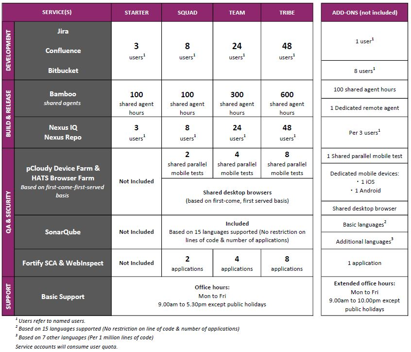

# Subscription

SHIP-HATS manages its tenants through subscriptions. Only agencies can subscribe to SHIP-HATS. However, agencies can extend subscriptions to non-agency users, such as vendors. Following image shows the 4 subscription tiers (Starter, Squad, Team, and Tribe) and available add-ons for each service under SHIP-HATS.

Public officers can visit the [Intranet website for pricing](https://sgdcs.sgnet.gov.sg/sites/IDA-GoSync/gdspdd-ai/ship/_layouts/15/start.aspx#/SitePages/Pricing.aspx). For further queries on pricing, please drop us an email at <enquiries_ENP@tech.gov.sg>.

## Understanding SHIP-HATS Subscription

## FAQs

 

 
<b>How does an agency subscribe to SHIP-HATS?</b>
   

  1. Please send an email to <enquiries_ENP@tech.gov.sg> with the primary email contact.  
  2. We will send an **Onboarding Form** to the Primary Contact to provide information such as subscription requirements, Start Date, details of Primary Contact, Secondary  
  Contact, Agency Nominated Approver and Billing Contact.   
  3. We review the information provided and email the Universal Service Terms (UST) and Service Sheet to the agency nominated approver for approval.   
  4. Once approved, we provisioni Primary and Secondary subscription administrator accounts.  
  For vendors, kindly get in touch with the agency that you engage with for SHIP-HATS access.
 

 

 
<b>How much does it cost to subscribe to SHIP-HATS?</b>
 
  Refer to [pricing details](https://sgdcs.sgnet.gov.sg/sites/IDA-GoSync/gdspdd-ai/ship/SitePages/Pricing.aspx) accessible via your GSIB/SOE machine.
 

 

 
<b>When does billing start for a subscription?</b>
 
  Billing starts only from the first of the following month as we offer free subscription from the day of account provisioning until the first of the following month. 
  For example, if account was provisioned on 5 February 2021, billing starts from 1 March 2021. We charge on a monthly basis, and agency receives invoices every quarter.
 

 

 
<b>Can there be users who just have “read-only” access? </b>
 
  Yes. Note that users with read-only access are also counted as one of the users of that subscription.
 

 

 
<b>Can I upgrade or downgrade to a different tier and how do I do this?</b>
 
  Yes. Subscription Administrator may upgrade or downgrade to a different tier by raising a [service request](https://jira.ship.gov.sg/servicedesk/customer/portal/11)ii. While you may upgrade to an upper tier anytime, you can downgrade to a lower tier after the Minimum Commitment Periodiii. 
 
  For example, if TEAM tier was provisioned on 1 February 2021, the Subscription Administrator may raise a service request to upgrade to TRIBE tier anytime. If needed, you may request to downgrade to SQUAD or STARTER tiers after 1 August 2021.
 

 

 
<b>Can I add-on or scale-down tools or resources bundled along with my subscription?</b>
 
  Yes. Subscription Administrator may add-on additional tools or resources any time and scale-down newly added tools after the Minimum Commitment Periodiii. Agency can scale up requirement at any point of time. To add on or scale-down the newly added tools, Subscription Administrator can raise a [service request](https://jira.ship.gov.sg/servicedesk/customer/portal/11)ii. 
 
  For example, if TEAM tier was provisioned on 1 February 2021 and later you identify a need to have a total of 40 users, 400 shared agent hours and six applications to be scanned for vulnerabilities. In this case, you may add on 2 sets of eight users, 100 shared agent hours and two more apps to your subscription anytime. To remove these add-ons, Subscription Administrator can raise a service request after 1 August 2021.
 

 

 
<b>How do I cancel my subscription?</b>
 
  Subscription Administrator can cancel the subscription. For more information, refer to the [Off-board an Account](https://docs.developer.tech.gov.sg/docs/ship-hats-documentation/#/manage-account?id=off-board-an-account) documentation. 
 

 

 
<b>Can I monitor resource utilisation at subscription and project levels? </b>
 
  Yes, as a Subscription Administrator or a Project Administrator, you can monitor resource utilisation from your SHIP-HATS account.  
  Subscription Administrators can monitor Plan Details, Named Users, Projects and Bamboo utilisation hours at the subscription level while Project Administrators can monitor Named Users and Bamboo utilisation hours at the associated project level.
  

 
 

  
<b>How many projects can be associated with a subscription?</b>
 

  | Tier name | Maximum no. of projects |
  | ------------- |:-------------:|
  | Starter       |       6             |
  | Squad         |       12            |
  | Team          |       24            |
  | Tribe         |       48            |

 

 
  

 
<b>How does SHIP-HATS pricing compare with other commercially available CI/CD tools? </b>
 
  Based on Total Cost of Ownership which includes set up and operating costs (including maintenance and audit), SHIP-HATS’ bundled pricing is approximately 60% more cost-efficient than subscribing to commercial licenses individually. Public officers can visit the [Competitive Pricing Assessment](https://sgdcs.sgnet.gov.sg/sites/IDA-GoSync/gdspdd-ai/ship/_layouts/15/WopiFrame2.aspx?sourcedoc=%7BACB6DFA8-2433-48B8-9A24-BABA8688B0F6%7D&file=SHIP-HATS%20Competitive%20Pricing%20Assessment.pdf&action=default&IsList=1&ListId=%7B609D81FE-D9DB-4B7D-8D1A-1F02CD38880C%7D&ListItemId=80) for a cost comparison with Azure DevOps and GitLab.
 

 

 
<b>Can I subscribe to individual tools like Jira or Confluence only?</b>
 
  We are not offering tools individually now; our bundles have been carefully designed to enable agencies adopt good DevSecOps practices. However, if you are keen and have valid reasons, please let us know using [SHIP-HATS Enquiries](https://go.gov.sg/she) form so that we may assess the possibility based on the demand.
 

  

 
<b>Can I request for a trial subscription?</b>
 
  Yes, we offer a 1-month trial account subject to availability. Agencies can reach <enquiries_ENP@tech.gov.sg> to request for trial accounts.
 

 

 
<b>What security classification is supported by SHIP-HATS?</b>
 
  SHIP-HATS supports applications and content that are “Restricted” or below.
 

 
<b>Can I use an existing email address to add a new user account?</b>
 
  No. Each user account requires a unique email address. For each new user account, you must use a new email address. 
 
 

 
<b>What are the Basic languages that are available for SonarQube add-on and who can buy them as add-on?</b>
 
  [Languages](https://docs.sonarqube.org/latest/analysis/languages/overview/) supported by SonarQube's [Community edition](https://www.sonarsource.com/plans-and-pricing/community/) are the basic languages. Note that only tenants who have subscribed to **Starter** tier can buy this add-on as it is available by default for other tiers.
 

 

 
<b>Is there any add-on to support multiple branch analysis in SonarQube?</b>
 
  Yes. You can add additional programming languages which extend your SonarQube Community edition capabilities to support the [Developer edition](https://www.sonarqube.org/developer-edition/) features and this includes multiple branch analysis. For more information on the languages supported, please refer to [languages](https://docs.sonarqube.org/latest/analysis/languages/overview/) supported by SonarQube.
 

 
[i] Depending on the agency’s response time to answer any follow-up queries raised by us, it may take 1-3 business days to provision the Subscription Administrator accounts. 
[ii] We take 1-3 business days to process a service request. 
[iii] Six consecutive months from the date of account provisioning. 

