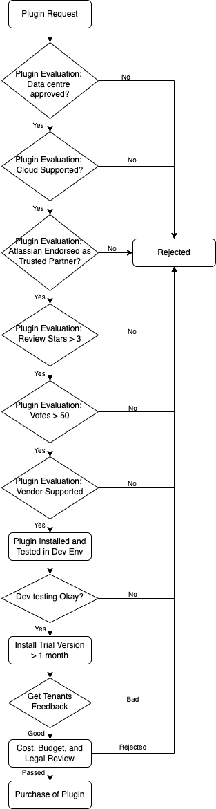

# Terms and Policies

**Topics**
- [Announcements](#announcements)
- [Service Level Agreement](#service-level-agreement)
- [Third Party Schedule](#third-party-schedule)
- [Plugin Review Process](#plugin-review-process)

## Announcements

The policies and annoucements below have been emailed out to SHIP-HATS users. It is cross posted here for ease of use.

### Latest (25 Oct 2021)

Add Content for latest announcement here

### FAQs

Add Related FAQs here

<!--

 
 OLD  
 

  

-->

## Service Level Agreement
This Service Level Agreement (SLA) is between Government
Technology Agency (GovTech/Service Provider) and the client for all services and service levels in connection to SHIP-HATS (henceforth also known as *Service*).

During the period of the Subscription Term, GovTech will provide:
- System Availability of at least 98.0% availability per service/ application, inclusive of scheduled maintenance downtime
- 5 days advanced notification for Monthly maintenance and updates (including patches)
- Technical support to resolve any errors in the Services in accordance with the following error resolution schedule. Please see table below:

  | Severity Level* | Description | Resolution Time** |
  | :------------- | :---------- | :-------------- |
  | 1 | Critical incident that prevents use of all Services | 1 to 3 business days |
  | 2 | Incident that disables major functions of the Services. | 4 to 6 business days |
  | 3 | Incident that disables minor functions. |Subject to complexity of the error in the service |

  ***Classification of the severity levels** is subject to GovTech&#39;s reasonable discretion. Technical support hours are Mondays to Fridays 9.00 am to 5.30 pm except public holidays. If the solution is temporary, GovTech will continue to work on the issue until a permanent solution is found.

  ****Resolution Time:** Indicates the time required to provide a permanent or temporary solution with respect to the relevant error and commences from the time GovTech is notified of the error. 

## Third Party Schedule 

All applicable terms and conditions relating to the following: 
- **Atlassian Service / Data Center Products:** https://www.atlassian.com/legal/privacy-policy/product-family 
- **OpenVPN:** https://openvpn.net/terms  & https://openvpn.net/license 

OpenVPN is going away. Do we have any other schedule links to mention here?

## Plugin Review Process

>**Important:** The information provided in this document is for reference only. To request for a plugin review, you must [raise a service request](https://jira.ship.gov.sg/servicedesk/customer/portal/11). The information contained herein is subject to change and the plugins can be rejected at the discretion of SHIP-HATS team.  

### Minimum requirement for a plugin request

Following are the minimum requirements for a plugin request:
- Data center approved
- Cloud Supported
- Atlassian endorsed as Trusted Partners
  - Cloud Fortified
  - Cloud Security Participant
- Plugin Ratings:
  - Stars > 3
  - Votes > 50
- Vendor Supported

### Plugin Review Process

Following diagram shows the plugin review process:

