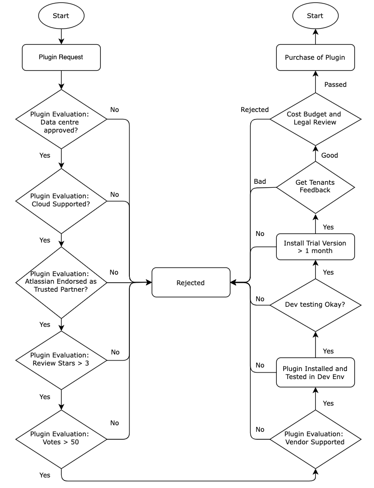

# Terms and Policies

## GitLab Fair Usage Policy

[Fair Usage Policy](gitlab-fair-usage-policy.md ':include')

## Confluence Global Retention Rules

[Confluence Global Retention Rules](./confluence-global-retention-rules.md ':include')

<!--In the view of improving our service capability and operation efficiency, SHIP-HATS Confluence Global Retention Rules will be configured as follows:

|Global Retention Rule|Rule criteria|
|---|---|
|**Attachment versions**|Keep by Number: **5 versions**  Keep the 5 most recent versions, and automatically delete any earlier versions.  
|**Page versions**|Keep by Age: **6 months**  Pages will automatically delete any version older than 6 months.  **Note:** Current version will not be affected. 
|**Trash**|Keep by Number: **1 month**  Purge any item deleted more than 1 month ago.

The SHIP-HATS Confluence Global Retention Rules will take effect on **30th November 2022**.

Agencies are reminded NOT to override the default SHIP-HATS Confluence retention configuration of your spaces.

### FAQs

>**Tip:** Click the question to view the answer.

  
<b>What if I want to keep one or few of older versions/attachments for our future reference?</b>
 
  We strongly recommend you to backup and store the pages/attachments in your own local storage services if needed.

 

  
<b>Will there be any notification send to agency what are the pages/attachments were deleted?</b>
 
  No notification will be sent to the agency. Please work with your project admin and do necessary housekeeping actions.

 

  
<b>What if my latest version itself is not updated for more than 6 months? Will it get deleted as well?</b>
 
  No, the current page version itself will not be affected.

 

-->

## Service level agreement

[Service level agreement](./service-level-agreement.md ':include')

<!--This Service Level Agreement (SLA) is between Government
Technology Agency (GovTech/Service Provider) and the client for all services and service levels in connection to SHIP-HATS (henceforth also known as *Service*).

During the period of the Subscription Term, GovTech will provide:
- System Availability of at least 98.0% availability per service/ application, inclusive of scheduled maintenance downtime
- 5 days advanced notification for Monthly maintenance and updates (including patches)
- Technical support to resolve any errors in the Services in accordance with the following error resolution schedule. Please see table below:

  | Severity Level* | Description | Resolution Time** |
  | :------------- | :---------- | :-------------- |
  | 1 | Critical incident that prevents use of all Services | 1 to 3 business days |
  | 2 | Incident that disables major functions of the Services. | 4 to 6 business days |
  | 3 | Incident that disables minor functions. |Subject to complexity of the error in the service |

  ***Classification of the severity levels** is subject to GovTech&#39;s reasonable discretion. Technical support hours are Mondays to Fridays 9.00 am to 5.30 pm except public holidays. If the solution is temporary, GovTech will continue to work on the issue until a permanent solution is found.

  ****Resolution Time:** Indicates the time required to provide a permanent or temporary solution with respect to the relevant error and commences from the time GovTech is notified of the error. 
-->

## Third party schedule 

[Third party schedule](./third-party-schedule.md ':include')

<!--All applicable terms and conditions relating to the following: 

|Tool/Service|Link|
|---|---|
|Atlassian Service & Products| https://www.atlassian.com/legal/privacy-policy/product-family 
|SonarQube|https://www.gnu.org/licenses/lgpl-3.0.en.html   https://www.sonarsource.com/docs/sonarsource_terms_and_conditions.pdf
-->

## Plugin review process

[Plugin review process](./plugin-review-process.md ':include')

<!--

!> **Important:** The information provided in this document is for reference only. To request for a plugin review, you must [raise a service request](https://jira.ship.gov.sg/servicedesk/customer/portal/11). The information contained herein is subject to change and the plugins can be rejected at the discretion of SHIP-HATS team.  

### Minimum requirement for a plugin request

The minimum requirements for a plugin request are provided below:
- Data center approved
- Cloud Supported
- Atlassian endorsed as Trusted Partners
  - Cloud Fortified
  - Cloud Security Participant
- Plugin Ratings:
  - Stars > 3
  - Votes > 50
- Vendor Supported

### Plugin Review Process

Following diagram shows the plugin review process:

-->