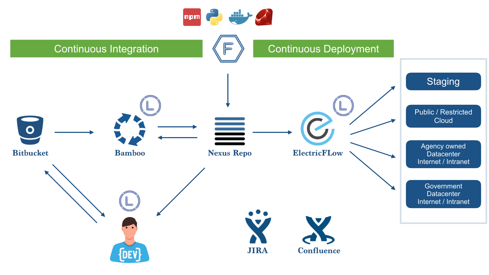

# Tools

<!---->

The following section provides list of tools for each stage in CI/CD pipeline offered under **SHIP-HATS**. 

|Stage|GitLab Native|Alternative Tool|
|---|---|---|
|Access|TechPass & SEED|TechPass & SEED|
|Planning|GitLab Issues/Wiki|Jira Cloud, Confluence Cloud (new!)
|Build|GitLab CI/CD  GitLab Package Registry|NA  Nexus Repo|
|Build Testing|GitLab SAST|Fortify-on-Demand (new!)
|Other Tests|GitLab Code Quality Scanning Tool   GitLab DAST  GitLab Container Scanning|SonarQube Developer Edition (On-Prem)  Fortify-on-demand (new!)  NA
|Deploy & Release|GitLab CI/CD|NA|

<!--

|DevSecOps Stage|DevSecOps Capability|Tools in 2.0|
|---|---|---|
|Planning|Dashboard - Value Stream|Gitlab Value Stream Measurement|
|Planning|Dashboard - Security|Gitlab Security Dashboard -or- Thinking HATS	
|Planning|Ticketing|Gitlab Issues -or- Jira (Cloud)|
|Planning|Documentation|Confluence|GitLab Wiki -or- Confluence (Cloud)|
|Development (Code)|Source Code Repository|GitLab|
|Building and Packaging|Build|GitLab|
|Building and Packaging|Static application security testing (SAST)|GitLab SAST -or- Fortify On Demand (FOD) SAST|
|Building and Packaging|Static application security testing (SAST)|GitLab Code Quality  -or- SonarQube Community/Developer Edition|
|Building and Packaging|Static application security testing (SAST)|Software Composition Analysis (SCA)| GitLab Dependency Scanning -or- Nexus IQ Server
|Building and Packaging|Static application security testing (SAST)|GitLab Container Scanning -or- Prisma Cloud|
|Pre-release Testing|Dynamic Application Security Testing (DAST) |GitLab DAST -or- Fortify On Demand (FOD) DAST|
|Pre-release Testing|Restricted Device farm for Automated Functional Testing|pCloudy with support for the following Test framework|
|Pre-release Testing|Automated Accessibility Testing (Check App 's Accessibility to persons with disabilities)|GitLab (Pa11y) -or- Purple HATS
|Deployment & Release|Deploy|GitLab|
|Deployment & Release|Deploy|GitLab Package Registry  -or- Nexus Repository Pro
|Operations & Monitoring|Monitoring|StackOps|

-->

<!--
## Tooling Strategy

[Tooling Strategy](./migration/tooling-strategy.md ':include')

-->
<!--
|DevSecOps Stage|DevSecOps Capability|Tools in 1.0|Tools in 2.0|
|---|---|---|---|
|Planning|Dashboard - Value Stream|None|Gitlab Value Stream Measurement|
-|Dashboard - Security|Thinking HATS|Gitlab Security Dashboard -or- Thinking HATS	
-|Ticketing|Jira|Gitlab Issues -or- Jira (Cloud)|
-|Documentation|Confluence|GitLab Wiki -or- Confluence (Cloud)|
|Development (Code)|Source Code Repository|Bitbucket|GitLab|
|Building and Packaging|Build|Bamboo|GitLab|
-|Static application security testing (SAST)|Fortify Static Code Analyzer|GitLab SAST -or- Fortify On Demand (FOD) SAST|
-|-|SonarQube Community/Developer Edition|GitLab Code Quality  -or- SonarQube Community/Developer Edition|
-|-|Software Composition Analysis (SCA)|Nexus IQ Server| GitLab Dependency Scanning -or- Nexus IQ Server
-|-|Container image scanning|Prisma Cloud|GitLab Container Scanning -or- Prisma Cloud|
|Pre-release Testing|Dynamic Application Security Testing (DAST) |Fortify WebInspect Enterprise|GitLab DAST -or- Fortify On Demand (FOD) DAST|
-|Restricted Device farm for Automated Functional Testing|pCloudy with support for the following Test framework <ul>|pCloudy with support for the following Test framework|
-|Automated Accessibility Testing (Check App 's Accessibility to persons with disabilities)|Purple HATS|GitLab (Pa11y) -or- Purple HATS
|Deployment & Release|Deploy|Digital.ai|GitLab|
-|-|Nexus Repository Pro|GitLab Package Registry  -or- Nexus Repository Pro
|Operations & Monitoring|Monitoring|NA|StackOps|

-->
<!--
For information on specific versions of Tools in SHIP-HATS, refer to the [Tools](https://docs.developer.tech.gov.sg/docs/ship-hats-tools/#/tools-overview) documentation. -->

<!--
### Project Management Tools

| Tool | Description | Links |
| --- | --- | --- |
|Shared space for collaboration to view, access, and manage all tasks and problems for the entire team enforces the idea of shared responsibility. Shared knowledge and environment to encourage experimentation. With Confluence Cloud, Atlassian hosts your site for you to provide you immediate access to latest features.| [Overview](https://www.atlassian.com/software/confluence/guides/get-started/confluence-overview) & [Tutorial](https://www.atlassian.com/software/confluence/guides/get-started/set-up) |
|Project management tool that is used to view, track, and manage projects and the progress of your team's tasks or bugs for a sprint displayed in an agile board. With Jira Software Cloud, Atlassian hosts and sets up your Jira Software site in the cloud for you. This allows you to get started quickly and easily without the need to manage the technical complexity of hosting yourself. | [Overview](https://www.atlassian.com/software/jira/guides/getting-started/overview) & [Tutorial](https://www.atlassian.com/software/jira/guides/getting-started/basics) |

### Build Tools

| Tool | Description | Links |
| --- | --- | --- |  
 **GitLab**|Tool for Continuous Integration that enables constant merging and testing of code, which leads to early defect detection and saves time to fix merge issues. This also enables the development teams to receive rapid feedback on their work. |  [Get Started with GitLab](https://docs.gitlab.com/ee/user/index.html) & [Tutorials](https://docs.gitlab.com/ee/tutorials/)|

### QA & Security Tools

| Tool | Description | Links |
| --- | --- | --- |
   **Nexus Repository Manager**| Tool for artifact management to ensure that the development, build, and production environments deploy consistent artifacts. This tool helps in reducing errors due to differences in build artifacts. This tool also provides version control for release artifacts for better control and easier rollback. | [Overview](https://www.sonatype.com/product-nexus-repository) & [Tutorials](https://help.sonatype.com/learning/repository-manager-3)|
|   **Nexus IQ**| Tool for scanning application binaries and open source libraries for all popular formats, including NPM, Nuget, Maven, Bowser, and more. This tool continuously monitors and alerts users of open-source vulnerabilities. | [Overview](https://www.sonatype.com/nexus-iq-server) & [Getting Started](https://help.sonatype.com/iqserver)|  
|    **pCloudy Test Farm**| Tool to run automated tests on browsers (desktop and mobile) and mobile apps. Automation is triggered from Bamboo using the [Robot Framework](https://robotframework.org/). | [Overview](https://www.pcloudy.com/) |
|  | Automatic code review tool to detect bugs, vulnerabilities, and code smell. 15 supported base languages include C#, Java, CSS, VB.NET, JavaScript, XML, TypeScript, Python, Flex, Kotlin, PHP, Go, Ruby, HTML, and Scala. | [Overview](https://docs.sonarqube.org/latest/) |
|    **Fortify on Demand**| Tool that identifies vulnerabilities without the need for external infrastructure or resources. | [Overview & Free Trial](https://www.microfocus.com/en-us/cyberres/application-security/fortify-on-demand) |  
| **Prisma Cloud**|Container vulnerability scanner that protects custom container images, configured by subscribers.|[Overview](https://docs.paloaltonetworks.com/prisma/prisma-cloud.html)|

-->