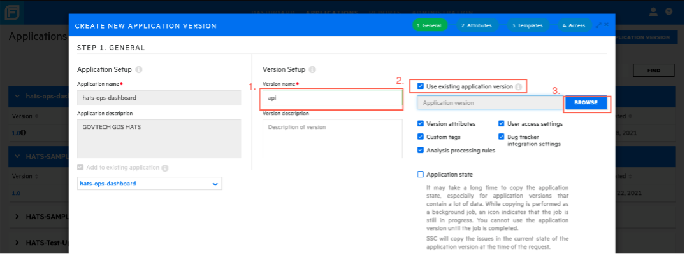
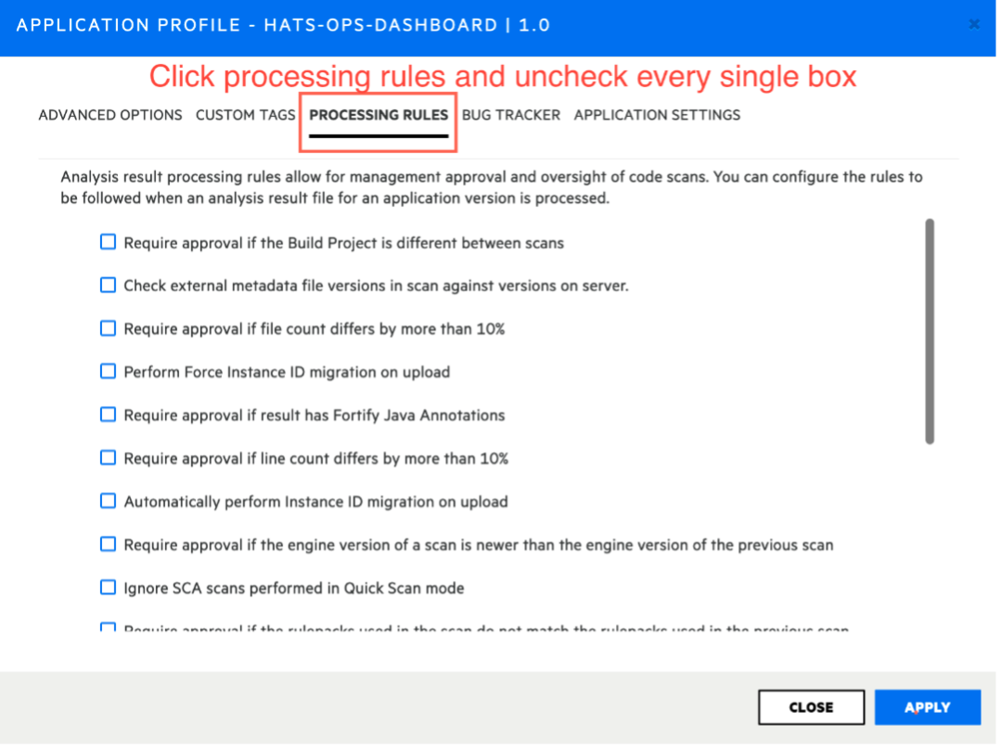

# Manage Application Version

**Topics**
- [Create New Application Version](#create-new-application-version)
- [Edit Application Version](#edit-application-version)
- [Deactivate Application Version](#deactivate-application-version)

## Create New Application Version

### Prerequisites
- Ensure you have access to the Fortify SSC.
- Ensure you are a Project Admin for your subscription and have the *GT-Manager* role.

### To create a new application version:
1. Log in to [Fortify SSC](https://ssc.hats.stack.gov.sg/ssc).
1. Click **Applications** > **New Application Version**.

    
1. Select an application for which you want to create a new application version.

    
1. Enter version name, select the **Use existing application version** check box, and then click **Browse** (Important to make sure all users are added from previous version)
    
1. Search for app version '1.0' to import details.

    
1. Click next all the way till you see **Finish**.

    

    >**IMPORTANT:** Ensure that the newly created application version is not blocked by manual approval. Without this step, Fortify SCA scans for this application version will fail.
    >
    >
    >
    >
    
1. Click **Apply** to save.

## Edit Application Version

### To edit the application version:

1. Click the target application version you want to edit.
    >**Tip:** If you have multiple versions, you can use the dropdown menu to select the target application version you want to edit.
1. Select the pencil icon to make the changes.

    

## Deactivate Application Version

>**IMPORTANT:** The data for the application version will be **erased permanently** if the application version is deleted. If this is what you are looking for, raise a service request via https://go.gov.sg/hats-ssd and select HATS Service Request. 

### To deactivate an application version:
If your team is not actively using an application version, you can opt to deactivate the version to remove it from display on the Fortify SSC dashboard.

1. Click **Profile**.
1. Navigate to **Application Settings**.
1. Click **Deactivate** for the target application version.  
If you have more than 1 application version to deactivate, you can do so here.

