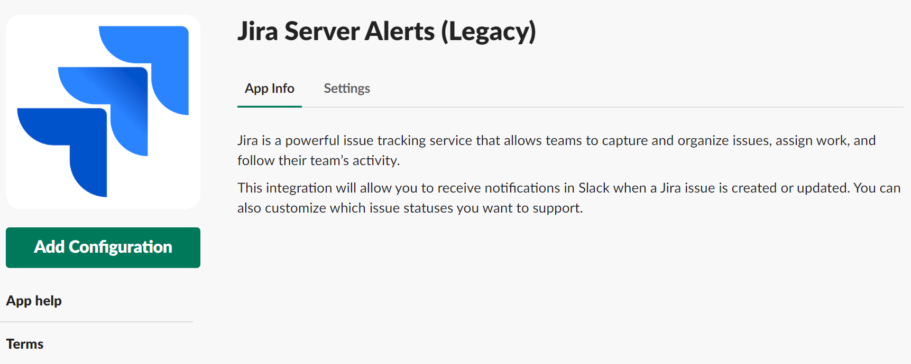
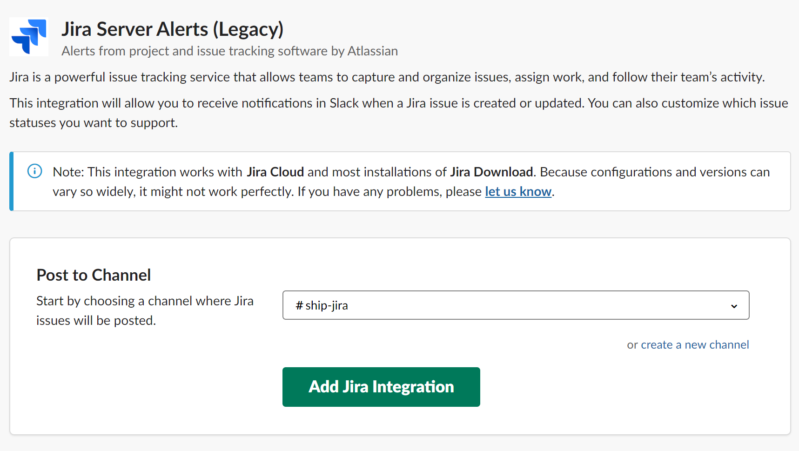

# Alerts

To set Jira server alerts, you need to enable Slack Webhook.

### To enable Slack Webhook to Jira

1. Install **Jira Server Alerts** on your slack.

    <kbd>

1. Click **Add Configuration** to add new Jira integration.

    <kbd>

1. After completing the configuration, copy the **Webhook URL**, and then raise a service desk ticket to SHIP teams.

    <kbd>
