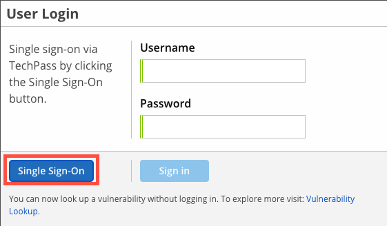

# Scan

Nexus IQ is used to perform software composition analysis. It provides intelligence on open source components used within the application, as well as the associated metadata, such as security vulnerabilities and licenses. 

Using Nexus IQ can involve the following

- Setting policies to govern the components used in the application 
- Evaluating (i.e. scanning) the application as part of the CI and CD pipeline
- Reviewing the policy violations in the evaluation report and to perform action accordingly (e.g. fix, mark vulnerability as not application or to waive violation)


To scan your repository automatically with bamboo plan please follow these steps.

1. First make sure you have your organization name and project name in Nexus-IQ, if not you can request to add it. 



1. When you create a new application, you will have to give the application name and application-id (this is unique).

1. In Bamboo, go to your stages & Jobs and create a script task after the build task and give the following command in the script window. 

|Project|Command|
|---|---|
|Java|`java -jar /opt/nexus-iq-cli.jar -i ${bamboo.nexusiq.appid} -s https://nexus-iq.ship.gov.sg -r $appname-nexus-iq-report.json -a ${bamboo.ship.username}:${bamboo.ship.password} target/*.war`|
|NPM|`java -jar /opt/nexus-iq-cli.jar -i ${bamboo.nexusiq.appid} -s https://nexus-iq.ship.gov.sg -r $appname-nexus-iq-report.json -a ${nexus.username}:${nexus.password} <node_modules_folderpath>`|

**For Java project:**

```
java -jar /opt/nexus-iq-cli.jar -i ${bamboo.nexusiq.appid} -s https://nexus-iq.ship.gov.sg -r $appname-nexus-iq-report.json -a ${bamboo.ship.username}:${bamboo.ship.password} target/*.war
```

**For NPM Project:** 

java -jar /opt/nexus-iq-cli.jar -i ${bamboo.nexusiq.appid} -s https://nexus-iq.ship.gov.sg -r $appname-nexus-iq-report.json -a ${nexus.username}:${nexus.password} <node_modules_folderpath>

**For Nuget/.net Project:**

java -jar C:\apps\nexus_iq_latest\nexusiqcli.jar -i ${bamboo.nexusiq.appid} -s https://nexus-iq.ship.gov.sg -r <app_name>-nexus-iq-report.json -a ${nexus.username}:${nexus.password} <nuget_package_folderpath>


1. If you are running it locally, you can download the cli from the below url 

wget https://download.sonatype.com/clm/scanner/nexus-iq-cli-1.81.0-04.jar (check the version of the nexus-iq)

1. Check the logs


1. Copy the link given in the log and use that link to look at your report.


1. You can add new policy and give your preferred conditions.

1. Also you can add your email id to get the report whenever there is any build failure or any security vulnerability issue in the build.


