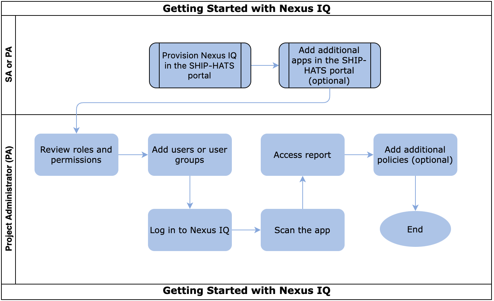

# User Journey

The following image and table outlines the steps that you must complete to get started with Nexus IQ. After you have completed these steps, you will need to perform additional steps to configure the tools that you want to use.

These tasks may be completed by multiple people in your organization and SHIP-HATS team. However, these tasks must be completed in the specified order. All steps are required unless otherwise noted. 

|Task|Owner|
|---|---|
|[Review users and permissions](nexus-iq/nexus-iq-roles-and-permissions)|PA|
|[Provision Nexus IQ in the SHIP-HATS portal](nexus-iq/nexus-iq-provision)|PA|
|[Add Apps](nexus-iq/nexus-iq-manage)|PA|
|[Add users or user groups in Nexus IQ](nexus-iq/nexus-iq-add)|PA|
|[Log in](nexus-iq/nexus-iq-log-in)|PA|
|[Scan the app](nexus-iq/nexus-iq-scan)|PA|
|[Access report](nexus-iq/nexus-iq-access-report)|PA|
|[Add additional policies (Optional)](nexus-iq/nexus-iq-add-policy)|PA|
<!--
Provision nexus iq - portal
add apps
Add user/user groups to the tool/app
log in to nexus iq https://nexus-iq.ship.gov.sg/
In Bamboo, scan the app and point to particular app id to view the repo - https://confluence.ship.gov.sg/display/SHIP/Nexus-IQ+scan
Access report -
Add policy - default policy is added. but you can add additional policies
-->