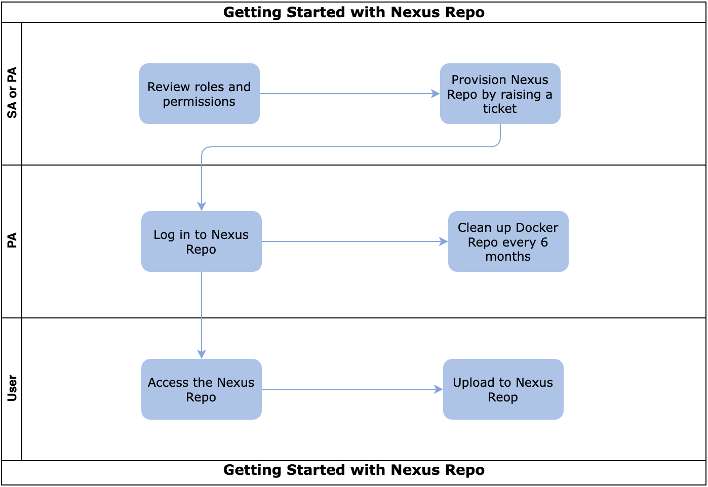

# User Journey

The following image and table outlines the steps that you must complete to get started with Nexus IQ. After you have completed these steps, you will need to perform additional steps to configure the tools that you want to use.

These tasks may be completed by multiple people in your organization and SHIP-HATS team. However, these tasks must be completed in the specified order. All steps are required unless otherwise noted. 

|Task|Owner|
|---|---|
|[Review roles and permissions](nexus-repository/nexus-repo-roles-and-permissions) |PA|
|[Provision Nexus repo](nexus-repository/nexus-repo-provision) |PA|
|[Log in to Nexus repo](nexus-repository/nexus-repo-log-in)|PA|
|[Clean up docker repo](nexus-repository/nexus-repository-clean-up-docker-repo)|PA|
|[Access repo](nexus-repository/)|PA
|[Upload to Nexus repo](nexus-repository/)|