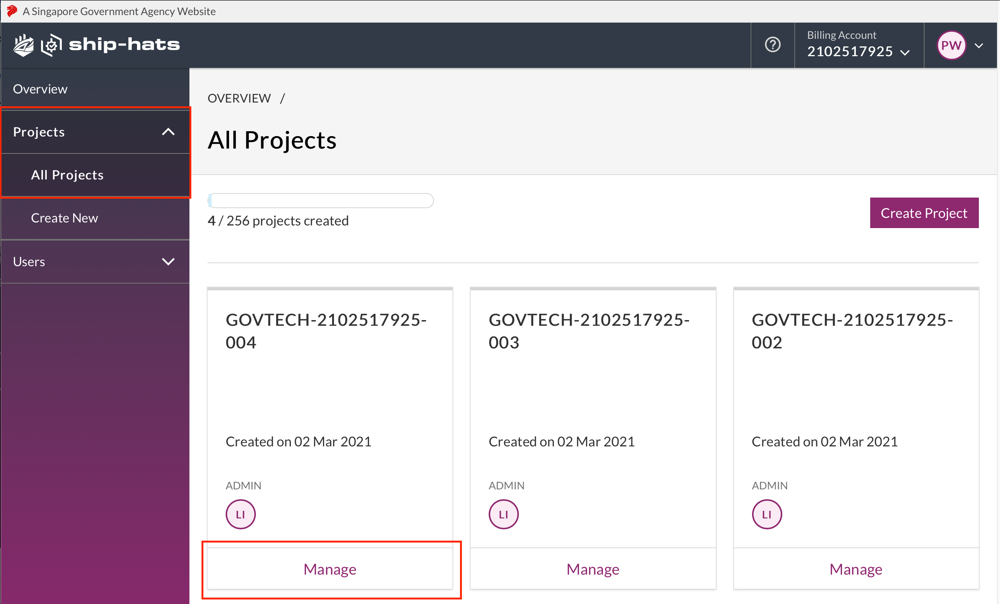
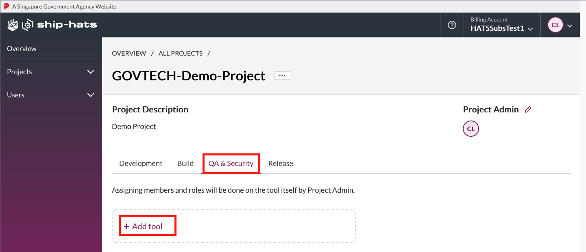
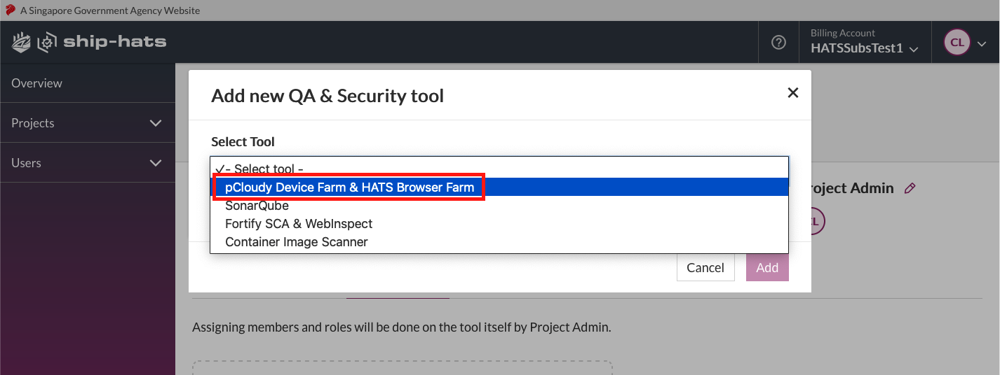
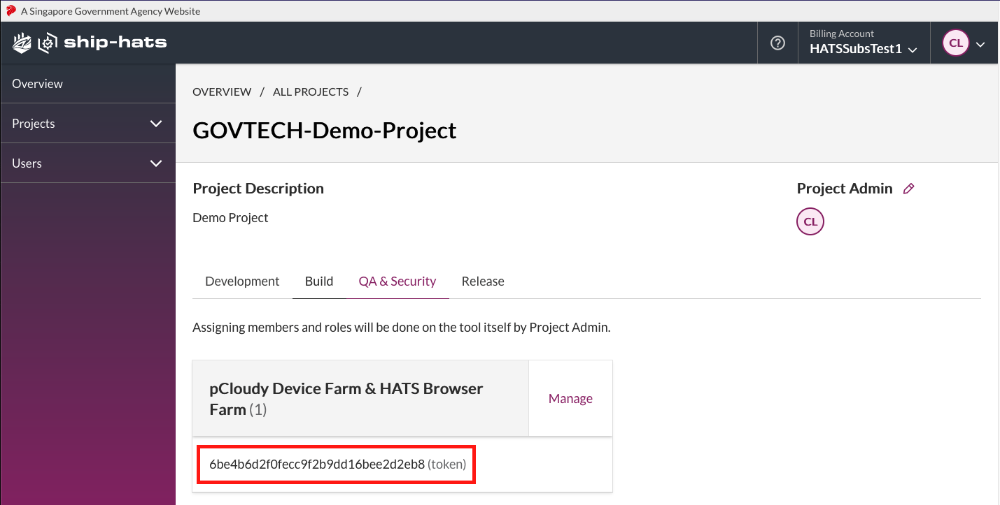

## pCloudy CLI

pCloudy CLI is a Command Line Interface(CLI) tool to be used as part of the Bamboo pipeline to help book and release devices on pCloudy.

## Prerequisites
- The user must be a Project Admin (PA) in order to retrieve the pCloudy token from the SHIP-HATS Self Help Portal.
- Make sure that your bamboo plan has an elastic image configuration of the HATS security agent dedicated to it (check with the HATS team)

## Retrieve PCloudy Token

To use the pCloudy CLI in bamboo, you would need to retrieve your pCloudy token from your pCloudy application from the SHIP-HATS Self Help portal.

### To retrieve PCloudy token

1. Log in to the [SHIP-HATS Portal](https://www.ship.gov.sg).
1. Click **Projects** > **All Projects**, and then click **Manage** on the project that your pCloudy application is in. If your pCloudy application is already created, you can jump to step 5. If you want to create a new pCloudy application, go to next step.  

    <kbd>
1. Click **QA & Security**, and then click **Add tool**.  

    <kbd>

1. Click **Select tool**, and then select **pCloudy Device Farm & HATS Browser Farm**.

    <kbd>

1. Click **Add**, and then copy the pCloudy token that appears.

    <kbd>


## Set up Bamboo Plan

### To set up your Bamboo plan
After you have your pCloudy token, you can use the pCloudy CLI in your bamboo plans, to book and release devices on pCloudy.

You can also use the pCloudy CLI to upload files to pCloudy.

## Upload Files

This is an optional step. This is mainly used to upload your application to pCloudy for testing.


### To upload files

You can use the pCloudy CLI with the command: `pcloudy-cli upload-file`. 

- You need your token for this command
- The name of the uploaded file may be different from the original name of the file
- The file cannot be empty
- The file can only have the extensions of `.zip` , `.apk`, or `.ipa`. 
- The name of the file may only contain the alphanumeric characters and ( `-` , `_` , `.` ) characters
- The required options are:
    - --pcloudy-token, -P
    - --file, -f

<!-- tabs:start -->
### **Command Format**

```
pcloudy-cli upload-file -P <your pCloudy Token> -f <Path to file to upload>
``` 
 
**Example: Upload a test build of an Android application to pCloudy**
```
pcloudy-cli upload-file -P "$token" -f artifacts/test_build_12_21.apk
```

### **Output Format**

If successful, the command would exit successfully with a stdout of:

```
{"uploaded_filename": "STRING"}
```

**Example pcloudy-cli upload-file -P "$token" -f artifacts/test_build_12_21.apk**
```
>> {"uploaded_filename": "test_build_12_21-1637507508.apk"}
```

You can then use a tool like `jq`  or `awk`  or `grep`  to get the data you want out of the stdout.

<!-- tabs:end -->


## Book Device

Regardless of whether you upload your test file or not to pCloudy, you can use the pCloudy CLI to book a device for testing.

### To book a device

- You need your token for this command
- This command will return you the `rid` (used for releasing the booked device early) and the `api_endpoint` (the appium endpoint you would use to run your robots tests)
- You can choose between browser testing or application testing  
- The required options are:
    - --pcloudy-token, -P
    - --duration, -d
    - --platform, -p
- Ensure that at least one of these options are used to set the test type of the booked device:
    - --app-name, -a
    - --browser, -b
- Optional options:
    - --platform-version
    - --device-name

<!-- tabs:start -->
### **Browser Testing**

**Command Format** 
```
pcloudy-cli book-device \
    -P <your pCloudy Token> \
    -d <duration to book the device (minutes)> \
    -p <device platform, [ios,android]> \
    -b # -b for browser based tests
```
**Android Example: Book Android device for browser testing, 10 minutes**
```
pcloudy-cli book-device -P "$token" -d 10 -p android -b
```

**iOS Example: Book iOS device for browser testing, 10 minutes**
```
pcloudy-cli book-device -P "$token" -d 10 -p ios -b
```

### **App Testing**

**Command Format**
```
pcloudy-cli book-device \
    -P <your pCloudy Token> \
    -d <duration to book the device (minutes)> \
    -p <device platform, [ios,android]> \
    -a <filename of app to test> # -a for app based tests
```    
**Android Example: Book Android device for app testing, 20 minutes**  

Ensure the package file to be in the current directory
```
pcloudy-cli book-device -P "$token" -d 20 -p android -a "demo_app.apk"
```
**iOS Example: Book iOS device for app testing, 20 minutes**  

Ensure the package file to be in the current directory
```
pcloudy-cli book-device -P "$token" -d 20 -p ios -a "demo_app.ipa"
```
### **Additional (Optional) Parameters**

**Book specific device based on platform version: Book specific iOS device with platform version 14.1.0**  

```
pcloudy-cli book-device -P "$token" -d 20 -p ios -b --platform-version "14.1.0"
```

**Book specific device based on device full name**
```
pcloudy-cli book-device -P "$token" -d 20 -p ios -b --full-name "Apple_iPhoneXR_Ios_14.4.0_f1c43"
```

<!-- tabs:end -->


---

## Expected Outputs

If the command ran successfully, you should get a stdout of:

<!-- tabs:start -->

### **Output Format**

```
{"rid": "INTEGER", "api_endpoint": "STRING, Appium Endpoint", ...other device information}
``` 
 
**Example**
```
pcloudy-cli book-device -P 6ba4b6d2f0fecc6f2b9ee16bee2d2eb8 -d 10 -p ios -b
>> {"duration": 10, "platform": "ios", "full_name": "Apple_iPhoneXR_Ios_14.4.0_f1c43", "version": "14.4.0", "rid": "52485", "platform_name": "Ios", "browser_name": "14", "device_name": "14", "appium_endpoint": "https://hats.pcloudy.com/appium/hubble/n6nn6382nbnf-6643"}
```

You can then use a tool like jq  or awk  or grep  to get the data you want out of the stdout.


<!-- tabs:end -->


## Run your tests

After booking the device (and optionally uploading your apk file), you can run additional commands to perform your pCloudy tests. In this example, we are using Robot Framework as the testing framework.

### To run your tests

**Sample Test Script**  

In this test script, we are running mobile browser testing.
This script is saved into a test file named `test.txt`.

Note that the sample APK file is already uploaded with the name of `pCloudyAppiumDemo.apk`.

- If you upload a package file with the same filename, the filename will be appended with a random numerical identifier by default - e.g, ` pCloudyAppiumDemo-1638321800.apk`.
- Value of the APP_PACKAGE use `com.pcloudy.appiumdemo`.

<!-- tabs:start -->

### **Browser Testing**

Sample Robot Framework Test Script

**Settings**
```
Documentation    To test basic demo app
 
Library          AppiumLibrary
```

**Keywords**
```
Do Google Search
    Go To Url   https://www.google.com
    Input text  //input[@aria-label="Search"]   "pCloudy"
    Press Keycode  66
```

**Test Cases**
```
Launch Browser Init
    Open Application  ${ENDPOINT}  platformName=Android  browserName=Chrome  deviceName=${DEVICE_ID}  pCloudy_EnableVideo=true  pCloudy_EnablePerformanceData=true  pCloudy_EnableDeviceLogs=true
Search for something on Google
    Do Google Search
Close All Apps
    Close All Applications
```


### **App Testing**

Sample Robot Framework Test Script

**Settings**

```
Library         AppiumLibrary
```

**Keywords**
```
Launch App Init
    Open Application  ${ENDPOINT}  platformName=Android  platformVersion=${VERSION}  deviceName=${DEVICE_ID}  appPackage=${APP_PACKAGE}  pCloudy_EnableVideo=true  pCloudy_EnablePerformanceData=true  pCloudy_EnableDeviceLogs=true
 
Book a flight
    Click Element   id=com.pcloudy.appiumdemo:id/accept
    Log To Console  Accept Button is clicked
 
    Wait Until Page Contains Element  id=com.pcloudy.appiumdemo:id/flightButton  20
    Click Element   id=com.pcloudy.appiumdemo:id/flightButton
    Log To Console  Book a flight button clicked
 
    Wait Until Page Contains Element  id=com.pcloudy.appiumdemo:id/spinnerfrom  20
    Click Element   id=com.pcloudy.appiumdemo:id/spinnerfrom
    Log To Console  From location drop down is clicked
 
    Wait Until Page Contains Element  //*[@id="android:id/text1" or @text="Bangalore, India (BLR)"]  20
    Click Element   //*[@id="android:id/text1" or @text="Bangalore, India (BLR)"]
    Log To Console  From Location is selected
 
    Click Element   id=com.pcloudy.appiumdemo:id/spinnerto
    Log To Console  To location drop down is clicked 
    Capture Page Screenshot
 
    Click Element   //*[@id="android:id/text1" or @text="Pune, India (PNQ)"]
    Log To Console  To location is selected
 
    Click Element   id=com.pcloudy.appiumdemo:id/singleTrip
    Log To Console  One way trip is selected
 
    Click Element   id=com.pcloudy.appiumdemo:id/txtdepart
    Log To Console  Departure time is selected
 
    Wait Until Page Contains Element  //*[@id="android:id/button1" or @text="OK"]  20
    Click Element   //*[@id="android:id/button1" or @text="OK"]
    Log To Console  Okay button is selected
 
    Wait Until Page Contains Element  com.pcloudy.appiumdemo:id/searchFlights  20
    Click Element   com.pcloudy.appiumdemo:id/searchFlights
    Log To Console  Search flight button is clicked
    Capture Page Screenshot
```

**Test Cases**

``` 
Test booking flight
    [Documentation]  As a user
    ...    I want to book a flight
    Launch App Init
    Book a flight
Close All Apps
    Close All Applications
```

<!-- tabs:end -->


**Passing Parameters into Test Script**

To run the Robot Framework script, you will need to provide the Appium Endpoint and deviceName to the `Open Application` keyword in order to connect to pCloudy remote devices.

<!-- tabs:start -->
### **Browser Testing**

Bamboo Script Task to run Robot Framework tests

Line 2 ~ 5 are the retrieval of the parameters to pass into your test
```
OUTPUT=$(pcloudy-cli book-device -P "$token" -p android -d 15 -b)
RID=$(echo "$OUTPUT" | jq -r ".rid")
APP_URL=$(echo "$OUTPUT" | jq -r ".appium_endpoint")
DEVICE_ID=$(echo "$OUTPUT" | jq -r ".device_name")
``` 
 
The sample robot framework script above is saved in the file `test.robot`
```
robot --variable ENDPOINT:"$APP_URL/wd/hub" --variable DEVICE_ID:"$DEVICE_ID" test.robot
```

### **App Testing**

Bamboo Script Task to run Robot Framework tests

Line 2 ~ 5 are the retrieval of the parameters to pass into your test
```
OUTPUT=$(pcloudy-cli book-device -P "$token" -p android -d 15 -b)
RID=$(echo "$OUTPUT" | jq -r ".rid")
APP_URL=$(echo "$OUTPUT" | jq -r ".appium_endpoint")
DEVICE_ID=$(echo "$OUTPUT" | jq -r ".device_name")  
``` 

The sample robot framework script above is saved in the file `testapp.robot`
```
robot --variable ENDPOINT:"$APP_URL/wd/hub" --variable DEVICE_ID:"$DEVICE_ID" \
--variable APP_PACKAGE:'com.pcloudy.appiumdemo' --variable VERSION:"$VERSION" testapp.robot
```

<!-- tabs:end -->

## Download Test Logs
After your tests are complete you can also download the logs from pCloudy using the pcloudy-cli download-logs-data command. This is an optional step.

### To download test logs
- You will need your pCloudy Token and `rid`  used to book the device
- The logs will also be based on the tests ran on the booked device
- Log files will be downloaded into the bamboo agent, where you can persist them by saving them as bamboo artifacts.

<!-- tabs:start -->

### **Command Format**

```
pcloudy-cli download-logs-data -P <your pCloudy Token> -r <rid string when the device was booked>
``` 
 
**Example: Download the logs of tests ran on booked device with rid of 52485**
```
pcloudy-cli download-logs-data -P "$token" -r 52485
```

### **Output Format**

If successfuly, the command would exit successfully with a stdout of:

```
{"success_logs": ["STRING", ...], "failed_logs": ["STRING", ...]}
```

**Example**
```
pcloudy-cli download-logs-data -P "$token" -r 52485
>> {"success_logs": [".pcloudy_appium_logs/52485/cpu.txt", ".pcloudy_appium_logs/52485/mem.txt", ".pcloudy_appium_logs/52485/net.txt", ".pcloudy_appium_logs/52485/bat.txt", ".pcloudy_appium_logs/52485/appium_stdout.txt", ".pcloudy_appium_logs/52485/appium_stderr.txt"], "failed_logs: [".pcloudy_appium_logs/52485/log.txt"]}
```

### **Directory Structure Format**

The downloaded logs will be stored in the current project's directory , in the bamboo agent, with a format of:  

```
./.pcloudy_appium_logs
|-- rid (NUMBER)
|   |-- *.txt (log files)
|   `-- ...
`-- ...
```

**Example**
```
./.pcloudy_appium_logs
`-- 52485
    |-- appium_stderr.txt
    |-- appium_stdout.txt
    |-- bat.txt
    |-- cpu.txt
    |-- log.txt
    |-- mem.txt
    `-- net.txt
```
<!-- tabs:end -->


## Release Device
After your tests are complete and you want to release the booked device, you can run the pcloudy-cli release-device  command.

### To release a device
- You will need to use the same token and rid  when booking the device
    <!-- tabs:start -->

    ### **Command Format**

    ```
    pcloudy-cli release-device -P <your pCloudy Token> -r <rid string when the device was booked>
    ```

    **Example: Release a booked device with an rid of 52485**
    ```
    pcloudy-cli release-device -P "$token" -r 52485
    ```

    <!-- tabs:end -->

- If successful, the command would exit successfully with a stdout of:

    <!-- tabs:start -->

    ### **Command Format**

    ```
    {"rid": "INTEGER"}
    ```

    **Example**
    ```
    pcloudy-cli release-device -P "$token" -r 52485
    >> {"rid": "52485"}
    ```

    <!-- tabs:end -->

## CLI Documentation

|Command Name|pcloudy-cli|
|---|---|
|Synopsis	|pcloudy-cli --help --version/-V
Example|	pcloudy-cli --help<br>pcloudy-cli -V
Description	|Base command for pCloudy CLI, should only be used in debugging situations.

|Options|Description|
|---|---|
--help	|Show the various options for the command and their respective descriptions
--version, -V	|Shows the version of the pCloudy CLI you are using

---

|Command Name|pcloudy-cli upload-file|
|---|---|
Synopsis	|pcloudy-cli upload-file --pcloudy-token/-P <pcloudy_token> --file/-f <PATH>
Example	|pcloudy-cli upload-file -P 6ba4b6d2f0fecc6f2b9ee16bee2d2eb8 -f artifacts/test_build_12_21.apk
Expected Output|	{"uploaded_filename": "test_build_12_21-1637507508.apk"}
Description	|pCloudy CLI command used to upload a file to pCloudy

|Options|Description|
|---|---|
--help	|Show the various options for the command and their respective descriptions
--pcloudy-token, -P <TEXT>	|The SHIP-HATS subscription's project's pcloudy application token.
--file, -f <PATH>	|The path to the file to upload to pCloudy
---


|Command Name|pcloudy-cli book-device|
|---|---|
Synopsis	|pcloudy-cli book-device --pcloudy-token/-P <pcloudy_token> --duration/-d <integer> --platform/-p <ios|andriod> --app-name/-a <app_name(optional)> --browser/-b(optional) --platform-version <platform_version(optional)> --device-name <device_name (optional)>
Example	|pcloudy-cli book-device -P 6ba4b6d2f0fecc6f2b9ee16bee2d2eb8 -d 10 -p ios -b
Expected Output	|{"duration": 10, "platform": "ios", "full_name": "Apple_iPhoneXR_Ios_14.4.0_f1c43", "version": "14.4.0", "rid": "53257", "platform_name": "Ios", "browser_name": "14", "device_name": "14", "appium_endpoint": "https://hats.pcloudy.com/appium/hubble/n6nn6382nbnf-6643"}
Description	|pCloudy CLI command used to book a device on pCloudy, using the pCloudy token generated from a SHIP-HATS subscription

|Options|Description|
|---|---|
--help	|Show the various options for the command and their respective descriptions
--pcloudy-token, -P <TEXT>	|The SHIP-HATS subscription's project's pcloudy application token.
--duration, -d <INTEGER>|The duration you want to book the device for
--platform, -p [ios/android]	|The platform of the device to book (Either ios/android )
--app-name, -a <TEXT> (Optional)	|Name of app to be used and test on the booked device (Used to set test type of booked device)
--browser, -b (Optional)	|Set the test type of the booked device to be browser (Used to set test type of booked device)
--platform-version <TEXT> (Optional)	|Filter devices by the platform version given to be booked
--full-name <TEXT> (Optional)|	Filter devices by the device name given to be booked
---


|Command Name|pcloudy-cli download-logs-data|
|---|---|
Synopsis	|pcloudy-cli download-logs-data --pcloudy-token/-P <pcloudy_token> --rid/-r <rid>
Example	|pcloudy-cli download-log-data -P 6ba4b6d2f0fecc6f2b9ee16bee2d2eb8 -r 52485
Expected Output	|{"success_logs": [".pcloudy_appium_logs/52485/cpu.txt", ...], "error_logs": [".pcloudy_appium_logs/52485/log/txt", ...]}
Description	|pCloudy CLI command used to download log data after tests

|Options|Description|
|---|---|
--help	|Show the various options for the command and their respective descriptions
--pcloudy-token, -P <TEXT>	|The SHIP-HATS subscription's project's pcloudy application token.
--rid, -r <TEXT>	|The rid of the booked device
---


|Command Name|pcloudy-cli release-device|
|---|---|
Synopsis	|pcloudy-cli release-device --pcloudy-token/-P <pcloudy_token> --rid/-r <rid>
Example	|pcloudy-cli release-device -P 6ba4b6d2f0fecc6f2b9ee16bee2d2eb8 -r 52485
Expected Output	|{"rid": "53257"}
Description	|pCloudy CLI command used to release a booked device early on pCloudy

|Options|Description|
|---|---|
--help	|Show the various options for the command and their respective descriptions
--pcloudy-token, -P <TEXT>	|The SHIP-HATS subscription's project's pcloudy application token.
--rid, -r <TEXT>	|The rid of the booked device to be released early