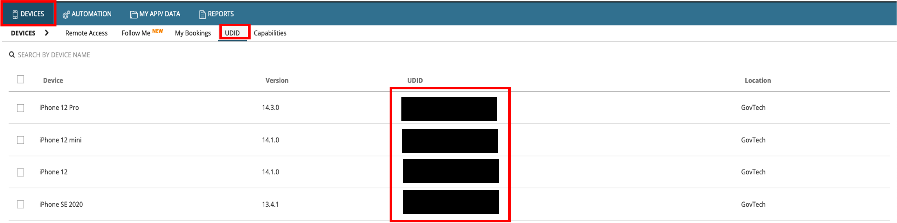
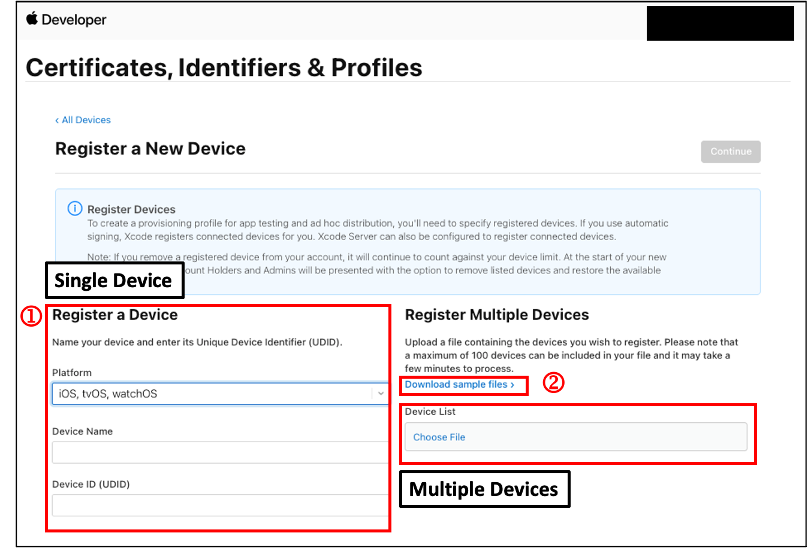

# Register Devices in Apple Developer Portal

**Topics**
- [Prerequisites](#prerequisites)
- [Retrieve UUID from pCloudy](#retrieve-uuid-from-pcloudy)
- [Register devices in the Apple Developer Account](#register-devices-in-the-apple-developer-account)
- [Additional Resources](#additional-resources)

## Prerequisites

- You must have access to the Apple Developer Account with has Apple Developer Program Membership.
- You must have access to HATS pCloudy iOS devices.

## Retrieve UUID from pCloudy

### To register UUID from pCloudy:
1. Log in to the [pCloudy device farm](https://hats.pcloudy.com).
1. Click **Devices** > **UUID**. You will be able to see the list of iOS devices.

    <kbd></kbd>

## Register devices in the Apple Developer Account

### To register devices in the Apple Developer Account
1. Log in to the Apple Developer Program.
1. Navigate to **Certificates**> **Identifiers & Profile**.
1. Click **Devices**.
1. Register single devices or multiple devices (via device file).

    <kbd></kbd>

## Additional Resources
- Register a single device: https://help.apple.com/developer-account/#/dev40df0d9fa
- Register multiple devices: https://help.apple.com/developer-account/#/devebd34abb1